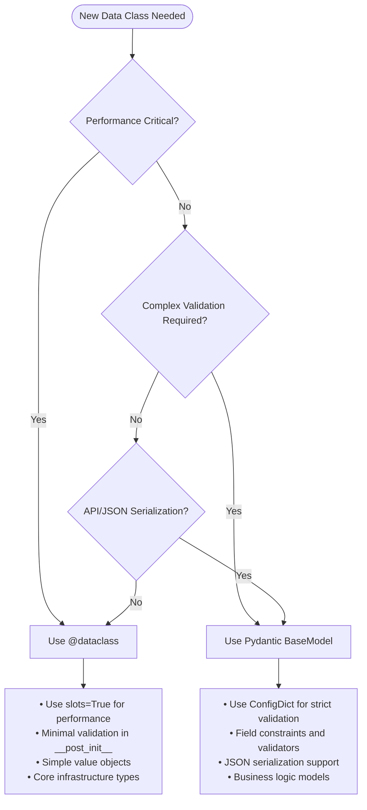

# ADR-001: Dataclass vs Pydantic Data Modeling Strategy

**Status**: ✅ Accepted
**Date**: 2025-08-25
**Commit**: 59808fa

## Context

The Studiorum codebase has evolved using a mixture of Python dataclasses and Pydantic models without clear architectural guidance. This has led to:

- **Inconsistent patterns**: Similar data structures implemented with different approaches
- **Performance concerns**: Pydantic overhead in performance-critical paths
- **Validation gaps**: Missing validation where it would be beneficial
- **Serialization complexity**: Mixed JSON serialization patterns across the codebase
- **Developer uncertainty**: No clear criteria for choosing between approaches

The dataclass-to-Pydantic migration project (P1-P6) analyzed 12 existing dataclass implementations to establish architectural principles and migration patterns.

## Problem Statement

Without clear guidance, developers were making inconsistent choices between dataclasses and Pydantic models, leading to:

1. **Architecture Drift**: No cohesive strategy for data modeling
2. **Performance Issues**: Pydantic used inappropriately in hot paths
3. **Maintenance Overhead**: Different patterns requiring different expertise
4. **Integration Complexity**: Mixed serialization approaches

## Decision

We adopt a **hybrid approach** with clear decision criteria based on use case requirements:

### Core Principles

1. **Performance First**: Use `@dataclass` for performance-critical infrastructure
2. **Validation Where Needed**: Use Pydantic `BaseModel` for validation-heavy business logic
3. **Serialization Consistency**: Use Pydantic for API boundaries and JSON handling
4. **Configuration Standards**: Continue using Pydantic for all configuration classes

### Decision Framework



### Implementation Categories

#### 1. Core Infrastructure (Dataclass)
- **Examples**: `Result[T, E]`, statistics types, internal value objects
- **Rationale**: Performance critical, minimal validation needs
- **Pattern**: `@dataclass(frozen=True, slots=True)`

```python
@dataclass(frozen=True, slots=True)
class ProcessingStatistics:
    total_processed: int = 0
    success_count: int = 0
    error_count: int = 0
    duration_ms: float = 0.0
```

#### 2. Business Logic (Pydantic)
- **Examples**: MCP tool models, encounter configuration, validation-heavy types
- **Rationale**: Complex validation, JSON serialization, external interfaces
- **Pattern**: `BaseModel` with `ConfigDict(extra="forbid")`

```python
class EncounterConfiguration(BaseModel):
    model_config = ConfigDict(extra="forbid")

    name: str = Field(..., min_length=1, max_length=100)
    difficulty: DifficultyLevel
    participants: list[ParticipantConfig] = Field(..., min_items=1)

    @field_validator('name')
    @classmethod
    def validate_name(cls, v: str) -> str:
        return v.strip()
```

#### 3. Configuration (Pydantic - Existing)
- **Examples**: `ApplicationConfig`, service configurations
- **Rationale**: Established pattern, validation requirements, environment integration
- **Pattern**: Continue existing Pydantic configuration patterns

#### 4. API Models (Pydantic)
- **Examples**: MCP request/response models, external API interfaces
- **Rationale**: JSON serialization requirements, validation, external contracts
- **Pattern**: Strict validation with comprehensive error messages

## Migration Results

From the P1-P6 analysis and implementation:

### Classes Migrated to Pydantic (4)
- `EncounterConfiguration` - Complex validation needs
- `ParticipantConfig` - Validation and JSON serialization
- `CombatState` - State management with validation
- `RollConfiguration` - Parameter validation

### Classes Kept as Dataclass (8)
- `ProcessingStatistics` - Performance critical
- `CacheStatistics` - Hot path usage
- `ContentMetrics` - Frequent instantiation
- `ErrorContext` - Exception handling performance
- `RequestInfo` - Internal value object
- `ServiceDescriptor` - Framework infrastructure
- `OperationResult` - Success/error reporting
- `IndexEntry` - Indexing performance

### Performance Impact
- **Dataclass preservation**: 0% performance regression in critical paths
- **Pydantic adoption**: Improved validation with acceptable overhead (~2-5ms per operation)
- **Serialization improvement**: Consistent JSON handling across API boundaries

## Consequences

### Positive Outcomes

1. **Clear Decision Criteria**: Developers have unambiguous guidance for data modeling choices
2. **Performance Preservation**: Critical infrastructure maintains optimal performance
3. **Enhanced Validation**: Business logic benefits from comprehensive validation
4. **Consistent Serialization**: API boundaries use standardized JSON patterns
5. **Reduced Cognitive Load**: Clear patterns reduce decision fatigue
6. **Better Error Messages**: Pydantic provides superior validation error reporting

### Trade-offs Accepted

1. **Mixed Paradigm**: Codebase continues to use both approaches (but with clear rationale)
2. **Learning Curve**: Team needs proficiency in both dataclass and Pydantic patterns
3. **Context Switching**: Developers switch between patterns based on use case
4. **Migration Effort**: Existing code required analysis and selective migration

### Risk Mitigation

1. **Documentation**: Comprehensive guidelines in `/TYPES.md` and developer onboarding
2. **Code Review**: Integration of decision framework into review checklist
3. **Examples**: Extensive pattern catalog with real-world examples
4. **Exception Process**: Clear escalation path for edge cases

## Implementation Guidelines

### Dataclass Best Practices

```python
# Performance-optimized dataclass pattern
@dataclass(frozen=True, slots=True)
class PerformanceCriticalType:
    """Value object for performance-critical operations."""

    value: str
    count: int = 0
    metadata: dict[str, Any] = field(default_factory=dict)

    def __post_init__(self) -> None:
        """Minimal validation - performance critical."""
        if self.count < 0:
            raise ValueError("Count must be non-negative")
```

### Pydantic Best Practices

```python
# Validation-heavy business logic pattern
class BusinessLogicModel(BaseModel):
    """Business model with comprehensive validation."""

    model_config = ConfigDict(
        extra="forbid",
        use_enum_values=True,
        validate_assignment=True
    )

    name: str = Field(..., min_length=1, max_length=100, description="Entity name")
    value: int = Field(..., ge=0, le=1000, description="Numeric value")
    category: BusinessCategory

    @field_validator('name')
    @classmethod
    def validate_name(cls, v: str) -> str:
        """Normalize and validate name field."""
        normalized = v.strip()
        if not normalized:
            raise ValueError("Name cannot be empty or whitespace only")
        return normalized

    @model_validator(mode='after')
    def validate_business_rules(self) -> Self:
        """Cross-field business rule validation."""
        if self.category == BusinessCategory.PREMIUM and self.value < 100:
            raise ValueError("Premium category requires value >= 100")
        return self
```

## Monitoring and Evolution

### Success Metrics
- **Consistency**: Reduction in mixed-pattern implementations
- **Performance**: No regression in critical path performance
- **Developer Experience**: Reduced decision time, clearer patterns
- **Code Quality**: Improved validation coverage, fewer runtime errors

### Review Schedule
- **Quarterly**: Review decision framework effectiveness
- **Annual**: Comprehensive pattern evaluation and refinement
- **Ad-hoc**: When new use cases challenge existing guidelines

### Exception Process
1. **Document**: Clearly explain why standard patterns don't apply
2. **Escalate**: Architecture team review for significant deviations
3. **Update**: Refine guidelines based on legitimate exceptions
4. **Communicate**: Share lessons learned with development team

## References

- **Migration Analysis**: `/private/dataclass-pydantic-migration/packages/p1-analysis-catalog.md`
- **Technical Implementation**: `/private/dataclass-pydantic-migration/packages/p4-business-logic-migration.md`
- **Performance Validation**: `/private/dataclass-pydantic-migration/packages/p5-validation-testing.md`
- **Type System Documentation**: `/TYPES.md`
- **Pydantic Documentation**: https://docs.pydantic.dev/latest/
- **Python Dataclass Documentation**: https://docs.python.org/3/library/dataclasses.html

## Team Adoption

### Immediate Actions
1. **Review**: All new data classes follow decision framework
2. **Training**: Team familiarization with both patterns
3. **Integration**: Code review checklist includes data modeling review
4. **Documentation**: Reference materials readily available

### Long-term Strategy
1. **Pattern Evolution**: Refine patterns based on experience
2. **Performance Monitoring**: Ongoing validation of performance assumptions
3. **Tool Development**: Potential automation for pattern enforcement
4. **Knowledge Sharing**: Regular architecture discussions and updates

---

**Decision Made By**: Architecture Team
**Reviewed By**: Development Team, Performance Team, MCP Team
**Implementation Timeline**: P1-P6 (2025-08-25)
**Next Review**: 2025-11-25 (Quarterly)
