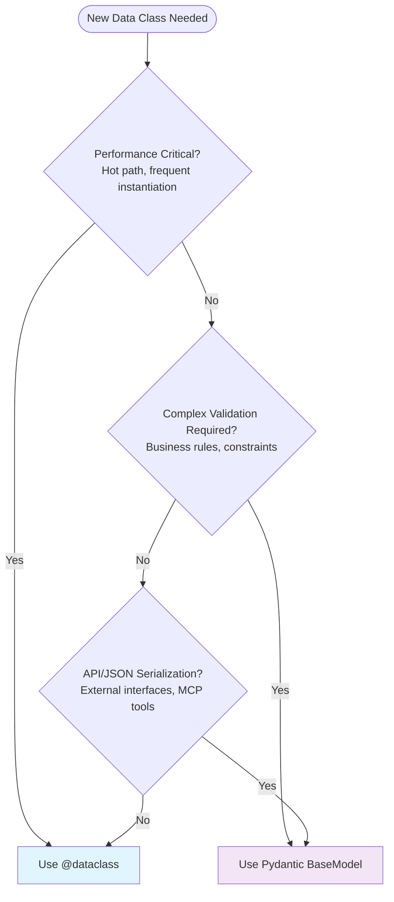

# Data Modeling in Studiorum: Developer Onboarding Guide

**Version**: 1.1
**Date**: 2025-08-25
**Audience**: New team members, developers working on data structures

## Quick Start

When you need to create a new data class in Studiorum, ask yourself:

1. **Need a simple value object?** → Use `@dataclass`
2. **Need validation or JSON serialization?** → Use Pydantic `BaseModel`
3. **Performance critical?** → Use `@dataclass` with slots
4. **Integrating with MCP tools?** → Use Pydantic for JSON support

## Decision Framework

Follow this decision tree for every new data class:



## Implementation Patterns

### 1. Dataclass Patterns

#### Simple Value Object

```python
@dataclass(frozen=True)
class Point:
    """Immutable coordinate point."""
    x: float
    y: float

    def distance_to(self, other: 'Point') -> float:
        return ((self.x - other.x)**2 + (self.y - other.y)**2)**0.5
```

#### Performance-Optimized Type

```python
@dataclass(frozen=True, slots=True)
class ProcessingStats:
    """High-performance statistics tracking."""
    processed: int = 0
    errors: int = 0
    duration_ms: float = 0.0

    def __post_init__(self) -> None:
        # Minimal validation only
        if self.processed < 0:
            raise ValueError("Processed count cannot be negative")
```

#### Mutable Business Object

```python
@dataclass
class GameState:
    """Mutable game state with validation."""
    round: int = 1
    active_players: list[str] = field(default_factory=list)

    def __post_init__(self) -> None:
        if self.round < 1:
            raise ValueError("Round must be positive")
        if len(self.active_players) > 8:
            raise ValueError("Maximum 8 players allowed")
```

### 2. Pydantic Patterns

#### Configuration Class

```python
class DatabaseConfig(BaseModel):
    """Database configuration with validation."""

    model_config = ConfigDict(
        env_prefix='DB_',
        case_sensitive=False,
        validate_default=True
    )

    host: str = Field(default="localhost", description="Database host")
    port: int = Field(default=5432, ge=1, le=65535, description="Database port")
    database: str = Field(..., min_length=1, description="Database name")
    username: str = Field(..., min_length=1, description="Username")
    password: str = Field(..., description="Password")

    @field_validator('host')
    @classmethod
    def validate_host(cls, v: str) -> str:
        if not v.strip():
            raise ValueError("Host cannot be empty")
        return v.strip()
```

#### API Request/Response Models

```python
class CreateUserRequest(BaseModel):
    """API request for creating a user."""

    model_config = ConfigDict(extra="forbid")

    username: str = Field(..., min_length=3, max_length=50, pattern=r'^[a-zA-Z0-9_]+$')
    email: EmailStr = Field(..., description="Valid email address")
    age: int | None = Field(None, ge=13, le=120, description="User age")

    @field_validator('username')
    @classmethod
    def normalize_username(cls, v: str) -> str:
        return v.lower().strip()

class CreateUserResponse(BaseModel):
    """API response for user creation."""

    success: bool
    user_id: str | None = None
    error: str | None = None
    created_at: datetime = Field(default_factory=datetime.now)
```

#### Business Logic with Complex Validation

```python
class EncounterConfig(BaseModel):
    """5e encounter configuration with business rules."""

    model_config = ConfigDict(
        extra="forbid",
        use_enum_values=True,
        validate_assignment=True
    )

    name: str = Field(..., min_length=1, max_length=100)
    difficulty: DifficultyLevel
    min_party_level: int = Field(..., ge=1, le=20)
    max_party_level: int = Field(..., ge=1, le=20)
    creatures: list[CreatureConfig] = Field(..., min_items=1)

    @field_validator('name')
    @classmethod
    def validate_name(cls, v: str) -> str:
        normalized = v.strip()
        if not normalized:
            raise ValueError("Encounter name cannot be empty")
        return normalized

    @model_validator(mode='after')
    def validate_level_range(self) -> Self:
        if self.min_party_level > self.max_party_level:
            raise ValueError("Min party level cannot exceed max party level")
        return self

    @model_validator(mode='after')
    def validate_difficulty_alignment(self) -> Self:
        # Complex business rule: legendary creatures require higher difficulty
        legendary_count = sum(1 for c in self.creatures if c.is_legendary)
        if legendary_count > 0 and self.difficulty == DifficultyLevel.EASY:
            raise ValueError("Legendary creatures require difficulty above Easy")
        return self
```

## Common Use Cases

### Configuration Classes (Always Pydantic)

```python
class LaTeXConfig(BaseModel):
    """LaTeX compilation configuration."""

    model_config = ConfigDict(env_prefix='LATEX_')

    compiler: Literal['pdflatex', 'xelatex', 'lualatex'] = 'pdflatex'
    timeout: int = Field(default=30, ge=5, le=300)
    max_runs: int = Field(default=3, ge=1, le=10)
    output_dir: Path = Field(default=Path('./output'))

    @field_validator('output_dir')
    @classmethod
    def ensure_output_dir_exists(cls, v: Path) -> Path:
        v.mkdir(parents=True, exist_ok=True)
        return v
```

### Internal Value Objects (Usually Dataclass)

```python
@dataclass(frozen=True, slots=True)
class CacheKey:
    """Cache key for content lookup."""
    content_type: str
    content_id: str
    version: str = "latest"

    def __str__(self) -> str:
        return f"{self.content_type}:{self.content_id}:{self.version}"

@dataclass(frozen=True)
class SearchResult:
    """Search result item."""
    title: str
    content_id: str
    score: float
    metadata: dict[str, Any] = field(default_factory=dict)
```

### API Integration (Always Pydantic)

```python
class MCPToolRequest(BaseModel):
    """MCP tool request structure."""

    model_config = ConfigDict(extra="allow")  # MCP allows extra fields

    tool: str = Field(..., min_length=1)
    arguments: dict[str, Any] = Field(default_factory=dict)

class MCPToolResponse(BaseModel):
    """MCP tool response structure."""

    content: list[dict[str, Any]] = Field(default_factory=list)
    isError: bool = False
```

## Migration Examples

### Dataclass to Pydantic (When Validation Needed)

**Before**:

```python
@dataclass
class UserPreferences:
    theme: str = "default"
    language: str = "en"
    notifications: bool = True

    def __post_init__(self):
        if self.theme not in ["default", "dark", "light"]:
            raise ValueError("Invalid theme")
        if len(self.language) != 2:
            raise ValueError("Language must be 2-letter code")
```

**After**:

```python
class UserPreferences(BaseModel):
    """User preferences with comprehensive validation."""

    model_config = ConfigDict(extra="forbid")

    theme: Literal["default", "dark", "light"] = "default"
    language: str = Field(
        default="en",
        min_length=2,
        max_length=2,
        pattern=r'^[a-z]{2}$'
    )
    notifications: bool = True

    @field_validator('language')
    @classmethod
    def validate_language(cls, v: str) -> str:
        return v.lower()
```

### When NOT to Migrate

Keep as dataclass when:

```python
# Performance-critical internal types
@dataclass(frozen=True, slots=True)
class ProcessingMetrics:
    """Keep as dataclass - used in hot path."""
    start_time: float
    end_time: float
    items_processed: int

    @property
    def duration(self) -> float:
        return self.end_time - self.start_time

# Simple value objects
@dataclass(frozen=True)
class Rectangle:
    """Keep as dataclass - simple geometry."""
    width: float
    height: float

    def area(self) -> float:
        return self.width * self.height
```

## Development Workflow

### 1. Design Phase

- Identify the primary use case (performance, validation, serialization)
- Choose dataclass or Pydantic based on decision framework
- Consider future evolution (might need validation later?)

### 2. Implementation Phase

```python
# Start with basic structure
class MyModel(BaseModel):  # or @dataclass
    field1: str
    field2: int

# Add validation incrementally
class MyModel(BaseModel):
    model_config = ConfigDict(extra="forbid")

    field1: str = Field(..., min_length=1)
    field2: int = Field(..., ge=0)
```

### 3. Testing Phase

```python
def test_my_model_validation():
    """Test validation behavior."""
    # Test valid input
    model = MyModel(field1="test", field2=5)
    assert model.field1 == "test"

    # Test validation
    with pytest.raises(ValidationError) as exc:
        MyModel(field1="", field2=-1)

    errors = exc.value.errors()
    assert len(errors) == 2
    assert "field1" in str(errors[0])
    assert "field2" in str(errors[1])
```

## Best Practices

### Dataclass Best Practices

1. **Use `frozen=True` for immutable types**
2. **Use `slots=True` for performance-critical types**
3. **Keep validation minimal in `__post_init__`**
4. **Use `field(default_factory=dict)` for mutable defaults**
5. **Add type hints for all fields**

```python
@dataclass(frozen=True, slots=True)
class Good:
    name: str
    values: list[int] = field(default_factory=list)

    def __post_init__(self) -> None:
        # Only essential validation
        if not self.name:
            raise ValueError("Name required")
```

### Pydantic Best Practices

1. **Always use `ConfigDict(extra="forbid")` for strict validation**
2. **Use `Field()` for constraints and documentation**
3. **Prefer field constraints over custom validators when possible**
4. **Use `@model_validator(mode='after')` for cross-field validation**
5. **Document validation rules in Field descriptions**

```python
class Good(BaseModel):
    model_config = ConfigDict(extra="forbid")

    name: str = Field(..., min_length=1, description="Required name")
    age: int = Field(..., ge=0, le=150, description="Age in years")

    @field_validator('name')
    @classmethod
    def normalize_name(cls, v: str) -> str:
        return v.strip().title()
```

## Common Pitfalls

### Dataclass Pitfalls

❌ **Mutable default values**:

```python
@dataclass
class Bad:
    items: list = []  # Shared across instances!

@dataclass
class Good:
    items: list = field(default_factory=list)  # New list per instance
```

❌ **Complex validation logic**:

```python
@dataclass
class Bad:
    def __post_init__(self):
        # Too much validation logic - use Pydantic instead
        if not self.email or "@" not in self.email:
            raise ValueError("Invalid email")
        if self.age < 0 or self.age > 150:
            raise ValueError("Invalid age")
```

### Pydantic Pitfalls

❌ **Missing `extra="forbid"`**:

```python
class Bad(BaseModel):
    name: str
    # Allows any extra fields - potential security issue

class Good(BaseModel):
    model_config = ConfigDict(extra="forbid")
    name: str
```

❌ **Over-complex validation**:

```python
class Bad(BaseModel):
    @field_validator('field')
    @classmethod
    def validate_field(cls, v):
        # 50 lines of validation logic - split into multiple validators
        pass
```

❌ **Using `Any` types**:

```python
class Bad(BaseModel):
    data: Any  # Loses type safety

class Good(BaseModel):
    data: dict[str, str] | list[int]  # Specific union type
```

## Tools and IDE Support

### MyPy Integration

Both patterns work well with MyPy:

```bash
# Type check your models
uv run mypy src/your_module.py
```

### IDE Support

- **Dataclass**: Good autocomplete, less validation hints
- **Pydantic**: Excellent IDE support, Field constraint hints

### Testing Tools

```python
# For Pydantic models
from pydantic import ValidationError
import pytest

def test_validation():
    with pytest.raises(ValidationError) as exc:
        MyModel(invalid_field="test")

    errors = exc.value.errors()
    assert len(errors) == 1
    assert errors[0]['type'] == 'missing'
```

## Getting Help

### Code Review

- Tag `@architecture-team` for complex data modeling decisions
- Include rationale for dataclass vs Pydantic choice in PR description
- Reference this guide in review comments

### Documentation

- **Architectural Decisions**: See `docs/adr/ADR-001-dataclass-pydantic-strategy.md`
- **Type System**: See `/TYPES.md` for type safety patterns
- **Performance**: See performance test results in P5 migration docs

### Common Questions

**Q: Can I mix dataclass and Pydantic in the same module?**
A: Yes, this is normal and expected. Use each pattern where appropriate.

**Q: How do I handle inheritance?**
A: Both support inheritance, but stick to the same pattern within an inheritance hierarchy.

**Q: What about serialization performance?**
A: Pydantic is optimized for JSON. For other formats, consider dataclasses with manual serialization.

**Q: How do I handle optional fields?**
A: Use `field | None = None` for dataclass, `field: str | None = None` for Pydantic.

---

**Next Steps**: Review the [Code Review Checklist](./code-review-checklist-updates.md) and explore [Pattern Examples](./data-modeling-patterns-catalog.md) for more detailed implementation guidance.
