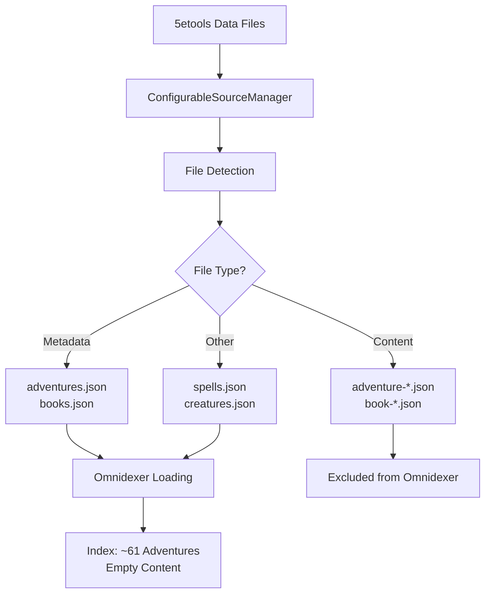
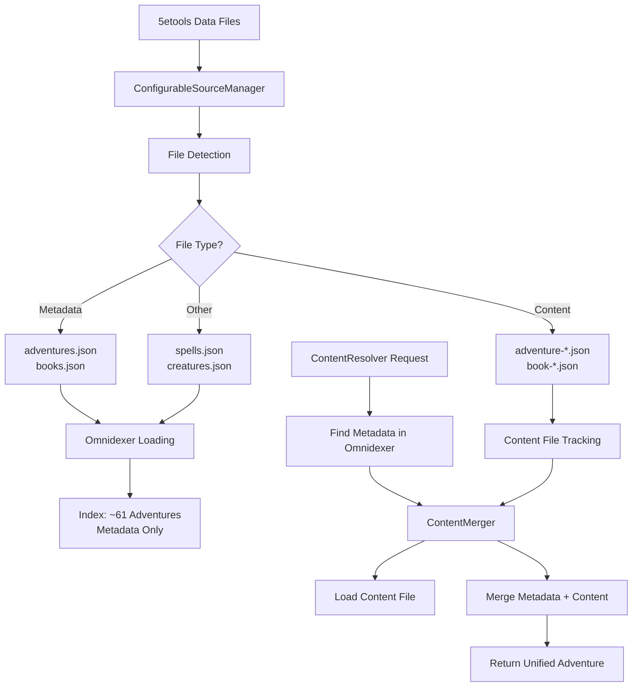

# Loader Architecture: Dual-File System

This document describes the dual-file architecture implemented for D&D 5e content loading, specifically for adventures and books.

## Overview

The 5e2pdf loader system implements a dual-file architecture that mirrors the 5etools data organization. This architecture separates lightweight metadata files from heavy content files to optimize loading performance and memory usage.

## Problem Statement

Originally, the omnidexer loaded both metadata files (e.g., `adventures.json`) and content files (e.g., `adventure-cos.json`) as separate entries, resulting in:

- **94 adventures loaded** instead of the expected ~61 unique adventures
- **Empty content in metadata entries** - adventures had correct names but no actual content
- **Duplicate entries** - both metadata and content versions of the same adventure
- **Resolution failures** - ContentResolver found metadata versions with empty content

## Solution: 5etools Dual-File Architecture

### File Structure

The dual-file architecture follows the 5etools pattern:

```
data/
├── adventures.json          # Metadata for all adventures (names, IDs, TOC)
├── books.json              # Metadata for all books
├── adventure/
│   ├── adventure-cos.json   # Full content for Curse of Strahd
│   ├── adventure-lmop.json  # Full content for Lost Mine of Phandelver
│   └── adventure-*.json     # Full content for other adventures
├── book/
│   ├── book-phb.json       # Full content for Player's Handbook
│   ├── book-mm.json        # Full content for Monster Manual
│   └── book-*.json         # Full content for other books
└── spells.json             # Other content types (single file)
```

### File Types

#### Metadata Files
- **Names**: `adventures.json`, `books.json` (exact filenames)
- **Purpose**: Lightweight index with names, IDs, table of contents structure
- **Loading**: Loaded at startup by omnidexer
- **Content**: Minimal adventure/book info with empty or stub content entries

#### Content Files
- **Names**: `adventure-{id}.json`, `book-{id}.json` (pattern-based)
- **Purpose**: Heavy content data with actual entries, text, mechanics
- **Loading**: Loaded on-demand when specific content is requested
- **Content**: Full adventure/book data with detailed entries

## Implementation

### Phase 1: Source Discovery (Completed)

The source discovery system was updated to properly separate metadata from content files:

#### ConfigurableSourceManager

```python
class ConfigurableSourceManager:
    def _is_metadata_file(self, file_path: Path) -> bool:
        """Check if file is a metadata file (adventures.json, books.json)."""
        filename = file_path.name.lower()
        metadata_files = {"adventures.json", "books.json"}
        return filename in metadata_files

    def _is_content_file(self, file_path: Path) -> bool:
        """Check if file is a content file (adventure-*.json, book-*.json)."""
        filename = file_path.name.lower()
        content_patterns = ["adventure-", "book-"]
        return filename.endswith(".json") and any(
            filename.startswith(pattern) for pattern in content_patterns
        )

    def get_data_paths(self) -> dict[ContentType, list[Path]]:
        """Return only metadata files for adventures/books to omnidexer."""
        # Implementation filters out content files

    def get_metadata_files(self) -> dict[ContentType, list[Path]]:
        """Return paths to metadata files organized by content type."""

    def get_content_files(self) -> dict[ContentType, list[Path]]:
        """Return paths to content files organized by content type."""
```

#### SourceManager Interface

The abstract `SourceManager` interface was extended to support dual-file operations:

```python
class SourceManager(ABC):
    @abstractmethod
    def get_data_paths(self) -> dict[ContentType, list[Path]]:
        """Return metadata files for omnidexer loading."""

    @abstractmethod
    def get_metadata_files(self) -> dict[ContentType, list[Path]]:
        """Return paths to metadata files."""

    @abstractmethod
    def get_content_files(self) -> dict[ContentType, list[Path]]:
        """Return paths to content files for on-demand loading."""
```

### Phase 2: On-Demand Content Loading (Planned)

The next phase will implement on-demand content loading and merging:

#### ContentMerger (Planned)

```python
class ContentMerger:
    """Merges metadata and content files for adventures/books."""

    def load_content_file(self, adventure_id: str) -> dict:
        """Load content file by adventure ID."""

    def merge_metadata_content(self, metadata: Adventure, content: dict) -> Adventure:
        """Merge metadata structure with content data."""
```

#### ContentResolver Updates (Planned)

```python
class ContentResolver:
    def resolve_adventure(self, name: str) -> Adventure:
        """Resolve adventure by loading metadata + content on-demand."""
        # 1. Find metadata entry in omnidexer
        # 2. Load corresponding content file
        # 3. Merge metadata + content
        # 4. Return unified Adventure object
```

## Data Flow

### Current Flow (Phase 1)



### Target Flow (Phase 2)



## Benefits

### Performance
- **Faster startup**: Omnidexer only loads lightweight metadata files
- **Lower memory usage**: Heavy content loaded only when needed
- **Scalable**: System performance doesn't degrade with large content libraries

### Correctness
- **No duplicates**: Each adventure appears once in omnidexer
- **Complete content**: On-demand loading provides full adventure data
- **Proper resolution**: ContentResolver finds correct adventures with content

### Maintainability
- **Clear separation**: Metadata and content concerns are separate
- **5etools compatibility**: Follows established 5etools architecture patterns
- **Extensible**: Pattern applies to any dual-file content type

## File Naming Conventions

### Metadata Files
- `adventures.json` - Adventure metadata (exact filename)
- `books.json` - Book metadata (exact filename)

### Content Files
- `adventure-{id}.json` - Adventure content (ID in lowercase)
- `book-{id}.json` - Book content (ID in lowercase)

### ID Normalization
Adventure IDs are normalized from metadata to content filenames:
- `CoS` → `adventure-cos.json`
- `LMoP` → `adventure-lmop.json`
- `DrDe-ACfaS` → `adventure-drde-acfas.json`

## Error Handling

### Missing Content Files
When a content file is missing:
1. Log warning about missing content file
2. Return metadata-only version with empty content
3. Allow graceful degradation

### Malformed Files
When files are malformed:
1. Log validation errors with file paths
2. Skip problematic entries
3. Continue loading other valid entries

### File System Errors
Handle common file system issues:
1. Permission errors
2. Network timeouts (for remote sources)
3. Disk space issues

## Testing Strategy

Comprehensive testing covers all aspects of the dual-file architecture:

### Unit Tests
- File pattern detection (`_is_metadata_file`, `_is_content_file`)
- Interface compliance (`SourceManager` implementations)
- Edge cases (malformed filenames, empty files)

### Integration Tests
- End-to-end omnidexer loading with filtered files
- Metadata vs content file separation verification
- Error handling for missing files

### Performance Tests
- Memory usage comparison (before/after)
- Loading time benchmarks
- Scalability with large datasets

## Migration Guide

For systems upgrading to the dual-file architecture:

### Before (Broken State)
```python
# Omnidexer loads both metadata and content files
omnidexer.load_all_data()
adventures = omnidexer.get_all_by_type(ContentType.ADVENTURE)
# Result: 94 adventures, many with empty content
```

### After (Fixed State)
```python
# Omnidexer loads only metadata files
omnidexer.load_all_data()
adventures = omnidexer.get_all_by_type(ContentType.ADVENTURE)
# Result: ~61 adventures with metadata

# Content loaded on-demand (Phase 2)
resolver = ContentResolver(omnidexer)
cos_adventure = resolver.resolve_adventure("cos")
# Result: Complete adventure with merged metadata + content
```

## Future Enhancements

### Content Caching
- Cache merged adventure objects to avoid re-parsing
- Implement LRU eviction for memory management
- Add cache invalidation based on file modification times

### Parallel Loading
- Load multiple content files concurrently
- Implement connection pooling for remote sources
- Add progress tracking for long operations

### Content Validation
- Validate metadata-content consistency
- Check for orphaned content files
- Verify ID normalization correctness

## Related Documentation

- [Source Manager API](../api/loaders.md#source-management)
- [Omnidexer Implementation](../developer/api/omnidexer.md)
- [Content Resolution](../user-guide/advanced-features.md)
- [Performance Optimization](../user-guide/troubleshooting.md)
