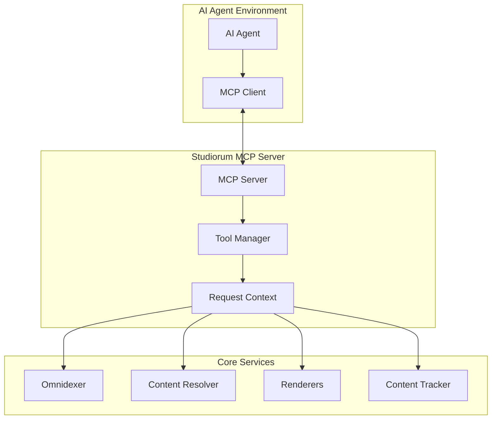

# AI Agent Development

!!! warning "Experimental"
    This is highly unstable and needs testing. The CLI is the primary interface for now.

Studiorum provides comprehensive MCP (Model Context Protocol) integration, enabling AI agents to dynamically convert D&D 5e content, search databases, and generate professional PDFs.

## MCP Architecture Overview

### Server Architecture

Studiorum's MCP server provides AI agents with:

- **Content Discovery**: Search and browse the complete D&D 5e dataset
- **Dynamic Conversion**: Generate LaTeX/PDF documents on demand
- **Cross-References**: Automatic appendix generation and content linking
- **Performance Monitoring**: Built-in metrics and caching



### Request Context Pattern

All MCP tools use AsyncRequestContext for service access:

```python
from studiorum.core.async_request_context import AsyncRequestContext
from studiorum.mcp.core.decorators import mcp_tool

@mcp_tool("lookup_creature")
async def lookup_creature_tool(
    ctx: AsyncRequestContext,
    name: str,
    include_actions: bool = True
) -> dict[str, Any]:
    """Look up creature with full stat block data."""

    # Get services through context
    omnidexer = await ctx.get_service(OmnidexerProtocol)
    resolver = await ctx.get_service(ContentResolverProtocol)

    # Perform lookup with error handling
    creature = omnidexer.get_creature_by_name(name)
    if not creature:
        return {
            "error": f"Creature not found: {name}",
            "suggestions": omnidexer.suggest_creature_names(name)
        }

    # Resolve full data if needed
    resolution_result = resolver.resolve_creature(creature.id)
    if isinstance(resolution_result, Error):
        return {
            "error": f"Failed to resolve creature: {resolution_result.error}"
        }

    resolved_creature = resolution_result.unwrap()

    # Build response with comprehensive data
    response = {
        "name": resolved_creature.name,
        "size": resolved_creature.size.value,
        "type": resolved_creature.creature_type.value,
        "challenge_rating": resolved_creature.challenge_rating.rating,
        "armor_class": resolved_creature.armor_class.display_value,
        "hit_points": resolved_creature.hit_points.display_value,
        "speeds": [speed.display for speed in resolved_creature.speeds],
        "ability_scores": {
            "strength": resolved_creature.ability_scores.strength,
            "dexterity": resolved_creature.ability_scores.dexterity,
            "constitution": resolved_creature.ability_scores.constitution,
            "intelligence": resolved_creature.ability_scores.intelligence,
            "wisdom": resolved_creature.ability_scores.wisdom,
            "charisma": resolved_creature.ability_scores.charisma
        },
        "source": {
            "book": resolved_creature.source.abbreviation,
            "page": resolved_creature.page
        }
    }

    # Include actions if requested
    if include_actions and resolved_creature.actions:
        response["actions"] = [
            {
                "name": action.name,
                "description": action.description,
                "attack_bonus": action.attack_bonus,
                "damage": [
                    {
                        "dice": dmg.dice,
                        "type": dmg.damage_type.value
                    }
                    for dmg in action.damage
                ]
            }
            for action in resolved_creature.actions
        ]

    return response
```

## Available MCP Tools

### Content Lookup Tools

#### lookup_creature

Look up individual creatures with complete stat blocks:

```python
@mcp_tool("lookup_creature")
async def lookup_creature(
    ctx: AsyncRequestContext,
    name: str,
    include_actions: bool = True,
    include_legendary_actions: bool = True,
    include_spells: bool = False
) -> dict[str, Any]:
    """
    Look up a D&D creature by name.

    Args:
        name: Creature name (e.g., "Ancient Red Dragon")
        include_actions: Include action descriptions
        include_legendary_actions: Include legendary actions
        include_spells: Include spellcasting information

    Returns:
        Comprehensive creature data including stats, actions, and metadata
    """
```

**Usage Examples:**

```python
# Basic creature lookup
result = await lookup_creature(ctx, "Beholder")

# Full creature data with all details
result = await lookup_creature(
    ctx,
    "Ancient Red Dragon",
    include_actions=True,
    include_legendary_actions=True,
    include_spells=True
)

# Response format
{
    "name": "Ancient Red Dragon",
    "size": "gargantuan",
    "type": "dragon",
    "challenge_rating": "24",
    "armor_class": "22 (Natural Armor)",
    "hit_points": "546 (28d20 + 252)",
    "speeds": ["40 ft.", "climb 40 ft.", "fly 80 ft."],
    "ability_scores": {
        "strength": 30, "dexterity": 10, "constitution": 29,
        "intelligence": 18, "wisdom": 15, "charisma": 23
    },
    "actions": [...],
    "legendary_actions": [...],
    "source": {"book": "MM", "page": 98}
}
```

#### search_creatures

Search creatures with flexible filters:

```python
@mcp_tool("search_creatures")
async def search_creatures(
    ctx: AsyncRequestContext,
    query: str | None = None,
    challenge_rating: str | None = None,
    creature_type: str | None = None,
    size: str | None = None,
    environment: str | None = None,
    source: str | None = None,
    limit: int = 20
) -> dict[str, Any]:
    """
    Search creatures with filters.

    Args:
        query: Text search query
        challenge_rating: CR filter (e.g., "5", "10-15", "1/2")
        creature_type: Type filter (e.g., "dragon", "undead")
        size: Size filter (e.g., "large", "huge")
        environment: Environment filter (e.g., "forest", "underdark")
        source: Source book filter (e.g., "MM", "VGtM")
        limit: Maximum results to return

    Returns:
        List of matching creatures with basic information
    """
```

#### lookup_spell

Look up spells with complete descriptions:

```python
@mcp_tool("lookup_spell")
async def lookup_spell(
    ctx: AsyncRequestContext,
    name: str,
    include_higher_levels: bool = True,
    include_classes: bool = True
) -> dict[str, Any]:
    """Look up a D&D spell by name with complete description."""
```

#### search_spells

Search spells with class, level, and school filters:

```python
@mcp_tool("search_spells")
async def search_spells(
    ctx: AsyncRequestContext,
    query: str | None = None,
    level: int | str | None = None,
    school: str | None = None,
    spell_class: str | None = None,
    ritual: bool | None = None,
    concentration: bool | None = None,
    limit: int = 50
) -> dict[str, Any]:
    """Search spells with comprehensive filters."""
```

### Content Conversion Tools

#### convert_adventure

Convert complete adventures to LaTeX/PDF:

```python
@mcp_tool("convert_adventure")
async def convert_adventure(
    ctx: AsyncRequestContext,
    name: str,
    format: str = "latex",
    include_creatures: bool = False,
    include_spells: bool = False,
    include_items: bool = False,
    compiler: str = "pdflatex"
) -> dict[str, Any]:
    """
    Convert a D&D adventure to LaTeX or PDF format.

    Args:
        name: Adventure name or abbreviation
        format: Output format ("latex" or "pdf")
        include_creatures: Add creatures appendix
        include_spells: Add spells appendix
        include_items: Add magic items appendix
        compiler: LaTeX compiler for PDF generation

    Returns:
        Conversion result with content or file path
    """
```

**Usage Examples:**

```python
# Convert adventure to LaTeX
result = await convert_adventure(
    ctx,
    "Lost Mine of Phandelver",
    format="latex",
    include_creatures=True,
    include_spells=True
)

# Generate complete PDF with appendices
result = await convert_adventure(
    ctx,
    "Curse of Strahd",
    format="pdf",
    include_creatures=True,
    include_spells=True,
    include_items=True,
    compiler="xelatex"
)

# Response format
{
    "success": True,
    "format": "pdf",
    "output_path": "/tmp/curse-of-strahd-complete.pdf",
    "size_bytes": 2457600,
    "page_count": 142,
    "appendices": {
        "creatures": 25,
        "spells": 18,
        "items": 12
    },
    "compilation_time_ms": 8450
}
```

#### convert_creatures

Convert creature collections:

```python
@mcp_tool("convert_creatures")
async def convert_creatures(
    ctx: AsyncRequestContext,
    names: list[str] | None = None,
    challenge_rating: str | None = None,
    creature_type: str | None = None,
    format: str = "latex",
    template: str = "stat-blocks"
) -> dict[str, Any]:
    """Convert multiple creatures to formatted output."""
```

#### convert_custom_content

Convert custom content collections:

```python
@mcp_tool("convert_custom_content")
async def convert_custom_content(
    ctx: AsyncRequestContext,
    content_spec: dict[str, Any],
    format: str = "latex",
    title: str | None = None,
    include_toc: bool = True
) -> dict[str, Any]:
    """
    Convert custom content specification to formatted output.

    Args:
        content_spec: Specification of content to include
        format: Output format
        title: Document title
        include_toc: Include table of contents
    """
```

**Content Specification Format:**

```python
content_spec = {
    "creatures": [
        {"name": "Ancient Red Dragon", "include_lair": True},
        {"challenge_rating": "10-15", "type": "dragon", "limit": 5}
    ],
    "spells": [
        {"level": 3, "school": "evocation", "limit": 10},
        {"names": ["Fireball", "Lightning Bolt", "Counterspell"]}
    ],
    "adventures": [
        {"name": "Lost Mine of Phandelver", "chapters": [1, 2, 3]}
    ],
    "custom_sections": [
        {
            "title": "House Rules",
            "content": "Custom campaign rules and modifications..."
        }
    ]
}
```

### Content Discovery Tools

#### list_adventures

List available adventures:

```python
@mcp_tool("list_adventures")
async def list_adventures(
    ctx: AsyncRequestContext,
    source: str | None = None,
    min_level: int | None = None,
    max_level: int | None = None
) -> dict[str, Any]:
    """List available D&D adventures with metadata."""
```

#### get_content_statistics

Get comprehensive content statistics:

```python
@mcp_tool("get_content_statistics")
async def get_content_statistics(
    ctx: AsyncRequestContext,
    source: str | None = None
) -> dict[str, Any]:
    """
    Get statistics about available D&D content.

    Returns:
        Comprehensive statistics including counts by type, CR distribution,
        level distribution, source breakdown, etc.
    """
```

**Response Format:**

```python
{
    "content_counts": {
        "creatures": 2847,
        "spells": 1243,
        "items": 892,
        "adventures": 47,
        "books": 25
    },
    "creature_stats": {
        "by_challenge_rating": {
            "0": 45, "1/8": 32, "1/4": 68, "1/2": 89,
            "1": 156, "2": 134, # ... etc
        },
        "by_type": {
            "humanoid": 412, "beast": 387, "monstrosity": 245,
            "dragon": 89, "undead": 156 # ... etc
        },
        "by_size": {
            "tiny": 89, "small": 234, "medium": 1245,
            "large": 567, "huge": 234, "gargantuan": 89
        }
    },
    "spell_stats": {
        "by_level": {
            "0": 67, "1": 156, "2": 134, # ... etc
        },
        "by_school": {
            "evocation": 187, "conjuration": 156, # ... etc
        }
    },
    "sources": {
        "MY-HOMEBREW": {"creatures": 67, "spells": 345, "items": 123},
        "MONSTER-COLLECTION": {"creatures": 456, "spells": 0, "items": 12},
        # ... etc
    }
}
```

## Advanced MCP Patterns

### Batch Processing

Process multiple items efficiently:

```python
@mcp_tool("batch_creature_lookup")
async def batch_creature_lookup(
    ctx: AsyncRequestContext,
    names: list[str],
    format: str = "summary"
) -> dict[str, Any]:
    """Look up multiple creatures efficiently."""

    omnidexer = await ctx.get_service(OmnidexerProtocol)

    results = []
    not_found = []

    # Process in parallel chunks
    chunk_size = 10
    for i in range(0, len(names), chunk_size):
        chunk = names[i:i + chunk_size]

        # Process chunk
        chunk_results = []
        for name in chunk:
            creature = omnidexer.get_creature_by_name(name)
            if creature:
                if format == "summary":
                    chunk_results.append({
                        "name": creature.name,
                        "cr": creature.challenge_rating.rating,
                        "type": f"{creature.size.value} {creature.creature_type.value}"
                    })
                else:
                    # Full lookup for detailed format
                    full_result = await lookup_creature_tool(ctx, name)
                    chunk_results.append(full_result)
            else:
                not_found.append(name)

        results.extend(chunk_results)

    return {
        "results": results,
        "found_count": len(results),
        "not_found": not_found,
        "total_requested": len(names)
    }
```

### Content Generation Pipeline

Create complex content generation workflows:

```python
@mcp_tool("generate_encounter")
async def generate_encounter(
    ctx: AsyncRequestContext,
    party_level: int,
    party_size: int,
    difficulty: str = "medium",
    environment: str | None = None,
    theme: str | None = None
) -> dict[str, Any]:
    """Generate a balanced encounter for a party."""

    omnidexer = await ctx.get_service(OmnidexerProtocol)

    # Calculate encounter budget
    encounter_budget = calculate_encounter_budget(party_level, party_size, difficulty)

    # Find suitable creatures
    suitable_creatures = omnidexer.search_creatures(
        challenge_rating=f"1-{party_level + 2}",
        environment=environment
    )

    # Apply theme filtering
    if theme:
        suitable_creatures = filter_creatures_by_theme(suitable_creatures, theme)

    # Generate encounter combinations
    encounter_combinations = generate_encounter_combinations(
        suitable_creatures,
        encounter_budget,
        max_combinations=10
    )

    # Select best combination
    selected_encounter = select_best_encounter(encounter_combinations)

    # Generate encounter details
    encounter_details = {
        "difficulty": difficulty,
        "total_xp_budget": encounter_budget,
        "adjusted_xp": selected_encounter["adjusted_xp"],
        "creatures": []
    }

    # Add creature details
    for creature_spec in selected_encounter["creatures"]:
        creature = omnidexer.get_creature_by_name(creature_spec["name"])
        encounter_details["creatures"].append({
            "name": creature.name,
            "count": creature_spec["count"],
            "challenge_rating": creature.challenge_rating.rating,
            "xp_each": creature.challenge_rating.experience_points,
            "total_xp": creature.challenge_rating.experience_points * creature_spec["count"],
            "role": infer_creature_role(creature),
            "tactics": generate_creature_tactics(creature)
        })

    return encounter_details
```

### Performance Monitoring

Built-in performance monitoring for MCP operations:

```python
@mcp_tool("get_performance_metrics")
async def get_performance_metrics(
    ctx: AsyncRequestContext,
    time_range: str = "1h"
) -> dict[str, Any]:
    """Get MCP server performance metrics."""

    # This would access the performance monitoring service
    perf_service = await ctx.get_service(PerformanceMonitoringProtocol)

    metrics = perf_service.get_metrics(time_range)

    return {
        "time_range": time_range,
        "total_requests": metrics.total_requests,
        "average_response_time_ms": metrics.average_response_time,
        "success_rate": metrics.success_rate,
        "tool_usage": {
            tool_name: {
                "requests": stats.request_count,
                "avg_time_ms": stats.average_time,
                "error_rate": stats.error_rate
            }
            for tool_name, stats in metrics.tool_stats.items()
        },
        "cache_stats": {
            "hit_rate": metrics.cache_hit_rate,
            "cache_size_mb": metrics.cache_size_bytes / (1024 * 1024)
        }
    }
```

## Custom MCP Tools

### Creating Custom Tools

Extend studiorum with domain-specific tools:

```python
from studiorum.mcp.core.decorators import mcp_tool
from studiorum.core.async_request_context import AsyncRequestContext

@mcp_tool("campaign_manager")
async def campaign_manager_tool(
    ctx: AsyncRequestContext,
    action: str,
    campaign_id: str,
    data: dict[str, Any] | None = None
) -> dict[str, Any]:
    """
    Manage campaign-specific content and state.

    Actions:
        - create_session_notes
        - track_character_progression
        - manage_story_hooks
        - generate_random_encounters
    """

    # Get custom campaign service
    campaign_service = await ctx.get_service(CampaignManagerProtocol)

    if action == "create_session_notes":
        return await _create_session_notes(campaign_service, campaign_id, data)
    elif action == "track_character_progression":
        return await _track_character_progression(campaign_service, campaign_id, data)
    elif action == "manage_story_hooks":
        return await _manage_story_hooks(campaign_service, campaign_id, data)
    elif action == "generate_random_encounters":
        return await _generate_random_encounters(campaign_service, campaign_id, data)
    else:
        return {"error": f"Unknown action: {action}"}

async def _create_session_notes(
    service: CampaignManagerProtocol,
    campaign_id: str,
    data: dict[str, Any]
) -> dict[str, Any]:
    """Generate structured session notes."""

    session_data = data.get("session_data", {})

    # Extract key events, combat encounters, story developments
    notes = await service.generate_session_notes(
        campaign_id=campaign_id,
        session_number=session_data.get("session_number"),
        events=session_data.get("events", []),
        combat_encounters=session_data.get("encounters", []),
        story_developments=session_data.get("story", []),
        character_interactions=session_data.get("characters", [])
    )

    return {
        "session_notes": notes,
        "generated_at": datetime.now().isoformat(),
        "campaign_id": campaign_id
    }
```

### Integration with External Services

Connect studiorum to external APIs and services:

```python
@mcp_tool("integrate_roll20")
async def integrate_roll20(
    ctx: AsyncRequestContext,
    action: str,
    campaign_id: str,
    content_spec: dict[str, Any]
) -> dict[str, Any]:
    """Integrate with Roll20 for automatic character sheet updates."""

    # Get Roll20 integration service
    roll20_service = await ctx.get_service(Roll20IntegrationProtocol)
    omnidexer = await ctx.get_service(OmnidexerProtocol)

    if action == "sync_creatures":
        # Get creatures from studiorum
        creatures = []
        for creature_name in content_spec.get("creatures", []):
            creature = omnidexer.get_creature_by_name(creature_name)
            if creature:
                creatures.append(creature)

        # Sync to Roll20
        sync_results = await roll20_service.sync_creatures_to_campaign(
            campaign_id=campaign_id,
            creatures=creatures
        )

        return {
            "synced_creatures": len(sync_results.successful),
            "failed_syncs": len(sync_results.failed),
            "roll20_campaign_id": campaign_id,
            "sync_details": sync_results.details
        }

    elif action == "create_handouts":
        # Generate handouts from adventure content
        adventure_name = content_spec.get("adventure")
        chapters = content_spec.get("chapters", [])

        adventure = omnidexer.get_adventure_by_name(adventure_name)
        if not adventure:
            return {"error": f"Adventure not found: {adventure_name}"}

        # Create handouts for specified chapters
        handout_results = await roll20_service.create_adventure_handouts(
            campaign_id=campaign_id,
            adventure=adventure,
            chapters=chapters,
            include_maps=content_spec.get("include_maps", True),
            include_npcs=content_spec.get("include_npcs", True)
        )

        return {
            "created_handouts": len(handout_results.handouts),
            "handout_details": handout_results.handouts,
            "roll20_campaign_id": campaign_id
        }
```

## AI Agent Examples

### Campaign Preparation Agent

Example of a comprehensive campaign preparation agent:

```python
class CampaignPrepAgent:
    """AI agent for comprehensive campaign preparation."""

    def __init__(self, mcp_client: MCPClient):
        self.mcp = mcp_client

    async def prepare_session(
        self,
        adventure_name: str,
        session_number: int,
        party_level: int,
        party_size: int
    ) -> dict[str, Any]:
        """Prepare everything needed for a game session."""

        # 1. Get adventure information
        adventure_info = await self.mcp.call_tool("lookup_adventure", {
            "name": adventure_name
        })

        # 2. Generate encounter tables for the session
        encounters = await self.mcp.call_tool("generate_encounter_table", {
            "adventure": adventure_name,
            "session": session_number,
            "party_level": party_level,
            "party_size": party_size,
            "encounter_types": ["combat", "social", "exploration"]
        })

        # 3. Prepare NPC stat blocks
        npcs = await self.mcp.call_tool("extract_session_npcs", {
            "adventure": adventure_name,
            "session": session_number
        })

        npc_stat_blocks = []
        for npc in npcs.get("npcs", []):
            if npc.get("has_stats"):
                stats = await self.mcp.call_tool("lookup_creature", {
                    "name": npc["creature_type"]
                })
                npc_stat_blocks.append({
                    "name": npc["name"],
                    "role": npc["role"],
                    "stats": stats
                })

        # 4. Create session handouts
        handouts = await self.mcp.call_tool("generate_session_handouts", {
            "adventure": adventure_name,
            "session": session_number,
            "include_maps": True,
            "include_props": True,
            "include_secrets": False  # Keep secrets for DM
        })

        # 5. Generate comprehensive session PDF
        session_pdf = await self.mcp.call_tool("convert_custom_content", {
            "content_spec": {
                "adventure_sections": [
                    {"name": adventure_name, "session": session_number}
                ],
                "encounters": encounters["encounters"],
                "npcs": npc_stat_blocks,
                "handouts": handouts["handouts"]
            },
            "format": "pdf",
            "title": f"{adventure_name} - Session {session_number}",
            "template": "session-prep"
        })

        return {
            "session_number": session_number,
            "adventure": adventure_name,
            "party_info": {
                "level": party_level,
                "size": party_size
            },
            "encounters": encounters,
            "npcs": npc_stat_blocks,
            "handouts": handouts,
            "session_pdf": session_pdf["output_path"],
            "preparation_time": "5-10 minutes",
            "estimated_play_time": "3-4 hours"
        }

    async def create_campaign_reference(
        self,
        campaign_name: str,
        adventures: list[str],
        custom_content: dict[str, Any] | None = None
    ) -> dict[str, Any]:
        """Create a complete campaign reference document."""

        # Build comprehensive content specification
        content_spec = {
            "title_page": {
                "title": campaign_name,
                "subtitle": "Campaign Reference",
                "include_toc": True
            },
            "adventures": []
        }

        # Add each adventure
        for adventure_name in adventures:
            adventure_content = await self.mcp.call_tool("convert_adventure", {
                "name": adventure_name,
                "format": "latex",
                "include_creatures": True,
                "include_spells": True,
                "include_items": True
            })
            content_spec["adventures"].append(adventure_content)

        # Add custom content if provided
        if custom_content:
            content_spec.update(custom_content)

        # Generate complete campaign book
        campaign_book = await self.mcp.call_tool("convert_custom_content", {
            "content_spec": content_spec,
            "format": "pdf",
            "title": f"{campaign_name} - Complete Reference",
            "include_toc": True,
            "include_index": True
        })

        return {
            "campaign_name": campaign_name,
            "included_adventures": adventures,
            "output_path": campaign_book["output_path"],
            "page_count": campaign_book["page_count"],
            "file_size_mb": campaign_book["size_bytes"] / (1024 * 1024),
            "generation_time": campaign_book["compilation_time_ms"]
        }
```

### Content Discovery Agent

Agent for intelligent content discovery and recommendations:

```python
class ContentDiscoveryAgent:
    """AI agent for discovering and recommending D&D content."""

    async def recommend_creatures_for_adventure(
        self,
        adventure_theme: str,
        party_level: int,
        environment: str | None = None
    ) -> dict[str, Any]:
        """Recommend creatures that fit an adventure theme."""

        # Get base creature pool
        creatures = await self.mcp.call_tool("search_creatures", {
            "challenge_rating": f"1-{party_level + 3}",
            "environment": environment,
            "limit": 100
        })

        # Analyze theme compatibility
        theme_matches = []
        for creature in creatures["results"]:
            compatibility_score = await self._analyze_theme_compatibility(
                creature, adventure_theme
            )

            if compatibility_score > 0.6:  # Good thematic match
                theme_matches.append({
                    **creature,
                    "theme_compatibility": compatibility_score,
                    "recommended_role": self._suggest_encounter_role(creature, adventure_theme),
                    "narrative_hooks": await self._generate_narrative_hooks(
                        creature, adventure_theme
                    )
                })

        # Sort by compatibility and level appropriateness
        theme_matches.sort(
            key=lambda x: (x["theme_compatibility"], -abs(x["level"] - party_level)),
            reverse=True
        )

        return {
            "adventure_theme": adventure_theme,
            "party_level": party_level,
            "environment": environment,
            "recommended_creatures": theme_matches[:20],
            "total_matches": len(theme_matches)
        }

    async def find_content_gaps(
        self,
        campaign_spec: dict[str, Any]
    ) -> dict[str, Any]:
        """Identify content gaps in a campaign specification."""

        # Analyze current campaign content
        current_content = await self._analyze_campaign_content(campaign_spec)

        # Identify gaps
        gaps = {
            "missing_cr_ranges": self._find_missing_cr_ranges(current_content),
            "underrepresented_types": self._find_underrepresented_types(current_content),
            "missing_environments": self._find_missing_environments(current_content),
            "spell_level_gaps": self._find_spell_gaps(current_content),
            "missing_item_rarities": self._find_item_gaps(current_content)
        }

        # Generate recommendations to fill gaps
        recommendations = {}
        for gap_type, gap_data in gaps.items():
            recommendations[gap_type] = await self._generate_gap_recommendations(
                gap_type, gap_data, campaign_spec
            )

        return {
            "campaign_analysis": current_content,
            "identified_gaps": gaps,
            "recommendations": recommendations,
            "priority_additions": self._prioritize_recommendations(recommendations)
        }
```

## Testing MCP Tools

### Tool Testing Patterns

```python
import pytest
from unittest.mock import Mock, AsyncMock
from studiorum.core.async_request_context import AsyncRequestContext

class TestMCPTools:
    async def test_lookup_creature_tool(self):
        """Test creature lookup MCP tool."""

        # Create mock context and services
        mock_ctx = Mock(spec=AsyncRequestContext)
        mock_omnidexer = AsyncMock()
        mock_resolver = AsyncMock()

        # Configure mock services
        mock_ctx.get_service.side_effect = lambda protocol: {
            OmnidexerProtocol: mock_omnidexer,
            ContentResolverProtocol: mock_resolver
        }[protocol]

        # Create mock creature
        mock_creature = Mock()
        mock_creature.name = "Ancient Red Dragon"
        mock_creature.challenge_rating.rating = "24"
        mock_creature.size.value = "gargantuan"
        mock_creature.creature_type.value = "dragon"

        mock_omnidexer.get_creature_by_name.return_value = mock_creature
        mock_resolver.resolve_creature.return_value = Success(mock_creature)

        # Test the tool
        result = await lookup_creature_tool(
            mock_ctx,
            "Ancient Red Dragon"
        )

        # Verify results
        assert result["name"] == "Ancient Red Dragon"
        assert result["challenge_rating"] == "24"
        assert result["size"] == "gargantuan"
        assert result["type"] == "dragon"

        # Verify service calls
        mock_omnidexer.get_creature_by_name.assert_called_once_with("Ancient Red Dragon")
        mock_resolver.resolve_creature.assert_called_once()

    async def test_tool_error_handling(self):
        """Test error handling in MCP tools."""

        mock_ctx = Mock(spec=AsyncRequestContext)
        mock_omnidexer = AsyncMock()

        # Configure service to return None (not found)
        mock_ctx.get_service.return_value = mock_omnidexer
        mock_omnidexer.get_creature_by_name.return_value = None
        mock_omnidexer.suggest_creature_names.return_value = ["Red Dragon", "Blue Dragon"]

        # Test tool with nonexistent creature
        result = await lookup_creature_tool(
            mock_ctx,
            "Nonexistent Creature"
        )

        # Verify error response
        assert "error" in result
        assert "Nonexistent Creature" in result["error"]
        assert "suggestions" in result
        assert len(result["suggestions"]) > 0
```

### Integration Testing

```python
@pytest.mark.mcp_integration
class TestMCPIntegration:
    async def test_full_adventure_conversion_workflow(self):
        """Test complete adventure conversion workflow."""

        # This would use a real MCP server instance
        async with MCPTestServer() as server:
            # Test adventure lookup
            adventure_list = await server.call_tool("list_adventures")
            assert len(adventure_list["adventures"]) > 0

            # Test adventure conversion
            conversion_result = await server.call_tool("convert_adventure", {
                "name": "Test Adventure",
                "format": "latex",
                "include_creatures": True
            })

            assert conversion_result["success"] is True
            assert "latex_content" in conversion_result
            assert len(conversion_result["latex_content"]) > 0

            # Verify appendices were generated
            if conversion_result.get("appendices"):
                assert "creatures" in conversion_result["appendices"]
```

## Performance and Monitoring

### Built-in Metrics

Studiorum MCP server includes comprehensive metrics:

```python
# Access performance metrics through MCP tool
metrics = await mcp_client.call_tool("get_performance_metrics", {
    "time_range": "24h"
})

print(f"Average response time: {metrics['average_response_time_ms']}ms")
print(f"Success rate: {metrics['success_rate'] * 100:.1f}%")
print(f"Cache hit rate: {metrics['cache_stats']['hit_rate'] * 100:.1f}%")
```

### Custom Monitoring

Add custom monitoring to your MCP tools:

```python
from studiorum.core.logging.performance import track_performance

@mcp_tool("monitored_tool")
@track_performance("custom_tool_operation")
async def monitored_tool(
    ctx: AsyncRequestContext,
    data: dict[str, Any]
) -> dict[str, Any]:
    """Tool with automatic performance monitoring."""

    # Tool implementation
    result = await process_complex_data(data)

    return {
        "result": result,
        "processed_items": len(data.get("items", [])),
        "processing_time_category": "standard"
    }
```

## Next Steps

- **[Architecture Guide](architecture.md)**: Understand the system design
- **[API Reference](api/index.md)**: Complete API documentation
- **[Getting Started](getting-started.md)**: Development environment setup
- **[Contributing](contributing.md)**: Contributing to studiorum
