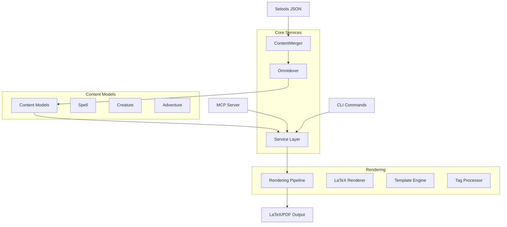

# API Reference

Complete API documentation for all studiorum components, organized by functional area.

## Quick Navigation

<div class="feature-cards" markdown>

-   🏗️ **Core Services**

    ---

    Service container, dependency injection, omnidexer, and content
    resolution systems

    [Services API](services.md){ .btn-primary }

-   📋 **Content Models**

    ---

    Type-safe Pydantic models for all D&D content types: spells,
    creatures, adventures, and more

    [Models API](models.md){ .btn-primary }

-   🎨 **Rendering Systems**

    ---

    LaTeX rendering pipeline, template engine, and content processing
    for PDF generation

    [Renderers API](renderers.md){ .btn-primary }

-   🔧 **Utilities & Helpers**

    ---

    Configuration management, error handling, validation, and common
    utility functions

    [Utilities](utilities.md){ .btn-secondary }

</div>

## Architecture at a Glance



## API Design Principles

### Type Safety First
All APIs use modern Python typing with runtime validation:

```python
from studiorum.core.models import Creature
from studiorum.core.result import Result, Success, Error

def get_creature(name: str) -> Result[Creature, str]:
    """Type-safe creature lookup with explicit error handling."""
    creature = omnidexer.get_content_by_name(name, ContentType.CREATURE)
    if creature:
        return Success(creature)
    return Error(f"Creature '{name}' not found")
```

### Protocol-Based Design
Loose coupling through runtime checkable protocols:

```python
from typing import Protocol, runtime_checkable

@runtime_checkable
class OmnidexerProtocol(Protocol):
    def get_content_by_name(self, name: str, content_type: ContentType) -> Any: ...
    def get_all_by_type(self, content_type: ContentType) -> list[Any]: ...
```

### Async/Sync Hybrid
Optimized patterns for different use cases:

```python
# Synchronous CLI usage
omnidexer = get_global_container().get_omnidexer_sync()

# Asynchronous MCP usage
async def mcp_handler(ctx: AsyncRequestContext) -> dict:
    omnidexer = await ctx.get_service(OmnidexerProtocol)
```

### Result Pattern
Explicit error handling without exceptions:

```python
result = content_resolver.resolve_adventure("my-adventure")

if isinstance(result, Success):
    adventure = result.value
    process_adventure(adventure)
elif isinstance(result, Error):
    handle_error(result.error)
```

## Common Usage Patterns

### Service Resolution

=== "CLI Context (Sync)"
    ```python
    from studiorum.core.container import get_global_container

    container = get_global_container()
    omnidexer = container.get_omnidexer_sync()
    resolver = container.get_content_resolver_sync()
    ```

=== "MCP Context (Async)"
    ```python
    from studiorum.core.context import AsyncRequestContext

    async def handle_request(ctx: AsyncRequestContext):
        omnidexer = await ctx.get_service(OmnidexerProtocol)
        resolver = await ctx.get_service(ContentResolverProtocol)
    ```

=== "Testing Context"
    ```python
    from studiorum.core.container import reset_global_container

    def test_setup():
        reset_global_container()  # Clean isolation
        # Your test setup here
    ```

### Content Processing

=== "Basic Content Lookup"
    ```python
    # Find spell by name
    spell = omnidexer.get_content_by_name("fireball", ContentType.SPELL)

    # Get all creatures of a specific CR
    creatures = omnidexer.get_all_by_type(ContentType.CREATURE)
    dragons = [c for c in creatures if c.challenge_rating >= 15]
    ```

=== "Adventure Resolution"
    ```python
    resolver = ContentResolver(omnidexer)
    result = resolver.resolve_adventure("lost-mine-of-phandelver")

    if result.is_success():
        adventure = result.content
        print(f"Chapters: {len(adventure.contents)}")
    ```

=== "Content Filtering"
    ```python
    # Advanced filtering with multiple criteria
    filter_params = {
        "level": {"min": 3, "max": 5},
        "school": ["evocation", "conjuration"],
        "source": ["PHB", "XGE"]
    }

    spells = omnidexer.filter_content(ContentType.SPELL, filter_params)
    ```

### Rendering Pipeline

=== "Basic LaTeX Rendering"
    ```python
    from studiorum.renderers.latex import LaTeXRenderer

    renderer = LaTeXRenderer()
    context = RenderingContext(output_format="latex")

    latex_output = renderer.render_adventure(adventure, context)
    ```

=== "Custom Rendering Context"
    ```python
    from studiorum.core.references import ContentTracker

    tracker = ContentTracker()
    context = RenderingContext(
        output_format="latex",
        content_tracker=tracker,
        metadata={
            "title": "My Campaign Guide",
            "appendix_spells": True,
            "appendix_creatures": True
        }
    )
    ```

=== "Template Customization"
    ```python
    from studiorum.renderers.latex import TemplateEngine

    engine = TemplateEngine()
    engine.add_template_path("/path/to/custom/templates")

    # Use custom template
    output = engine.render_template("custom_adventure.tex", {
        "adventure": adventure,
        "custom_data": my_data
    })
    ```

## Error Handling Patterns

### Result Pattern Usage
```python
from studiorum.core.result import Result, Success, Error

def safe_content_processing(name: str) -> Result[str, str]:
    """Example of comprehensive error handling."""

    # Content resolution
    resolve_result = resolver.resolve_adventure(name)
    if isinstance(resolve_result, Error):
        return resolve_result.with_context(
            "Failed to resolve adventure",
            adventure_name=name
        )

    adventure = resolve_result.value

    # Rendering
    try:
        latex_output = renderer.render_adventure(adventure, context)
        return Success(latex_output)
    except Exception as e:
        return Error(f"Rendering failed: {e}")
```

### Context-Aware Error Handling
```python
# Error context chaining preserves full error history
if isinstance(result, Error):
    return result.with_context(
        "Failed to process adventure images",
        operation="image_processing",
        adventure_id=adventure.id
    )
```

[Explore the complete API documentation →](services.md)

## Reference Sections

| Section | Description | Key Components |
|---------|-------------|----------------|
| **[Services](services.md)** | Core services and dependency injection | Omnidexer, ContentResolver, ServiceContainer |
| **[Models](models.md)** | Content models and data structures | Spell, Creature, Adventure, Book |
| **[Renderers](renderers.md)** | Rendering pipeline and LaTeX generation | LaTeXRenderer, TemplateEngine, TagProcessor |
| **[Utilities](utilities.md)** | Configuration, validation, and helpers | Config, Validation, Error handling |

---

Need help with a specific API? Check the detailed documentation for each component or join our [developer discussions](https://github.com/sargeant/studiorum/discussions).
