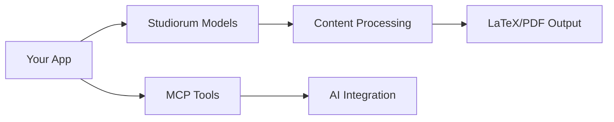
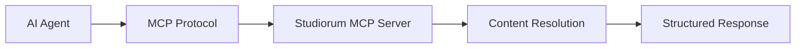

# Developer Guide

Build applications with studiorum's modern Python architecture for 5e content processing.

<div class="hero-banner gradient-background">
  <h2 class="hero-title">Build with Studiorum</h2>
  <p class="hero-description">Leverage powerful models, services, and rendering systems for comprehensive 5e content applications</p>
</div>

## Architecture Overview

<div class="feature-cards" markdown>

-   🏗️ **System Architecture**

    ---

    Understand the service container, async patterns, and modern Python
    design that powers studiorum

    [Architecture Overview](architecture.md){ .btn-primary }

-   🚀 **Quick Development Setup**

    ---

    Get your development environment running in under 30 minutes with
    our comprehensive setup guide

    [Getting Started](getting-started.md){ .btn-primary }

-   📚 **API Reference**

    ---

    Complete API documentation with examples for models, services,
    and rendering systems

    [API Documentation](api/){ .btn-secondary }

-   🤖 **AI Agent Development**

    ---

    Build intelligent 5e applications using MCP tools and async
    service patterns

    [AI Agents](ai-agents.md){ .btn-accent }

</div>

## Development Pathways

### Application Development
Build applications that process 5e content:



1. **[Architecture](architecture.md)** - Understand the system design
2. **[Models](models.md)** - Work with typed 5e content models
3. **[API Reference](api/)** - Explore services and rendering systems

### MCP Tool Development
Create AI-powered 5e tools:



1. **[AI Agents](ai-agents.md)** - MCP development patterns
2. **[Getting Started](getting-started.md#mcp-development)** - Development setup
3. **[API Reference](api/services.md)** - Service layer integration

### Core Contribution
Contribute to studiorum itself:

1. **[Contributing](contributing.md)** - Development workflow and standards
2. **[Architecture](architecture.md)** - Deep system understanding
3. **[Getting Started](getting-started.md#core-development)** - Contributor setup

## Key Concepts

### Service Container Pattern
Modern dependency injection with async support:

```python
from studiorum.core.container import get_global_container

# CLI usage (sync)
omnidexer = get_global_container().get_omnidexer_sync()

# MCP usage (async)
async def mcp_tool(ctx: AsyncRequestContext):
    omnidexer = await ctx.get_service(OmnidexerProtocol)
```

### Type-Safe Models
Pydantic models with full 5e content support:

```python
from studiorum.core.models import Creature, Spell

# Load and validate content
dragon = Creature.from_5etools("ancient-red-dragon")
fireball = Spell.from_5etools("fireball")

# Type-safe access
print(f"CR: {dragon.challenge_rating}")
print(f"Damage: {fireball.damage}")
```

### Async/Sync Hybrid
Optimized for different use cases:

- **CLI**: Synchronous for simple sequential operations
- **MCP**: Asynchronous for concurrent request handling
- **Testing**: Isolated containers for parallel test execution

## Integration Examples

### Basic Content Processing

```python
from studiorum.core.loaders import Omnidexer
from studiorum.core.resolvers import ContentResolver

# Load and resolve content
omnidexer = Omnidexer()
omnidexer.load_all_data()

resolver = ContentResolver(omnidexer)
result = resolver.resolve_adventure("lost-mine-of-phandelver")

if result.is_success():
    adventure = result.content
    print(f"Adventure: {adventure.name}")
```

### MCP Tool Development

```python
from studiorum.mcp.server import mcp_tool
from studiorum.core.models import ContentType

@mcp_tool("lookup_spell")
async def lookup_spell(ctx: AsyncRequestContext, name: str) -> dict:
    """Look up a spell by name."""
    omnidexer = await ctx.get_service(OmnidexerProtocol)
    spell = omnidexer.get_content_by_name(name, ContentType.SPELL)

    return {
        "name": spell.name,
        "level": spell.level,
        "school": spell.school,
        "damage": spell.damage
    }
```

### Custom Rendering Pipeline

```python
from studiorum.renderers.latex import LaTeXRenderer
from studiorum.core.references import ContentTracker

# Set up rendering context
tracker = ContentTracker()
context = RenderingContext(
    output_format="latex",
    content_tracker=tracker,
    metadata={"title": "My Adventure"}
)

# Render with custom options
renderer = LaTeXRenderer()
latex_output = renderer.render_adventure(adventure, context)
```

## Development Standards

### Code Quality
- **Type Safety**: Full mypy compliance with modern Python patterns
- **Testing**: Property-based testing with Hypothesis + traditional unit tests
- **Performance**: Async architecture with intelligent caching
- **Security**: LaTeX injection prevention and input validation

### Architecture Principles
- **Protocol-Based**: Loose coupling through runtime checkable protocols
- **Service Oriented**: Dependency injection with lifecycle management
- **Result Pattern**: Explicit error handling without exceptions
- **Progressive Enhancement**: Graceful degradation and feature detection

[Start Building →](getting-started.md){ .btn-primary .btn-large }

---

## Resources

- 📖 **[Architecture Deep Dive](architecture.md)** - Complete system design
- 🔧 **[API Reference](api/)** - Comprehensive API documentation
- 🤖 **[AI Agent Patterns](ai-agents.md)** - MCP development guide
- 🚀 **[Contributing](contributing.md)** - Join the development community
- 💬 **[Discussions](https://github.com/sargeant/studiorum/discussions)** - Community support
