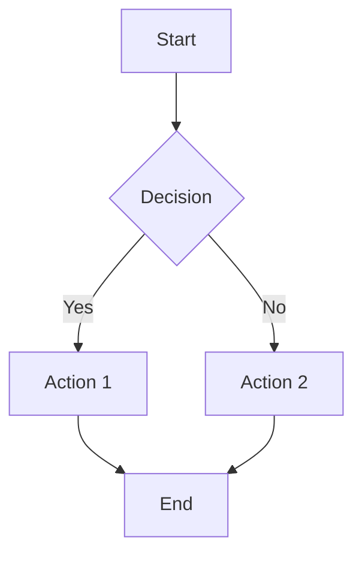
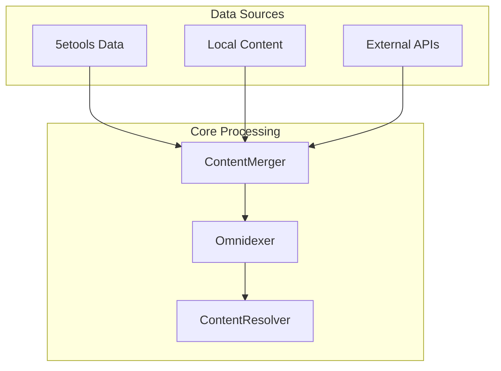
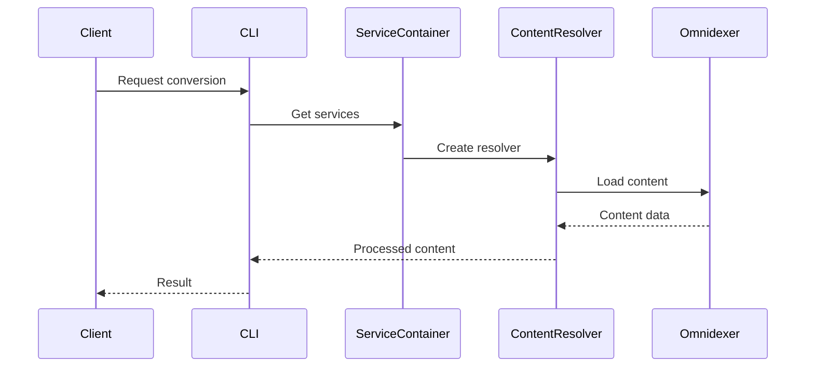
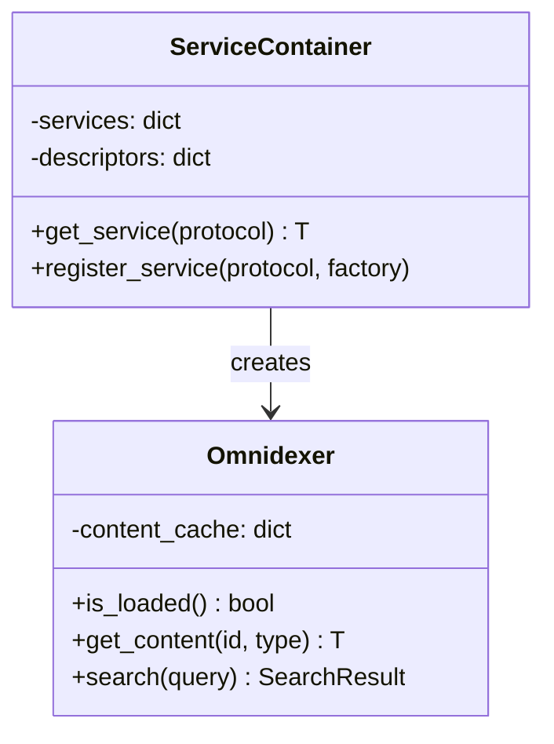
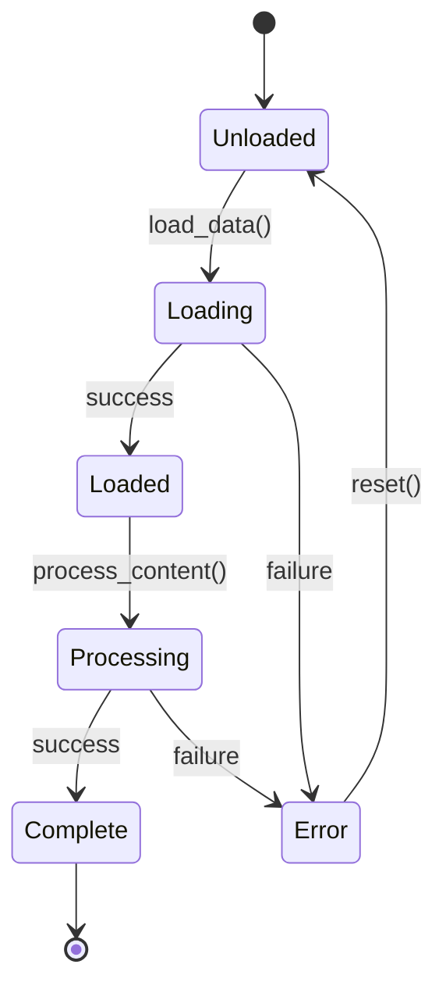
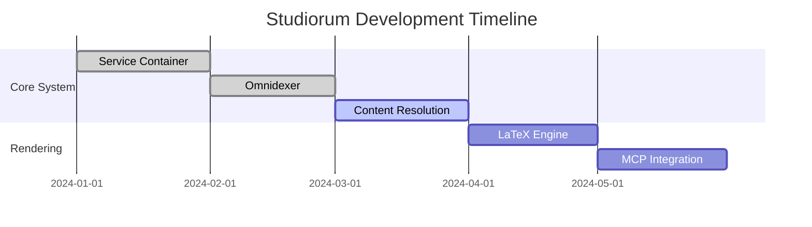
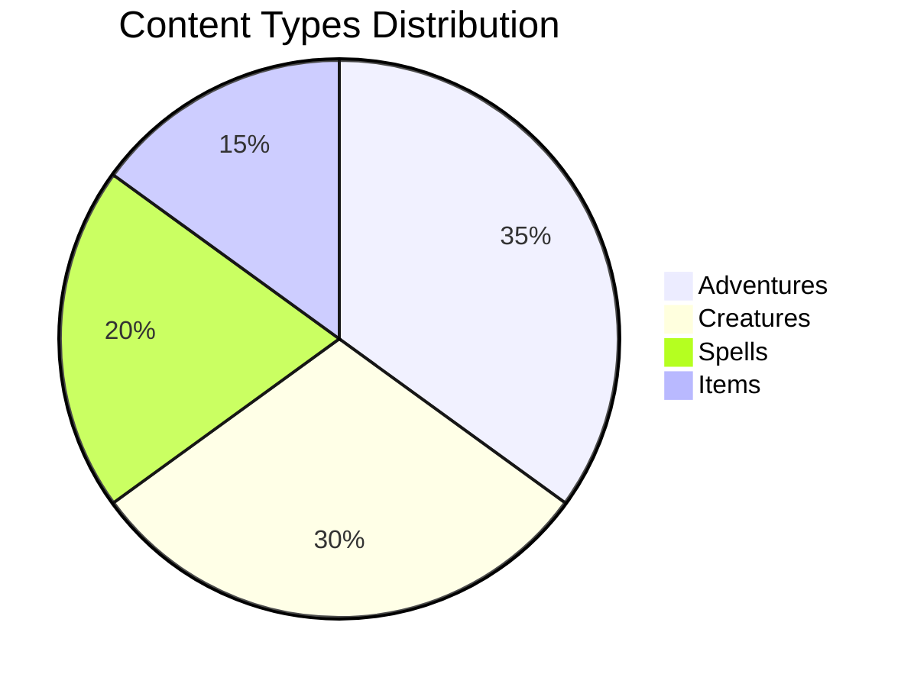
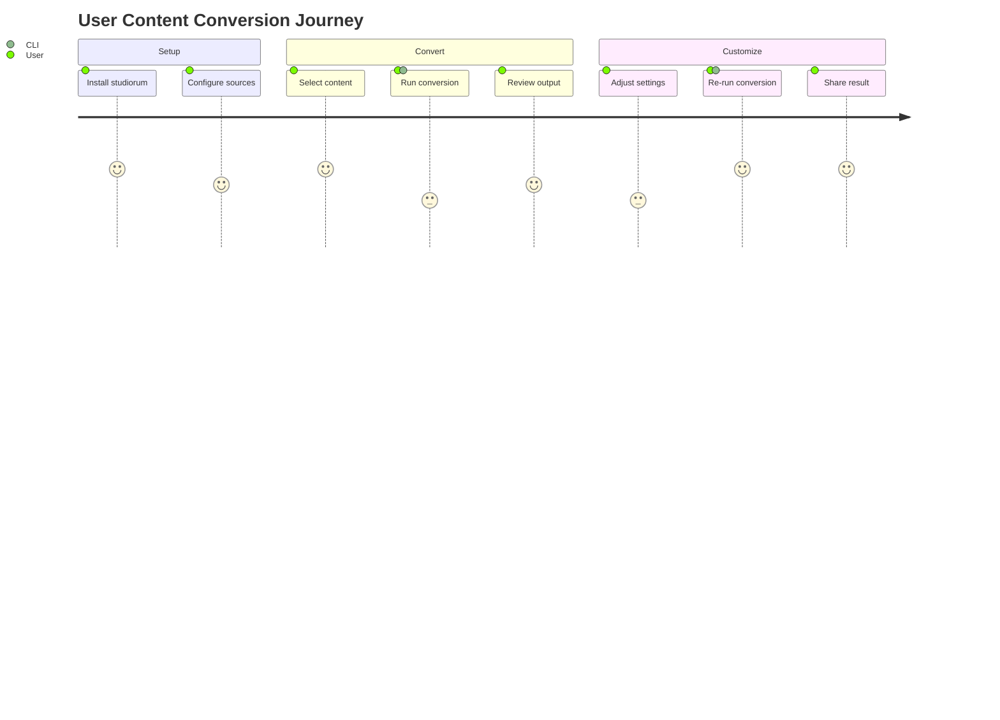
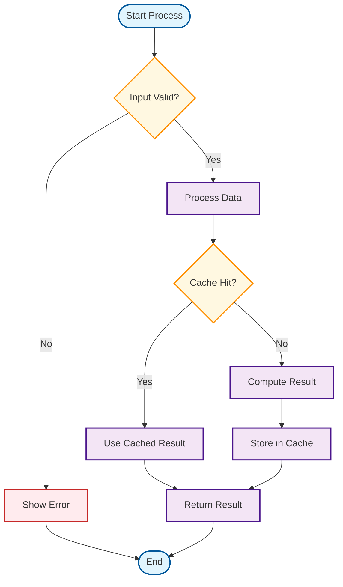

# Mermaid Diagram Tests

This page tests various Mermaid diagram types and syntax patterns to ensure v11 compatibility.

## Test 1: Simple Flowchart



## Test 2: Architecture Diagram (Original Problem)



## Test 3: Sequence Diagram



## Test 4: Class Diagram



## Test 5: State Diagram



## Test 6: Gantt Chart



## Test 7: Pie Chart



## Test 8: User Journey



## Test 9: Git Graph

```mermaid
gitgraph
    commit id: "Initial"
    branch develop
    checkout develop
    commit id: "Service Container"
    commit id: "Omnidexer"
    branch feature/mcp
    checkout feature/mcp
    commit id: "MCP Server"
    commit id: "MCP Tools"
    checkout develop
    merge feature/mcp
    commit id: "Integration Tests"
    checkout main
    merge develop
    commit id: "Release v1.0"
```

## Test 10: Complex Flowchart with Styling



## JavaScript Console Check

Open browser dev tools and check console for any Mermaid errors or warnings.

<script>
// Add debugging info
document.addEventListener('DOMContentLoaded', function() {
    setTimeout(function() {
        console.log('Mermaid version:', typeof mermaid !== 'undefined' ? mermaid.version || 'Version info not available' : 'Not loaded');
        console.log('Mermaid diagrams found:', document.querySelectorAll('.mermaid').length);
        console.log('Mermaid rendered diagrams:', document.querySelectorAll('.mermaid svg').length);
    }, 2000);
});
</script>
