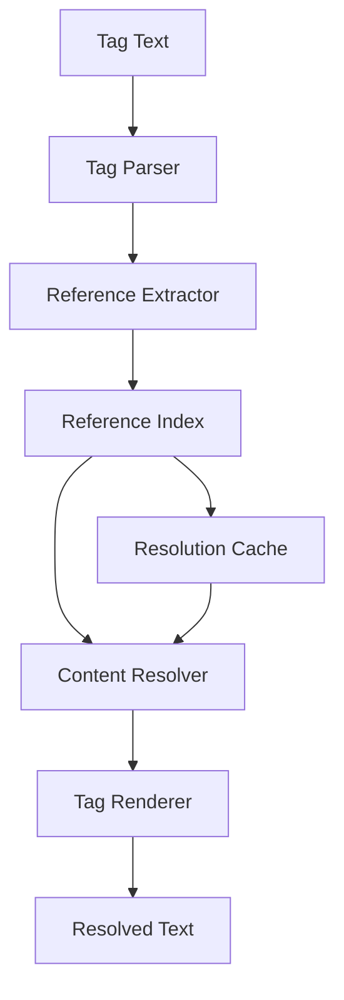

# Indexing and Cross-References

Systems for content indexing, tag resolution, and cross-referencing.

## Tag Resolver

Core system for resolving content references and tags.

```{eval-rst}
.. automodule:: dnd5e.core.indexer.tag_resolver
   :members:
   :undoc-members:
   :show-inheritance:
```

**Example Usage:**

```python
from dnd5e.core.indexer import TagResolver
from dnd5e.core.loaders import Omnidexer

# Setup
omnidexer = Omnidexer()
await omnidexer.load_all_data()
resolver = TagResolver(omnidexer)

# Resolve tags in text
text = "The {@spell fireball} spell deals {@dice 8d6} fire damage."
resolved = resolver.resolve_tags(text)
print(resolved)  # "The fireball spell deals 8d6 fire damage."

# Get detailed resolution info
resolution = resolver.resolve_tag_detailed("{@spell fireball}")
print(f"Resolved to: {resolution.resolved_text}")
print(f"Source: {resolution.source}")
print(f"Content type: {resolution.content_type}")
```

## Tag Parser

```{eval-rst}
.. automodule:: dnd5e.core.indexer.tag_parser
   :members:
   :undoc-members:
   :show-inheritance:
```

## Tag Renderer

```{eval-rst}
.. automodule:: dnd5e.core.indexer.tag_renderer
   :members:
   :undoc-members:
   :show-inheritance:
```

## Reference Index

```{eval-rst}
.. automodule:: dnd5e.core.indexer.reference_index
   :members:
   :undoc-members:
   :show-inheritance:
```

## Tag System

The tag system provides cross-referencing between content using a standardized syntax:

### Tag Syntax

| Tag Type | Syntax | Example | Description |
|----------|--------|---------|-------------|
| Spell | `{@spell name}` | `{@spell fireball}` | Reference to spell |
| Creature | `{@creature name}` | `{@creature ancient red dragon}` | Reference to creature |
| Item | `{@item name}` | `{@item +1 sword}` | Reference to item |
| Class | `{@class name}` | `{@class wizard}` | Reference to class |
| Race | `{@race name}` | `{@race elf}` | Reference to race |
| Condition | `{@condition name}` | `{@condition charmed}` | Reference to condition |
| Dice | `{@dice expression}` | `{@dice 2d6+3}` | Dice expression |
| Damage | `{@damage dice type}` | `{@damage 1d8 fire}` | Damage with type |
| Hit | `{@hit bonus}` | `{@hit +5}` | Attack bonus |
| DC | `{@dc value ability}` | `{@dc 15 Constitution}` | Saving throw DC |

### Advanced Tag Features

#### Qualified References

```python
# Source-specific references
"{@spell fireball|PHB}"        # Fireball from Player's Handbook
"{@creature troll|MM}"         # Troll from Monster Manual
"{@item +1 sword|DMG}"         # +1 Sword from Dungeon Master's Guide
```

#### Display Text Override

```python
# Custom display text
"{@spell fireball|PHB|the fireball spell}"
"{@creature ancient red dragon||great wyrm}"
```

#### Conditional Tags

```python
# Tags that resolve conditionally
"{@spell|if-class-wizard fireball}"     # Only for wizards
"{@item|if-attunement staff of power}"  # Only if attuned
```

## Cross-Reference Resolution

### Resolution Process



### Resolution Configuration

```python
from dnd5e.core.indexer import TagResolver, ResolutionConfig

config = ResolutionConfig(
    # Resolution behavior
    strict_mode=False,          # Allow partial matches
    case_sensitive=False,       # Case-insensitive matching
    fuzzy_matching=True,        # Use fuzzy string matching

    # Output formatting
    include_page_numbers=True,  # Add page references
    include_source_info=True,   # Add source information
    hyperlink_format="latex",   # Format for hyperlinks

    # Caching
    enable_cache=True,          # Cache resolved tags
    cache_ttl=3600,            # Cache timeout (1 hour)

    # Error handling
    on_unresolved="warn",       # warn, error, or ignore
    fallback_text=None,         # Text for unresolved tags
)

resolver = TagResolver(omnidexer, config=config)
```

## Performance Optimization

### Indexing Performance

```python
# Pre-build reference index
resolver = TagResolver(omnidexer)
await resolver.build_index()  # Async indexing

# Batch resolution
tags = ["{@spell fireball}", "{@spell magic missile}", "{@spell cure wounds}"]
resolved = resolver.resolve_tags_batch(tags)
```

### Caching

```python
# Configure resolution caching
cache_config = {
    "backend": "disk",          # memory, disk, or redis
    "directory": "~/.5e2pdf/tag_cache",
    "max_size": "100MB",
    "ttl": 86400               # 24 hours
}

resolver.configure_cache(**cache_config)
```

## Content Analysis

### Reference Statistics

```python
# Analyze tag usage
stats = resolver.get_reference_stats()
print(f"Total tags resolved: {stats.total_tags}")
print(f"Unique references: {stats.unique_references}")
print(f"Resolution rate: {stats.resolution_rate:.2%}")

# Most referenced content
top_refs = stats.most_referenced(limit=10)
for ref in top_refs:
    print(f"{ref.name}: {ref.count} references")
```

### Broken Reference Detection

```python
# Find broken references
broken_refs = resolver.find_broken_references()
for ref in broken_refs:
    print(f"Broken: {ref.tag} in {ref.source_content}")
    print(f"Suggestions: {ref.suggestions}")
```

### Content Coverage

```python
# Analyze cross-reference coverage
coverage = resolver.analyze_coverage()
print(f"Content with references: {coverage.referenced_content:.1%}")
print(f"Orphaned content: {coverage.orphaned_content:.1%}")
print(f"Reference density: {coverage.avg_refs_per_content:.1f}")
```

## Advanced Features

### Custom Tag Types

```python
from dnd5e.core.indexer import register_tag_type

@register_tag_type("homebrew")
class HomebrewTagRenderer:
    """Custom tag renderer for homebrew content."""

    def render(self, tag_data: dict, context: RenderContext) -> str:
        name = tag_data.get("name", "")
        return f"\\textit{{{name}}} (Homebrew)"

# Usage: {@homebrew my custom spell}
```

### Tag Validation

```python
# Validate tag syntax
from dnd5e.core.indexer import validate_tags

text = "Invalid tag: {@invalid syntax here}"
validation_result = validate_tags(text)

if not validation_result.is_valid:
    for error in validation_result.errors:
        print(f"Line {error.line}: {error.message}")
```

### Reference Extraction

```python
# Extract all references from content
references = resolver.extract_references(content)
for ref in references:
    print(f"Type: {ref.tag_type}")
    print(f"Target: {ref.target}")
    print(f"Context: {ref.context}")
```

## Integration with Renderers

### LaTeX Integration

```python
from dnd5e.renderers.latex import LaTeXDocumentRenderer

# Automatic tag resolution during rendering
renderer = LaTeXDocumentRenderer(
    tag_resolver=resolver,
    resolve_tags=True,
    hyperlink_refs=True
)

# Tags are resolved to LaTeX hyperlinks
output = renderer.render_content(content)
```

### Custom Render Formats

```python
# Define custom tag rendering for different output formats
resolver.register_format("html", {
    "spell": '<a href="/spells/{name}" class="spell-link">{display_name}</a>',
    "creature": '<a href="/monsters/{name}" class="monster-link">{display_name}</a>',
    "dice": '<span class="dice-roll">{expression}</span>'
})

# Use custom format
html_output = resolver.resolve_tags(text, format="html")
```

See {doc}`/developer/implementation/deep-indexing` for detailed implementation information and {doc}`/examples/index` for practical usage examples.
