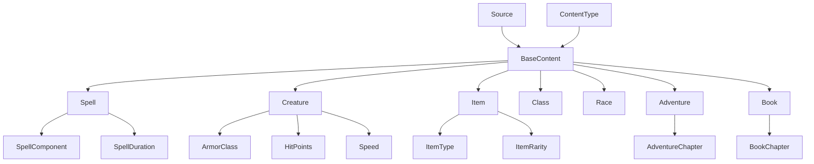

# Data Models

Core data models representing D&D content.

## Base Models

### Content

```{eval-rst}
.. automodule:: dnd5e.core.models.content
   :members:
   :undoc-members:
   :show-inheritance:
```

## Content Types

### Spells

```{eval-rst}
.. automodule:: dnd5e.core.models.spells
   :members:
   :undoc-members:
   :show-inheritance:
```

**Example Usage:**

```python
from dnd5e.core.models.spells import Spell, SpellComponent

# Access spell properties
spell = omnidexer.find_one(content_type="spell", name="Fireball")
print(f"Level: {spell.level}")
print(f"School: {spell.school}")
print(f"Components: {', '.join(spell.components)}")
print(f"Casting Time: {spell.time}")
print(f"Range: {spell.range}")
print(f"Duration: {spell.duration}")
```

### Creatures

```{eval-rst}
.. automodule:: dnd5e.core.models.creatures
   :members:
   :undoc-members:
   :show-inheritance:
```

**Example Usage:**

```python
from dnd5e.core.models.creatures import Creature

# Access creature properties
creature = omnidexer.find_one(content_type="monster", name="Ancient Red Dragon")
print(f"CR: {creature.cr}")
print(f"AC: {creature.ac}")
print(f"HP: {creature.hp}")
print(f"Speed: {creature.speed}")
print(f"STR: {creature.str}")
```

### Items

```{eval-rst}
.. automodule:: dnd5e.core.models.items
   :members:
   :undoc-members:
   :show-inheritance:
```

### Classes

```{eval-rst}
.. automodule:: dnd5e.core.models.classes
   :members:
   :undoc-members:
   :show-inheritance:
```

### Races

```{eval-rst}
.. automodule:: dnd5e.core.models.races
   :members:
   :undoc-members:
   :show-inheritance:
```

### Adventures

```{eval-rst}
.. automodule:: dnd5e.core.models.adventures
   :members:
   :undoc-members:
   :show-inheritance:
```

### Books

```{eval-rst}
.. automodule:: dnd5e.core.models.books
   :members:
   :undoc-members:
   :show-inheritance:
```

## Model Relationships

The models are designed with clear relationships:



## Validation

All models use Pydantic for validation and serialization:

```python
from pydantic import ValidationError

try:
    spell = Spell(name="Test", level=10)  # Invalid level
except ValidationError as e:
    print(f"Validation error: {e}")
```

## Serialization

Models can be serialized to various formats:

```python
# JSON serialization
spell_json = spell.model_dump_json()
spell_dict = spell.model_dump()

# Create from JSON
spell_from_json = Spell.model_validate_json(spell_json)
spell_from_dict = Spell.model_validate(spell_dict)
```

## Field Definitions

All model fields are documented with:
- Type annotations
- Field descriptions
- Validation constraints
- Default values
- Examples

See the individual model classes for detailed field documentation.
