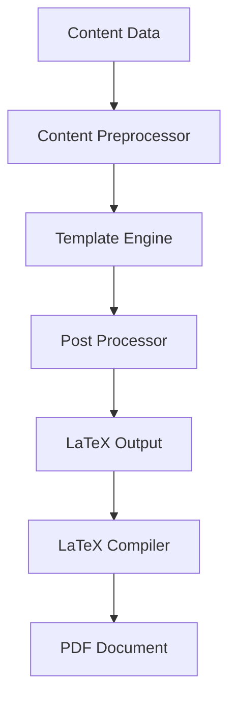

# Renderers and Output Generation

Systems for generating formatted output from D&D content.

## Base Renderers

Abstract interfaces and base classes for all renderers.

```{eval-rst}
.. automodule:: dnd5e.renderers.base
   :members:
   :undoc-members:
   :show-inheritance:
```

## LaTeX Renderers

LaTeX-specific rendering for PDF output.

### Document Renderer

```{eval-rst}
.. automodule:: dnd5e.renderers.latex.document
   :members:
   :undoc-members:
   :show-inheritance:
```

**Example Usage:**

```python
from dnd5e.renderers.latex import LaTeXDocumentRenderer
from dnd5e.core.loaders import Omnidexer

# Setup
omnidexer = Omnidexer()
renderer = LaTeXDocumentRenderer()

# Render spells to LaTeX
spells = omnidexer.find(content_type="spell", source="PHB")
latex_output = renderer.render_content(spells)

# Save to file
with open("spells.tex", "w") as f:
    f.write(latex_output)

# Render to PDF
pdf_output = renderer.render_to_pdf(spells, output_path="spells.pdf")
```

### Template Engine

```{eval-rst}
.. automodule:: dnd5e.renderers.latex.template_engine
   :members:
   :undoc-members:
   :show-inheritance:
```

## Rendering Workflow

The rendering process follows this workflow:



## Configuration

### Renderer Settings

```python
from dnd5e.renderers.latex import LaTeXDocumentRenderer
from dnd5e.renderers.latex.config import LaTeXConfig

config = LaTeXConfig(
    paper_size="A4",
    columns=2,
    font_family="Times",
    font_size=10,
    margins={
        "top": "2cm",
        "bottom": "2cm",
        "left": "1.5cm",
        "right": "1.5cm"
    }
)

renderer = LaTeXDocumentRenderer(config=config)
```

### Template Customization

```python
# Custom template
renderer = LaTeXDocumentRenderer(
    template_path="custom_templates/",
    template_name="my_spell_template.tex"
)

# Template variables
template_vars = {
    "title": "Player's Handbook Spells",
    "author": "Custom Author",
    "date": "2024",
    "show_index": True,
    "show_toc": True
}

output = renderer.render_content(spells, template_vars=template_vars)
```

## Content-Specific Rendering

### Spell Rendering

```python
# Spell-specific options
spell_config = {
    "show_components": True,
    "show_materials": True,
    "group_by_level": True,
    "include_descriptions": True,
    "highlight_damage": True
}

spells_output = renderer.render_spells(spells, **spell_config)
```

### Creature Rendering

```python
# Creature stat blocks
creature_config = {
    "stat_block_style": "classic",
    "show_challenge_rating": True,
    "include_lore": False,
    "compact_layout": True
}

creatures_output = renderer.render_creatures(creatures, **creature_config)
```

### Item Rendering

```python
# Item formatting
item_config = {
    "show_rarity": True,
    "show_value": True,
    "group_by_type": True,
    "include_attunement": True
}

items_output = renderer.render_items(items, **item_config)
```

## Advanced Features

### Custom Styling

```python
# Custom CSS-like styling
styles = {
    "spell_name": {"font": "bold", "size": "large", "color": "darkblue"},
    "spell_level": {"font": "italic", "size": "small"},
    "damage_text": {"color": "red", "weight": "bold"}
}

renderer.apply_styles(styles)
```

### Page Breaking

```python
# Control page breaks
page_config = {
    "break_on_level": True,  # New page for each spell level
    "break_on_school": False,  # Keep school groups together
    "orphan_protection": True,  # Prevent orphaned lines
    "widow_protection": True   # Prevent widow lines
}

renderer.configure_page_breaks(**page_config)
```

## Error Handling

```python
from dnd5e.renderers.exceptions import (
    RenderingError,
    TemplateError,
    LaTeXCompilationError
)

try:
    output = renderer.render_content(content)
except TemplateError as e:
    print(f"Template error: {e}")
except LaTeXCompilationError as e:
    print(f"LaTeX compilation failed: {e}")
    print(f"LaTeX log: {e.latex_log}")
```

## Performance

### Rendering Optimization

```python
# Parallel rendering for large datasets
renderer = LaTeXDocumentRenderer(
    parallel=True,
    worker_count=4
)

# Memory-efficient streaming
for page in renderer.render_stream(large_content_list):
    process_page(page)

# Caching for repeated renders
renderer.enable_cache(cache_dir="~/.5e2pdf/render_cache")
```

### LaTeX Compilation

```python
# Fast compilation options
compiler_config = {
    "engine": "lualatex",  # Faster than pdflatex
    "passes": 1,           # Single pass for drafts
    "halt_on_error": True,
    "interaction": "nonstopmode"
}

renderer.configure_compiler(**compiler_config)
```

## Custom Renderers

### Creating a Custom Renderer

```python
from dnd5e.renderers.base import BaseRenderer
from dnd5e.core.models import BaseContent
from typing import List

class MarkdownRenderer(BaseRenderer):
    """Custom Markdown renderer."""

    def render_content(self, content: List[BaseContent]) -> str:
        """Render content to Markdown format."""
        output = []
        for item in content:
            output.append(f"# {item.name}")
            output.append(f"{item.description}")
            output.append("")
        return "\n".join(output)

    def render_to_file(self, content: List[BaseContent],
                      output_path: str) -> None:
        """Render content to Markdown file."""
        with open(output_path, "w") as f:
            f.write(self.render_content(content))
```

### Renderer Plugins

```python
# Register custom renderer
from dnd5e.renderers import register_renderer

register_renderer("markdown", MarkdownRenderer)

# Use via CLI
# 5e2pdf convert --renderer markdown --output spells.md
```

See {doc}`/developer/implementation/index` for detailed renderer development guides.
