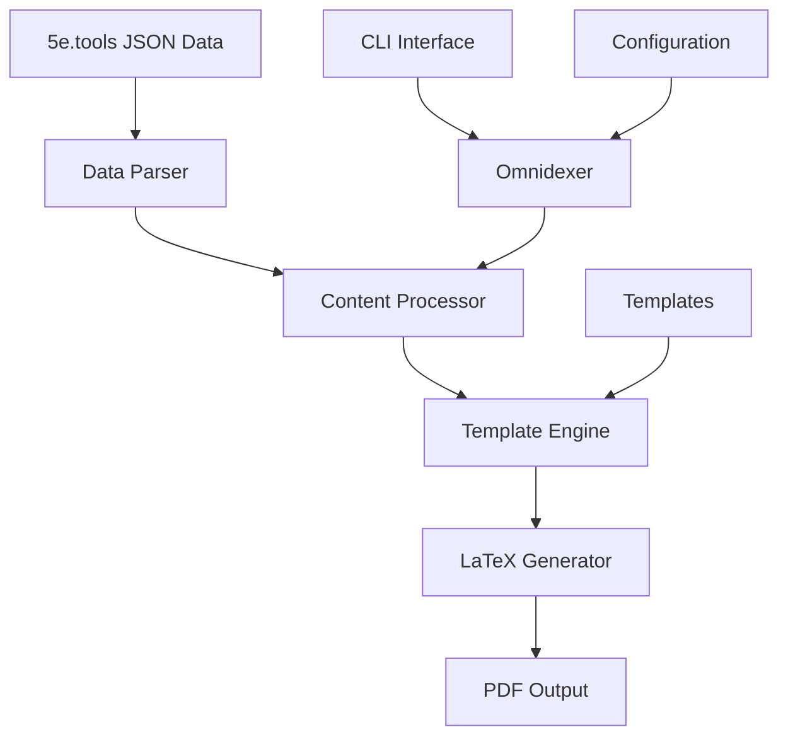

# Architecture

```{note}
This page is under construction. Please check back later for detailed architectural documentation.
```

## System Overview



## Core Components

### Data Layer

**Purpose**: Handle 5e.tools JSON data ingestion and parsing

- **Parser**: JSON to internal data structures
- **Validator**: Data integrity and format validation
- **Cache**: Performance optimization for repeated access

### Processing Layer

**Purpose**: Transform parsed data into structured content

- **Content Processor**: Data transformation and filtering
- **Omnidexer**: Deep indexing and cross-referencing
- **Template Engine**: LaTeX template processing

### Output Layer

**Purpose**: Generate final PDF documents

- **LaTeX Generator**: Convert processed content to LaTeX
- **PDF Builder**: Compile LaTeX to PDF using external tools
- **Asset Manager**: Handle images, fonts, and other resources

## Design Principles

### Modularity

- Each component has a single responsibility
- Clear interfaces between layers
- Pluggable architecture for extensibility

### Performance

- Lazy loading of large datasets
- Efficient caching strategies
- Parallel processing where beneficial

### Maintainability

- Comprehensive type hints
- Extensive test coverage
- Clear documentation and examples

## Data Flow

1. **Input**: 5e.tools JSON files
2. **Parse**: Convert to Python data structures
3. **Process**: Apply business logic and transformations
4. **Template**: Apply LaTeX templates
5. **Generate**: Create LaTeX source
6. **Compile**: Build final PDF

## Configuration System

### Hierarchy

1. Command line arguments (highest priority)
2. Configuration files
3. Environment variables
4. Default values (lowest priority)

### File Formats

- TOML configuration files
- YAML template definitions
- JSON data schemas

For implementation details, see the [API Documentation](api/index.md) and [Implementation Guides](implementation/index.md).
