# Architecture Diagrams

Visual representations of the 5e2pdf system architecture and data flow.

## System Overview

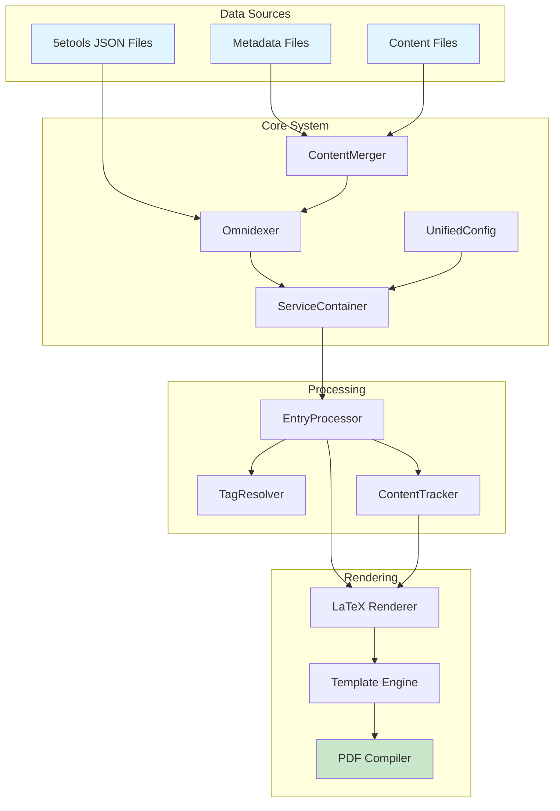

## Data Flow Pipeline

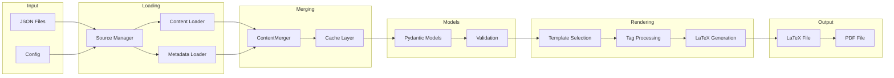

## Service Container Architecture

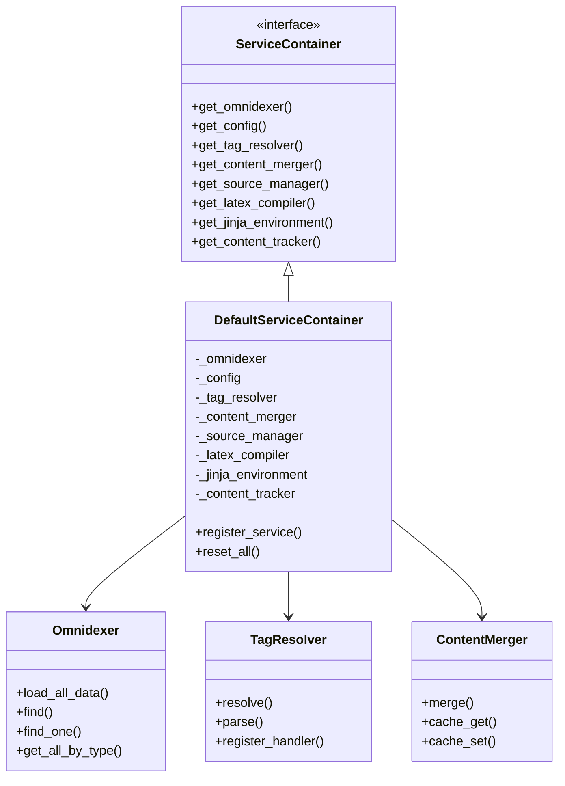

## Entry Processing System

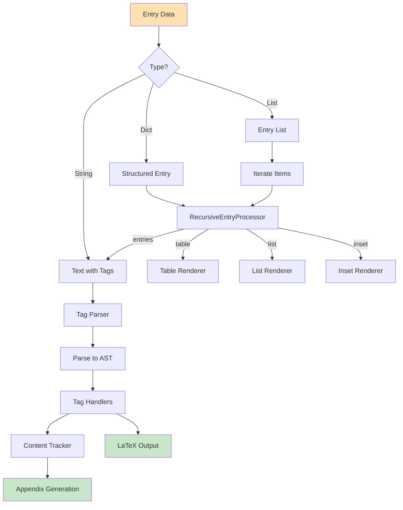

## Tag Resolution Process

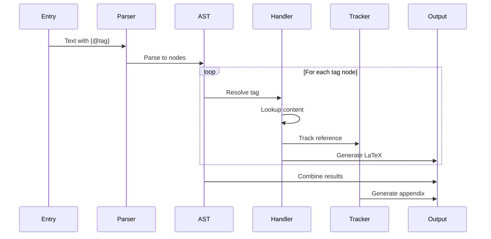

## Content Loading Hierarchy

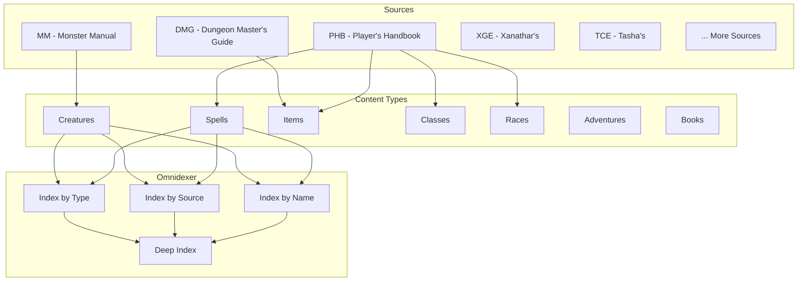

## LaTeX Rendering Pipeline

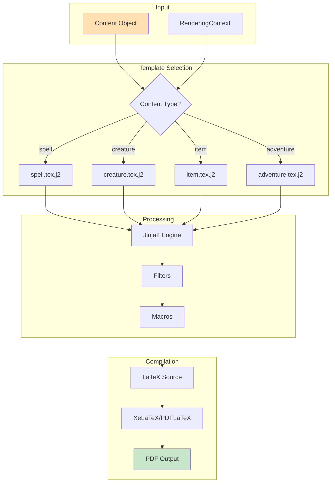

## Configuration Hierarchy

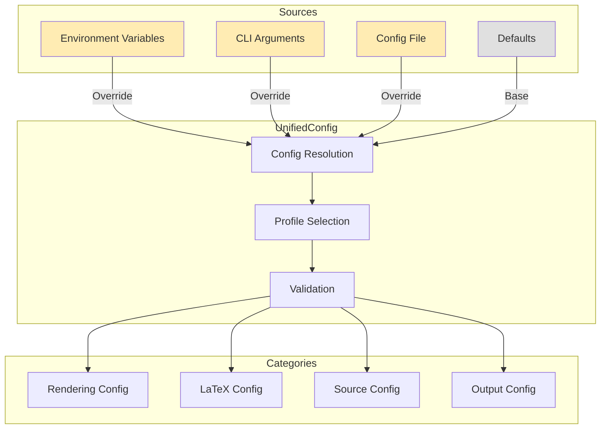

## Error Handling Flow

```mermaid
flowchart TD
    OP[Operation] --> R{Result?}

    R -->|Success| S[Success[T]]
    R -->|Failure| F[Failure]

    S --> V[Value]
    S --> M[Metadata]

    F --> E[Error]
    F --> C[Context]
    F --> ST[Stack Trace]

    F --> H{Handler?}
    H -->|Recovery| REC[Recovery Strategy]
    H -->|Fallback| FB[Fallback Value]
    H -->|Propagate| P[Bubble Up]

    REC --> OP
    FB --> V
    P --> LOG[Error Log]

    style S fill:#c8e6c9
    style F fill:#ffcdd2
    style V fill:#c8e6c9
```

## Testing Architecture

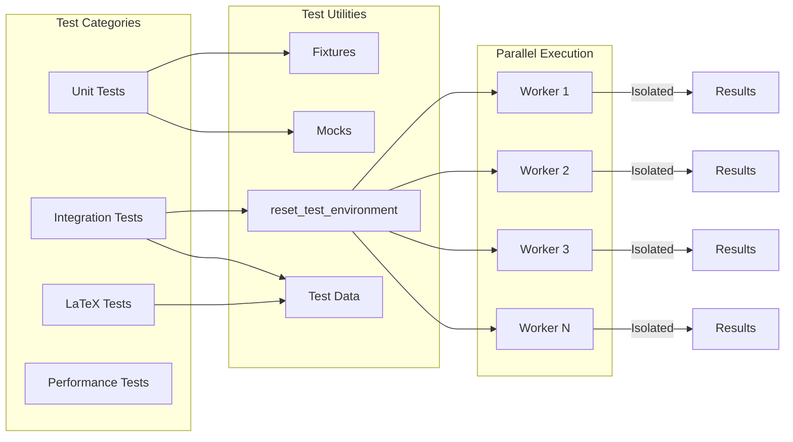

## Deployment Architecture

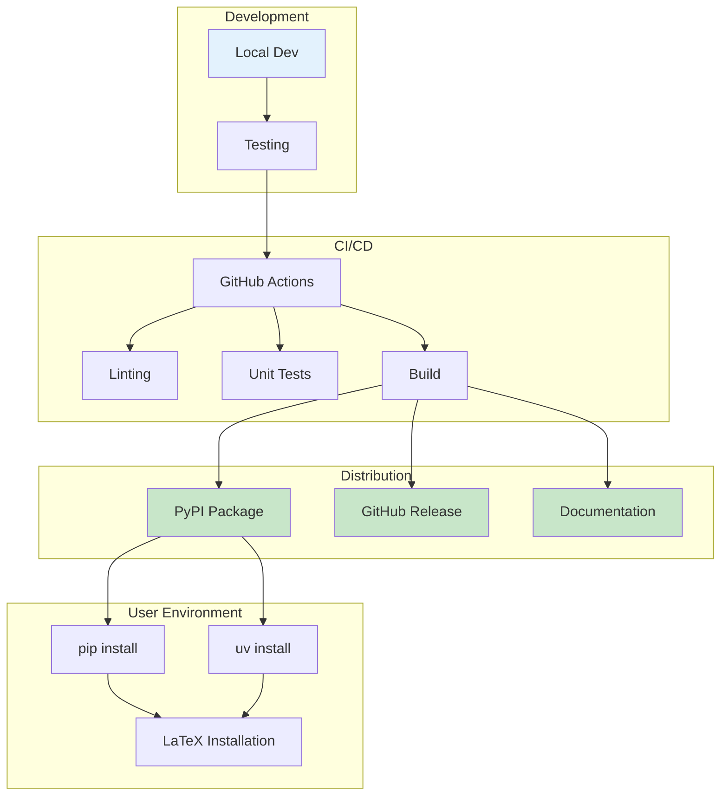

## Memory and Performance

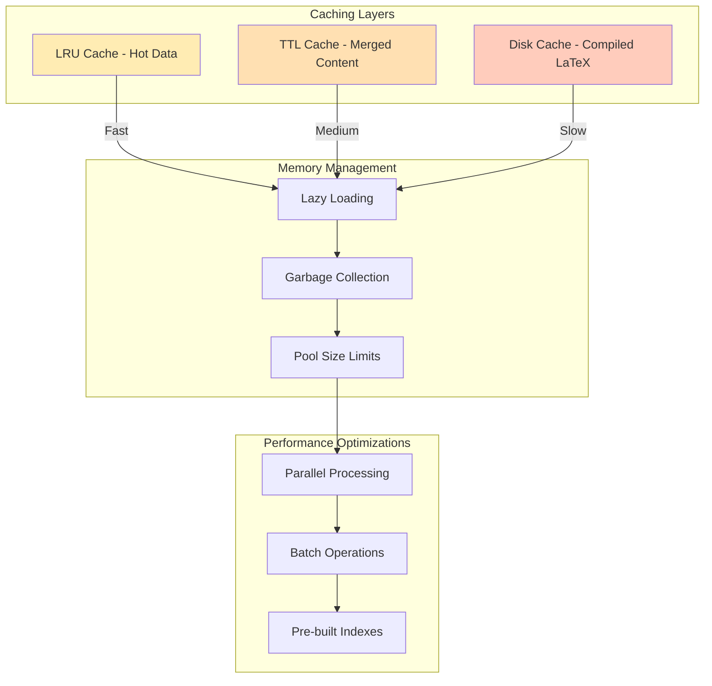

## See Also

- {doc}`architecture-overview` - Detailed text description
- {doc}`design-patterns` - Implementation patterns
- {doc}`/user-guide/quickstart-tutorial` - Getting started guide
