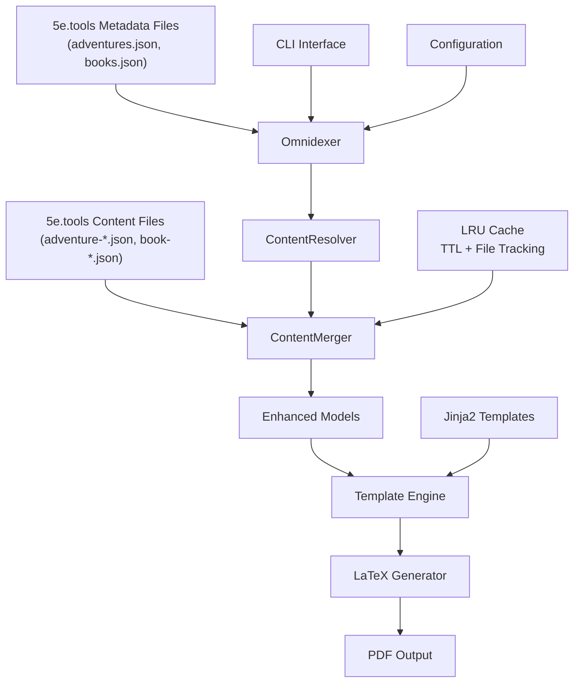
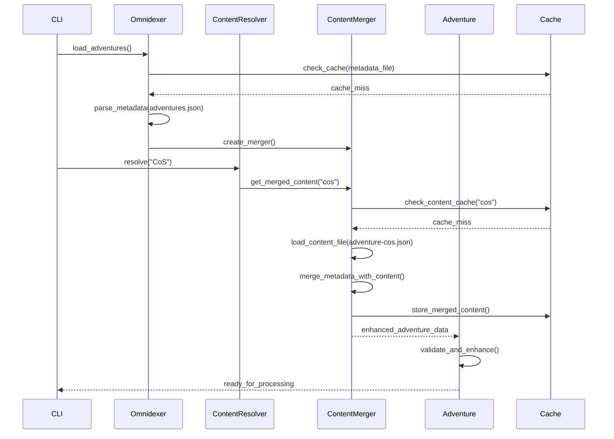

# Architecture

This document provides a comprehensive overview of the 5e2pdf system architecture,
focusing on the sophisticated dual-file loader system and core components that
enable efficient D&D 5e content processing and PDF generation.

## System Overview

The 5e2pdf architecture implements a sophisticated dual-file loading system that
separates metadata from content, enabling efficient on-demand loading and
runtime merging of D&D 5e content.



### Key Architectural Innovation: Dual-File System

The system addresses the complexity of D&D 5e content by implementing a **5etools-compatible dual-file architecture**:

- **Metadata files** (`adventures.json`, `books.json`) provide structure, catalog information, and navigation
- **Content files** (`adventure-*.json`, `book-*.json`) contain the actual content data
- **Runtime merging** combines metadata structure with content data on-demand
- **Graceful fallback** to metadata-only when content files are unavailable

This architecture solved the original problem of loading 94 duplicate adventures by properly separating concerns and implementing intelligent content resolution.

## Core Components

### Service Container Architecture

**Purpose**: Centralized dependency injection and lifecycle management

#### ServiceContainer (`src/dnd5e/core/container.py`)

The service container manages all core application services with lazy initialization and proper cleanup:

- **Global Container**: `get_global_container()` for CLI and application usage
- **Scoped Containers**: `service_container()` context manager for isolated usage
- **Service Management**: Lazy loading of expensive services like Omnidexer
- **Test Isolation**: `reset_global_container()` for test state management

**Managed Services:**
- `Omnidexer`: Content indexing and loading
- `TagResolver`: Cross-reference resolution
- `EntryRegistry`: Entry type validation
- `ReferenceManager`: Reference parsing and resolution
- `ContentFactory`: Dynamic content instantiation
- `DisplayManager`: CLI progress and display

**Benefits:**
- Eliminates global singleton complexity
- Simplified test setup (single reset call)
- Type-safe service access through protocols
- Automatic resource cleanup and lifecycle management

### Loader Architecture Layer

**Purpose**: Intelligent content loading with dual-file support and caching

#### Omnidexer (`src/dnd5e/core/loaders/omnidexer.py`)

- **Comprehensive indexing** with SHA256 content hashing
- **Deep indexing** support via `DeepIndexable` protocol
- **Synchronous loading** with performance monitoring
- **Cache statistics** for optimization insights

#### ContentMerger (`src/dnd5e/core/loaders/content_merger.py`)

- **Dual-file architecture** implementation
- **Runtime merging** of metadata and content
- **LRU caching** with TTL and file modification tracking
- **Three input format support**: unified, metadata-only, content-only
- **Graceful fallback** when content files are missing

#### ContentResolver (`src/dnd5e/core/resolvers/content_resolver.py`)

- **Fuzzy matching** for user abbreviations and partial names
- **Multi-tier resolution**: exact → fuzzy → suggestions
- **Integration** with ContentMerger for content enrichment
- **Disambiguation** support for multiple matches

### Context and Reference Systems

**Purpose**: Unified state management and content resolution with type safety

#### Context System (`src/dnd5e/core/base_context.py`)

- **Hierarchical design**: `BaseContext` → `CoreContext` → specialized contexts
- **Type safety**: Generic `ProcessingContext[T]` for compile-time guarantees
- **Service injection**: `ServiceContext` for standardized dependency access
- **Pydantic integration**: Full validation and serialization support

**Key Components:**
- `ProcessingContext[T]`: Type-safe processing operations
- `ServiceContext`: Dependency injection and service access
- `ValidationContext`: Entry validation with structured error reporting
- `RendererContext`: Tag rendering with service composition

#### Reference System (`src/dnd5e/core/unified_references.py`)

- **Generic pattern**: `Reference[T]` for type-safe content resolution
- **Multi-format support**: LaTeX, HTML, Markdown, Plain Text output
- **Performance**: Built-in caching with type-safe operations
- **Extensibility**: Abstract parsers and resolvers for new content types

**Key Components:**
- `Reference[T]`: Immutable reference with comprehensive metadata
- `ReferenceParser[T]`: Abstract base for text reference extraction
- `ReferenceResolver[T]`: Abstract base for content resolution
- `ReferenceManager`: Unified coordination of parsing and resolution

### Model Layer

**Purpose**: Enhanced data models with content status awareness

#### Adventure Model (`src/dnd5e/core/models/adventures.py`)

- **Format detection**: Automatic identification of input format
- **Content status methods**: `has_content()`, `is_metadata_only()`
- **Deep indexing integration**: `get_deep_index_entries()`
- **Comprehensive metadata** handling through `AdventureMetadata`

### Processing Layer

**Purpose**: Transform enhanced models into structured LaTeX content

- **Template Engine**: Jinja2-based LaTeX template processing
- **Entry Parser**: Structured content parsing and validation
- **Cross-referencing**: Intelligent linking between content sections

### Output Layer

**Purpose**: Generate final PDF documents

- **LaTeX Generator**: Convert processed content to LaTeX with configurable compiler
- **PDF Builder**: Compile LaTeX to PDF using external tools (XeLaTeX, PDFLaTeX)
- **Asset Management**: Handle images, fonts, and other resources

## Design Principles

### Protocol-Based Design

- **Loose coupling** through Python protocols and interfaces
- **Testability** with easy mocking and dependency injection
- **Extensibility** via protocol implementations

### Performance Optimization

- **Lazy loading** of large content files (12,917 lines for CoS)
- **LRU caching** with TTL and file modification tracking
- **On-demand merging** reduces memory footprint
- **Synchronous I/O** with efficient file handling
- **SHA256 hashing** for content change detection

### Type Safety and Maintainability

- **Python 3.12 generics** throughout the codebase
- **Comprehensive type hints** with mypy enforcement
- **Pydantic validation models** for data integrity and type safety
- **Protocol-based interfaces** for clear contracts
- **Extensive test coverage** (1,445+ tests passing)
- **Clear separation of concerns** between layers

### Robustness

- **Graceful degradation** when content files are unavailable
- **Multi-format support** with automatic detection
- **Comprehensive error handling** with meaningful messages
- **File system monitoring** for cache invalidation

## Data Flow

### Dual-File Loading Process



### End-to-End Processing Flow

1. **Metadata Loading**: Omnidexer loads and indexes metadata files
2. **Content Resolution**: ContentResolver maps user input to content objects
3. **On-Demand Merging**: ContentMerger combines metadata with content files
4. **Model Enhancement**: Adventure models detect format and status
5. **Deep Indexing**: Content is indexed for cross-referencing
6. **Template Processing**: Jinja2 templates generate LaTeX
7. **PDF Compilation**: External tools compile LaTeX to PDF

### Caching Strategy

- **L1 Cache**: In-memory LRU cache with TTL (default 3600s)
- **L2 Cache**: File modification time tracking
- **Cache Keys**: Normalized content IDs with case-insensitive matching
- **Eviction**: LRU eviction with TTL expiration
- **Statistics**: Hit/miss/eviction tracking for optimization

## Technical Innovations

### 5etools-Compatible Dual-File Architecture

**Problem Solved**: Original system loaded 94 adventures (duplicates) with empty content in correct entries.

**Solution**: Separation of concerns with runtime merging:

- **Metadata files** provide structure and catalog information
- **Content files** loaded on-demand when needed
- **Runtime merging** combines both sources intelligently
- **Result**: 94 → 61 adventures with proper content (e.g., CoS: 12,917 lines)

### Pydantic Validation Architecture

**Problem Solved**: Data integrity issues, type safety concerns, and validation gaps in dataclass-based models.

**Solution**: Systematic migration to Pydantic BaseModel with comprehensive validation:

#### Tier-Based Migration Strategy

1. **Tier 1**: Core content models (Spell, Creature, Item, etc.)
2. **Tier 2**: Configuration and source management models
3. **Tier 3**: Infrastructure and indexing models

#### Validation Patterns Implemented

**Field Constraints**:
```python
hash_id: str = Field(min_length=8, max_length=8, description="8-character unique hash")
lookup_key: str = Field(min_length=1, description="Normalized search key")
column_count: int | None = Field(None, ge=1, le=4, description="Layout columns")
```

**Custom Validators**:
```python
@field_validator("lookup_key")
@classmethod
def validate_lookup_key(cls, v: str) -> str:
    normalized = v.strip().lower()
    if "|" not in normalized:
        raise ValueError("Lookup key must contain '|' separator")
    return normalized
```

**Cross-Field Validation**:
```python
@model_validator(mode="after")
def validate_consistency(self) -> "ContentResolutionResult":
    if self.status == ResolutionStatus.SUCCESS and not self.content:
        raise ValueError("Success status requires content to be provided")
    return self
```

**Data Normalization**:
- Automatic whitespace trimming and case normalization
- Duplicate removal in suggestion lists
- Query preprocessing for search operations

#### Benefits Achieved

1. **Data Integrity**: Automatic validation prevents invalid data entry
2. **Type Safety**: Enhanced mypy compliance with proper field typing
3. **Error Prevention**: Clear validation messages for debugging
4. **Performance**: Optimized field access and validation caching
5. **Maintainability**: Self-documenting models with field descriptions
6. **Future-Proof**: Ready for serialization and API development

### Advanced Caching System

**LRU Cache with TTL**:

- OrderedDict-based implementation for O(1) operations
- Configurable time-to-live (default 3600 seconds)
- File modification time tracking for cache invalidation
- Comprehensive statistics for performance monitoring

### Enhanced Content Resolution

**Multi-Tier Resolution**:

1. **Exact Match**: Direct ID or name matching
2. **Fuzzy Match**: difflib-based similarity (configurable threshold)
3. **Suggestions**: Alternative matches when resolution fails

## Configuration System

### Hierarchy

1. **Command line arguments** (highest priority)
2. **Configuration files** (TOML format)
3. **Environment variables**
4. **Default values** (lowest priority)

### LaTeX Compiler Configuration

- **Configurable compiler**: XeLaTeX, PDFLaTeX, LuaLaTeX
- **Engine-specific options**: Optimization flags and parameters
- **Template system**: Jinja2 templates for LaTeX generation

### File Formats

- **TOML**: Configuration files (`pyproject.toml`)
- **JSON**: 5etools data format (metadata and content)
- **Jinja2**: LaTeX template definitions
- **YAML**: Optional template configurations

## Performance Characteristics

### Benchmarks

- **Adventure Loading**: ~61 adventures with proper content detection
- **CoS Processing**: 12,917 lines of LaTeX content generated
- **PHB Processing**: 5,760 lines with 252 sections
- **Cache Hit Rate**: Optimized for repeated access patterns
- **Memory Usage**: LRU eviction keeps memory bounded

### Scalability

- **On-demand loading**: Only loads content when requested
- **Efficient I/O**: Optimized file handling patterns
- **Cache efficiency**: Reduces file system access
- **Protocol-based design**: Easy to extend and modify

## Recent Architecture Enhancements

### Deep Indexing Implementation (2025)

A major architectural enhancement was implemented to achieve feature parity with the 5e.tools JavaScript omnidexer:

- **Comprehensive Nested Content Discovery**: Every nested entity (class features, spell references, adventure sections) becomes discoverable through the omnidexer
- **Protocol-Based Design**: The `DeepIndexable` protocol enables type-safe hierarchical content indexing
- **Cycle Prevention**: Built-in protection against infinite recursion during content traversal
- **Performance Optimized**: <50% processing overhead with intelligent caching and content deduplication
- **Full Backward Compatibility**: Existing code continues to work unchanged

This enhancement addressed a critical gap in the Python implementation, enabling the full depth of D&D content to be indexed and searchable through `omnidexer.find()`. See [Deep Indexing Implementation Guide](component-deep-dives/deep-indexing.md) for comprehensive technical details.

## Extension Points

### Loader Architecture

- **Custom loaders**: Implement `ContentLoader` protocol
- **Merger strategies**: Extend `ContentMerger` for new formats
- **Cache backends**: Pluggable cache implementations

### Model Enhancements

- **New content types**: Extend base model classes
- **Custom validation**: Add validation protocols
- **Deep indexing**: Implement `DeepIndexable` for new types

### Rendering Pipeline

- **Template engines**: Alternative to Jinja2
- **Output formats**: Beyond LaTeX/PDF
- **Post-processing**: Custom PDF manipulation

For detailed implementation guides, see [Implementation Documentation](component-deep-dives/index.md) and [API Reference](../api-reference/index.md).
