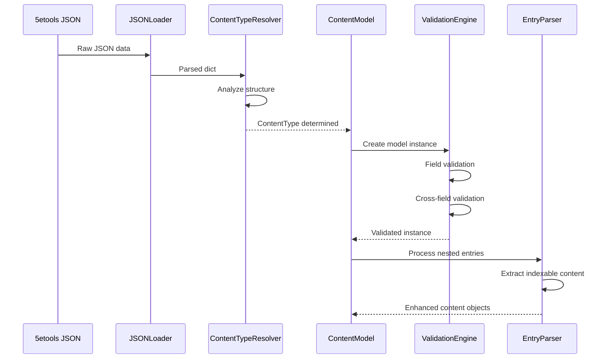

# Content Parsing Pipeline Implementation Guide

This guide provides comprehensive information for understanding and extending the sophisticated content parsing system that transforms 5etools JSON data into typed content objects.

## Overview

The content parsing pipeline implements a multi-stage transformation process that converts raw JSON data from 5etools into strongly-typed Python objects, with validation, error handling, and extensibility built-in.

### Key Benefits

- **Type Safety**: Full Pydantic validation with Python 3.12 type annotations
- **Flexible Parsing**: Handles multiple input formats and malformed data gracefully
- **Extensible Design**: Protocol-based architecture for adding new content types
- **Comprehensive Validation**: Strict and liberal validation modes for different use cases
- **Rich Error Context**: Detailed error reporting with source and context information

## Architecture Overview

```mermaid
graph TD
    A[5etools JSON Data] --> B[JSONLoader]
    B --> C[ContentTypeRegistry]
    C --> D[ContentFactory]

    D -->|@content_type| E[SpellModel]
    D -->|@content_type| F[CreatureModel]
    D -->|@content_type| G[ItemModel]
    D -->|@content_type| H[AdventureModel]
    D -->|@content_type| I[BookModel]
    D -->|@content_type| J[ClassModel]
    D -->|@content_type| K[DiseaseModel]
    D -->|@content_type| L[RewardModel]

    E --> M[ValidationEngine]
    F --> M
    G --> M
    H --> M
    I --> M
    J --> M
    K --> M
    L --> M

    M --> N[EntryParser]
    N --> O[NestedContentExtractor]
    O --> P[TypedContentObjects]

    Q[FluffLoader] --> R[FluffModel]
    R --> M

    S[ConfigurableSourceManager] --> T[FilePatternDetection]
    T --> C

    U[initialize_content_types] --> V[DynamicEnumUpdate]
    V --> W[SystemIntegration]
```

## Core Components

### BaseContent and ContentType System

**Location**: `src/dnd5e/core/models/content.py`

The foundation of the parsing system provides type-safe content classification:

#### ContentType Enumeration

```python
from dnd5e.core.models.content import ContentType, BaseContent

# Core content types
ContentType.SPELL           # Individual spells
ContentType.CREATURE         # Monsters and NPCs
ContentType.ITEM            # Equipment and magic items
ContentType.CLASS           # Character classes
ContentType.RACE            # Player races
ContentType.FEAT            # Feats and features
ContentType.BACKGROUND      # Character backgrounds

# Container content types
ContentType.ADVENTURE       # Complete adventures
ContentType.BOOK            # Rulebooks and supplements

# Nested content types (extracted from containers)
ContentType.ADVENTURE_SECTION    # Adventure chapters/sections
ContentType.ADVENTURE_TABLE      # Tables within adventures
ContentType.ADVENTURE_INSET      # Sidebar content
ContentType.BOOK_SECTION         # Book chapters/sections
ContentType.VARIANT_RULE         # Optional rules
```

#### Base Content Model

```python
class BaseContent(BaseModel):
    """Base class for all D&D content."""

    model_config = ConfigDict(
        extra="allow",          # Allow extra fields from 5etools
        use_enum_values=True,   # Serialize enums as values
    )

    name: str = Field(..., description="Content name")
    source: Source = Field(..., description="Source book reference")

    @field_validator("source", mode="before")
    @classmethod
    def parse_source(cls, v: str | dict | Source) -> dict | Source:
        """Handle flexible source format parsing."""
        if isinstance(v, str):
            return {"abbreviation": v, "name": v}
        return v
```

#### Source Model

```python
class Source(BaseModel):
    """Represents D&D source book reference."""

    abbreviation: str = Field(..., description="Source abbreviation (PHB, MM)")
    name: str | None = Field(None, description="Full source name")
    page: int | None = Field(None, description="Page number")
    url: str | None = Field(None, description="URL reference")

    def __str__(self) -> str:
        if self.page:
            return f"{self.abbreviation}, p. {self.page}"
        return self.abbreviation
```

### Registry-Based Content Type Resolution

**Location**: `src/dnd5e/core/registry/` and `src/dnd5e/core/interfaces/registry.py`

Content type resolution now uses the registry system for dynamic type detection:

#### Registry-Based Resolution

```python
from dnd5e.core.models.content import ContentType
from dnd5e.core.registry import initialize_content_types
from dnd5e.core.interfaces import get_content_type_registry

# Initialize all registered content types
initialize_content_types()

# Registry provides content type resolution
registry = get_content_type_registry()

# Get content type from model class
content_type = registry.get_type(content_object)

# Use ContentType with proper registration workflow
# Content types are available through the registry and factory
from dnd5e.core.loaders.content_factory import ContentFactory
factory = ContentFactory()
supported_types = factory.get_supported_types()
print(f"Factory supports: {[ct.value for ct in supported_types[:5]]}")

# Get all available content types
all_types = registry.get_all_types()
print(f"Registered: {[ct.value for ct in all_types]}")
```

#### ContentFactory Integration

```python
from dnd5e.core.loaders.content_factory import ContentFactory

# Factory uses registry for content creation
factory = ContentFactory()

# Create content based on registered type
disease_data = {"name": "Plague", "symptoms": ["fever"]}
disease = factory.create_content("disease", disease_data)

# List all supported types (from registry)
supported_types = factory.get_supported_types()
```

#### Automatic File Pattern Detection

```python
from dnd5e.core.loaders.configurable_source_manager import ConfigurableSourceManager

# Source manager uses registry file patterns
manager = ConfigurableSourceManager()
file_paths = manager.get_data_paths()

# File patterns from @content_type decorators are automatically included
for content_type, paths in file_paths.items():
    print(f"{content_type}: {len(paths)} files detected")
```

### Specialized Content Models

#### Spell Model

**Location**: `src/dnd5e/core/models/spells.py`

Comprehensive spell data representation:

```python
class Spell(BaseContent):
    """Spell content model with full 5etools compatibility."""

    level: int = Field(..., description="Spell level (0-9)")
    school: str = Field(..., description="School of magic")
    time: list[SpellTime] = Field(..., description="Casting time")
    range: SpellRange = Field(..., description="Spell range")
    components: SpellComponent = Field(..., description="V/S/M components")
    duration: list[SpellDuration] = Field(..., description="Duration")
    entries: list[Any] = Field(..., description="Spell description entries")

    # Optional fields with intelligent defaults
    ritual: bool = Field(False, description="Can be cast as ritual")
    classes: dict[str, list[str]] | None = Field(None, description="Class availability")
    damage: dict[str, Any] | None = Field(None, description="Damage information")
    save: dict[str, str] | None = Field(None, description="Saving throw info")

    def get_formatted_level(self) -> str:
        """Get human-readable spell level."""
        if self.level == 0:
            return "Cantrip"
        elif self.level == 1:
            return "1st-level"
        elif self.level == 2:
            return "2nd-level"
        elif self.level == 3:
            return "3rd-level"
        else:
            return f"{self.level}th-level"

    def get_formatted_components(self) -> str:
        """Get formatted component string."""
        parts = []
        if self.components.verbal:
            parts.append("V")
        if self.components.somatic:
            parts.append("S")
        if self.components.material:
            if isinstance(self.components.material, str):
                parts.append(f"M ({self.components.material})")
            else:
                parts.append("M")
        return ", ".join(parts)
```

##### Component Models

```python
class SpellComponent(BaseModel):
    """Spell components with flexible parsing."""

    verbal: bool = Field(False, alias="v")
    somatic: bool = Field(False, alias="s")
    material: bool | str = Field(False, alias="m")

    @field_validator("material", mode="before")
    @classmethod
    def parse_material(cls, v: Any) -> bool | str:
        """Handle various material component formats."""
        if isinstance(v, dict) and "text" in v:
            return str(v["text"])
        elif isinstance(v, str):
            return v
        return bool(v)

class SpellTime(BaseModel):
    """Casting time representation."""

    number: int = Field(1, description="Number of time units")
    unit: str = Field(..., description="Time unit")
    condition: str | None = Field(None, description="Conditional timing")

    def __str__(self) -> str:
        result = f"{self.number} {self.unit}" if self.number == 1 else f"{self.number} {self.unit}s"
        if self.condition:
            result += f" ({self.condition})"
        return result
```

#### Creature Model

**Location**: `src/dnd5e/core/models/creatures.py`

Complex creature data with computed properties:

```python
class Creature(BaseContent):
    """Monster/NPC model with comprehensive stat block support."""

    # Basic information
    type: str | dict[str, Any] = Field(..., description="Creature type")
    size: str = Field(..., description="Size category")
    alignment: str | list[str] = Field(..., description="Alignment")

    # Combat statistics
    ac: list[ArmorClass] = Field(..., description="Armor class")
    hp: HitPoints = Field(..., description="Hit points")
    speed: Speed = Field(..., description="Movement speeds")

    # Ability scores
    str: int = Field(..., description="Strength score")
    dex: int = Field(..., description="Dexterity score")
    con: int = Field(..., description="Constitution score")
    int: int = Field(..., description="Intelligence score")
    wis: int = Field(..., description="Wisdom score")
    cha: int = Field(..., description="Charisma score")

    # Derived statistics
    save: dict[str, str] | None = Field(None, description="Saving throws")
    skill: dict[str, str] | None = Field(None, description="Skills")
    passive: int | None = Field(None, description="Passive Perception")

    # Challenge and experience
    cr: str | int | dict[str, Any] = Field(..., description="Challenge rating")

    @property
    def ability_scores(self) -> dict[str, int]:
        """Get all ability scores as a dictionary."""
        return {
            "str": self.str,
            "dex": self.dex,
            "con": self.con,
            "int": self.int,
            "wis": self.wis,
            "cha": self.cha
        }

    @property
    def ability_modifiers(self) -> dict[str, int]:
        """Calculate ability modifiers."""
        return {
            ability: (score - 10) // 2
            for ability, score in self.ability_scores.items()
        }

    def get_proficiency_bonus(self) -> int:
        """Calculate proficiency bonus from CR."""
        cr_value = self._parse_cr_value(self.cr)
        if cr_value < 0.25:
            return 2
        elif cr_value < 5:
            return 2
        elif cr_value < 9:
            return 3
        elif cr_value < 13:
            return 4
        elif cr_value < 17:
            return 5
        else:
            return 6
```

##### Creature Component Models

```python
class ArmorClass(BaseModel):
    """Flexible AC representation."""

    ac: int | None = Field(None, description="AC value")
    from_: list[str] | None = Field(None, alias="from", description="AC sources")
    condition: str | None = Field(None, description="Conditional AC")
    special: str | None = Field(None, description="Special AC text")

    def __str__(self) -> str:
        if self.special:
            return self.special
        elif self.ac is not None:
            result = str(self.ac)
            if self.from_:
                result += f" ({', '.join(self.from_)})"
            if self.condition:
                result += f" {self.condition}"
            return result
        return "Unknown"

class HitPoints(BaseModel):
    """Hit point representation with formula support."""

    average: int | None = Field(None, description="Average HP")
    formula: str | None = Field(None, description="Hit dice formula")
    special: str | None = Field(None, description="Special HP description")

    def __str__(self) -> str:
        if self.special:
            return self.special
        elif self.average and self.formula:
            return f"{self.average} ({self.formula})"
        elif self.average:
            return str(self.average)
        return self.formula or "Unknown"
```

### Entry Parser System

**Location**: `src/dnd5e/core/parsers/entry_parser.py`

Processes nested content structures from adventures and books:

#### Core Parser Implementation

```python
from dnd5e.core.parsers.entry_parser import EntryParser
from dnd5e.core.entry_registry import ValidationMode

# Initialize parser with context
parser = EntryParser(
    source=Source(abbreviation="CoS", name="Curse of Strahd"),
    parent_name="Chapter 1",
    validation_mode=ValidationMode.STRICT
)

# Parse entry list
for content_object in parser.parse_entries(entries, "adventure"):
    print(f"Extracted: {content_object.name}")
```

#### Entry Processing Pipeline

```python
class EntryParser:
    """Parser for extracting indexable content from entries."""

    def parse_entries(self, entries: list[Any], content_type: str) -> Iterator[Any]:
        """Parse entries and yield indexable content objects."""
        for entry in entries:
            yield from self._parse_single_entry(entry, content_type)

    def _parse_single_entry(self, entry: Any, content_type: str) -> Iterator[Any]:
        """Parse individual entry with error handling."""
        try:
            # Validate entry structure
            if isinstance(entry, str):
                return  # Plain text, no indexable content

            if not isinstance(entry, dict):
                self._log_warning(f"Non-dict entry: {type(entry)}")
                return

            entry_type = entry.get("type", "")

            # Process based on entry type
            if entry_type == "section":
                yield from self._parse_section_entry(entry)
            elif entry_type == "inset":
                yield self._parse_inset_entry(entry)
            elif entry_type == "table":
                yield self._parse_table_entry(entry)
            elif entry_type == "entries":
                # Recursive processing for nested entries
                nested_entries = entry.get("entries", [])
                yield from self.parse_entries(nested_entries, content_type)

        except Exception as e:
            self._handle_parsing_error(entry, e)
```

### Nested Content Models

**Location**: `src/dnd5e/core/models/nested_content.py`

Models for extractable content within adventures and books:

#### Section Model

```python
class Section(BaseContent):
    """Represents a section within an adventure or book."""

    entries: list[Any] = Field(default_factory=list, description="Section content")
    page: int | None = Field(None, description="Page number")
    chapter: str | None = Field(None, description="Chapter reference")
    depth: int = Field(1, description="Nesting depth")

    def get_deep_index_entries(self) -> list[IndexEntry]:
        """Extract indexable entries for deep indexing."""
        entries = []

        # Add section itself
        entries.append(IndexEntry(
            name=self.name,
            type="section",
            source=self.source.abbreviation,
            page=self.page,
            content_preview=self._get_content_preview()
        ))

        # Process nested content
        parser = EntryParser(self.source, self.name)
        for nested_content in parser.parse_entries(self.entries, "adventure"):
            entries.extend(nested_content.get_deep_index_entries())

        return entries
```

#### Table Model

```python
class Table(BaseContent):
    """Represents a table with structured data."""

    colLabels: list[str] = Field(..., description="Column headers")
    colStyles: list[str] | None = Field(None, description="Column styling")
    rows: list[list[Any]] = Field(..., description="Table rows")
    caption: str | None = Field(None, description="Table caption")

    def to_latex(self) -> str:
        """Generate LaTeX table representation."""
        col_spec = "|".join("l" * len(self.colLabels))

        latex_lines = [
            "\\begin{DndTable}[" + (self.caption or "") + "]{" + col_spec + "}",
            " & ".join(f"\\textbf{{{label}}}" for label in self.colLabels) + " \\\\",
            "\\hline"
        ]

        for row in self.rows:
            row_text = " & ".join(str(cell) for cell in row) + " \\\\"
            latex_lines.append(row_text)

        latex_lines.append("\\end{DndTable}")
        return "\n".join(latex_lines)
```

#### Inset Model

```python
class Inset(BaseContent):
    """Represents sidebar or inset content."""

    entries: list[Any] = Field(..., description="Inset content")
    inset_type: str = Field("sidebar", description="Type of inset")

    def to_latex(self) -> str:
        """Generate LaTeX inset representation."""
        env_name = "DndSidebar" if self.inset_type == "sidebar" else "DndReadAloud"

        content_lines = []
        for entry in self.entries:
            if isinstance(entry, str):
                content_lines.append(entry)
            elif isinstance(entry, dict):
                # Process nested entries
                content_lines.append(self._process_nested_entry(entry))

        content = "\n".join(content_lines)
        return f"\\begin{{{env_name}}}[{self.name}]\n{content}\n\\end{{{env_name}}}"
```

## Validation System

### Validation Modes

The parsing system supports different validation modes for different use cases:

```python
from dnd5e.core.entry_registry import ValidationMode

# Strict validation - fails on any unknown elements
ValidationMode.STRICT      # Development and testing
ValidationMode.LIBERAL     # Production with unknown content
ValidationMode.PERMISSIVE  # Maximum compatibility
```

### Custom Validators

```python
from pydantic import field_validator
from dnd5e.core.models.content import BaseContent

class CustomSpell(BaseContent):
    """Spell with custom validation rules."""

    level: int = Field(..., description="Spell level")
    school: str = Field(..., description="School of magic")

    @field_validator("level")
    @classmethod
    def validate_spell_level(cls, v: int) -> int:
        """Ensure spell level is valid."""
        if not 0 <= v <= 9:
            raise ValueError(f"Spell level must be 0-9, got {v}")
        return v

    @field_validator("school")
    @classmethod
    def validate_school(cls, v: str) -> str:
        """Validate school of magic."""
        valid_schools = {
            "abjuration", "conjuration", "divination", "enchantment",
            "evocation", "illusion", "necromancy", "transmutation"
        }

        if v.lower() not in valid_schools:
            raise ValueError(f"Invalid school: {v}")
        return v.lower()
```

### Error Handling Patterns

```python
from dnd5e.core.exceptions import EntryProcessingError, EntryValidationError

def robust_content_parsing(data: dict) -> BaseContent | None:
    """Parse content with comprehensive error handling."""

    try:
        # Attempt primary parsing
        return parse_primary_format(data)

    except EntryValidationError as e:
        logger.warning(f"Validation failed: {e}")

        # Try fallback parsing
        try:
            return parse_fallback_format(data)
        except Exception as fallback_error:
            logger.error(f"Fallback parsing failed: {fallback_error}")

    except EntryProcessingError as e:
        logger.error(f"Processing error: {e}")
        if e.entry:
            logger.debug(f"Problematic entry: {e.entry}")

    except Exception as e:
        logger.error(f"Unexpected error parsing content: {e}")

    return None
```

## Data Flow Patterns

### JSON to Model Transformation



### Nested Content Extraction

```python
def extract_nested_content(adventure: Adventure) -> list[BaseContent]:
    """Extract all nested indexable content from adventure."""

    extracted_content = []

    # Process each chapter
    for chapter in adventure.chapters:
        parser = EntryParser(
            source=adventure.source,
            parent_name=chapter.name
        )

        # Extract content from chapter entries
        for content in parser.parse_entries(chapter.entries, "adventure"):
            extracted_content.append(content)

            # Recursively process nested content
            if hasattr(content, 'entries'):
                nested_parser = EntryParser(
                    source=adventure.source,
                    parent_name=content.name
                )

                for nested in nested_parser.parse_entries(content.entries, "adventure"):
                    extracted_content.append(nested)

    return extracted_content
```

## Extension Patterns

### Adding New Content Types

#### 1. Define Content Type

```python
# Add to ContentType enum
class ContentType(str, Enum):
    # ... existing types
    CUSTOM_HOMEBREW = "customHomebrew"
```

#### 2. Create Content Model

```python
class HomebrewContent(BaseContent):
    """Custom homebrew content model."""

    author: str = Field(..., description="Content author")
    version: str = Field("1.0", description="Content version")
    tags: list[str] = Field(default_factory=list, description="Content tags")
    homebrew_data: dict[str, Any] = Field(..., description="Custom data")

    def validate_homebrew_data(self) -> bool:
        """Validate custom homebrew data structure."""
        required_fields = ["type", "mechanics", "flavor"]
        return all(field in self.homebrew_data for field in required_fields)
```

#### 3. Register Content Type Resolver

```python
def homebrew_content_resolver(data: dict) -> ContentType | None:
    """Resolver for homebrew content detection."""
    if data.get("_meta", {}).get("homebrew") or data.get("isHomebrew"):
        return ContentType.CUSTOM_HOMEBREW
    return None

# Register resolver
resolver = get_content_type_resolver()
resolver.register_resolver(homebrew_content_resolver)
```

#### 4. Add to Model Registry

```python
from dnd5e.core.models import register_content_model

register_content_model(ContentType.CUSTOM_HOMEBREW, HomebrewContent)
```

### Custom Entry Processors

```python
class CustomEntryProcessor:
    """Process custom entry types."""

    def __init__(self, source: Source, parent_name: str):
        self.source = source
        self.parent_name = parent_name

    def process_custom_entry(self, entry: dict[str, Any]) -> BaseContent | None:
        """Process custom entry format."""

        entry_type = entry.get("type", "")

        if entry_type == "customBlock":
            return CustomBlock(
                name=entry.get("name", "Unnamed Block"),
                source=self.source,
                content=entry.get("content", []),
                block_type=entry.get("blockType", "generic")
            )

        elif entry_type == "customReference":
            return CustomReference(
                name=entry.get("name", "Unnamed Reference"),
                source=self.source,
                target=entry.get("target", ""),
                reference_type=entry.get("refType", "generic")
            )

        return None

# Integrate with main parser
class ExtendedEntryParser(EntryParser):
    """Entry parser with custom entry support."""

    def __init__(self, *args, **kwargs):
        super().__init__(*args, **kwargs)
        self.custom_processor = CustomEntryProcessor(self.source, self.parent_name)

    def _parse_single_entry(self, entry: Any, content_type: str) -> Iterator[Any]:
        """Extended entry parsing with custom support."""

        # Try standard parsing first
        yield from super()._parse_single_entry(entry, content_type)

        # Try custom parsing
        if isinstance(entry, dict):
            custom_content = self.custom_processor.process_custom_entry(entry)
            if custom_content:
                yield custom_content
```

### Data Source Extensions

```python
class CustomDataSource:
    """Custom data source with specialized parsing."""

    def __init__(self, source_config: dict[str, Any]):
        self.config = source_config
        self.parser_overrides = {}

    def register_parser_override(self, content_type: ContentType, parser_func):
        """Register custom parser for specific content type."""
        self.parser_overrides[content_type] = parser_func

    def parse_content(self, raw_data: dict[str, Any]) -> BaseContent:
        """Parse content with custom overrides."""

        content_type = self._determine_content_type(raw_data)

        # Use custom parser if available
        if content_type in self.parser_overrides:
            parser_func = self.parser_overrides[content_type]
            return parser_func(raw_data, self.config)

        # Fall back to standard parsing
        return self._standard_parse(raw_data, content_type)
```

## Performance Optimization

### Lazy Loading Patterns

```python
from functools import cached_property
from typing import TYPE_CHECKING

class OptimizedAdventure(Adventure):
    """Adventure with lazy-loaded nested content."""

    @cached_property
    def extracted_content(self) -> list[BaseContent]:
        """Lazily extract and cache nested content."""
        if not hasattr(self, '_extracted_content'):
            self._extracted_content = extract_nested_content(self)
        return self._extracted_content

    @cached_property
    def content_by_type(self) -> dict[ContentType, list[BaseContent]]:
        """Group content by type for efficient access."""
        grouped = {}
        for content in self.extracted_content:
            content_type = ContentType.from_content(content)
            if content_type not in grouped:
                grouped[content_type] = []
            grouped[content_type].append(content)
        return grouped
```

### Batch Processing

```python
def batch_parse_content(
    data_items: list[dict[str, Any]],
    batch_size: int = 100
) -> list[BaseContent]:
    """Parse content in batches for memory efficiency."""

    results = []

    for i in range(0, len(data_items), batch_size):
        batch = data_items[i:i + batch_size]

        # Process batch
        batch_results = []
        for item in batch:
            try:
                content = parse_content_item(item)
                if content:
                    batch_results.append(content)
            except Exception as e:
                logger.warning(f"Failed to parse item: {e}")

        results.extend(batch_results)

        # Optional: progress callback for long operations
        if len(results) % (batch_size * 10) == 0:
            logger.info(f"Processed {len(results)} items...")

    return results
```

### Memory Management

```python
import weakref
from functools import lru_cache

class ContentCache:
    """Memory-efficient content caching."""

    def __init__(self, max_size: int = 1000):
        self.max_size = max_size
        self._cache = {}
        self._access_order = []

    @lru_cache(maxsize=100)
    def get_content_by_id(self, content_id: str) -> BaseContent | None:
        """Cached content lookup."""
        return self._load_content(content_id)

    def store_content(self, content: BaseContent) -> None:
        """Store content with memory management."""
        content_id = self._get_content_id(content)

        # Use weak reference to allow garbage collection
        self._cache[content_id] = weakref.ref(content)

        # Manage cache size
        if len(self._cache) > self.max_size:
            self._evict_oldest()

    def _evict_oldest(self) -> None:
        """Remove oldest cached items."""
        items_to_remove = len(self._cache) - self.max_size + 100

        for _ in range(items_to_remove):
            if self._access_order:
                oldest_id = self._access_order.pop(0)
                self._cache.pop(oldest_id, None)
```

## Testing Strategies

### Model Testing

```python
import pytest
from pydantic import ValidationError
from dnd5e.core.models.spells import Spell

class TestSpellModel:
    """Test spell model parsing and validation."""

    def test_valid_spell_parsing(self):
        """Test parsing of valid spell data."""
        spell_data = {
            "name": "Magic Missile",
            "source": "PHB",
            "level": 1,
            "school": "evocation",
            "time": [{"number": 1, "unit": "action"}],
            "range": {"type": "point", "distance": {"type": "feet", "amount": 120}},
            "components": {"v": True, "s": True},
            "duration": [{"type": "instant"}],
            "entries": ["You create three glowing darts..."]
        }

        spell = Spell(**spell_data)

        assert spell.name == "Magic Missile"
        assert spell.level == 1
        assert spell.get_formatted_level() == "1st-level"
        assert "V, S" in spell.get_formatted_components()

    def test_invalid_spell_level(self):
        """Test validation of invalid spell level."""
        spell_data = {
            "name": "Invalid Spell",
            "source": "TEST",
            "level": 15,  # Invalid level
            "school": "evocation",
            # ... other required fields
        }

        with pytest.raises(ValidationError) as exc_info:
            Spell(**spell_data)

        assert "spell level must be 0-9" in str(exc_info.value).lower()

    def test_flexible_source_parsing(self):
        """Test flexible source format handling."""
        # String source
        spell1 = Spell(source="PHB", **minimal_spell_data())
        assert spell1.source.abbreviation == "PHB"

        # Dict source
        spell2 = Spell(source={"abbreviation": "PHB", "page": 257}, **minimal_spell_data())
        assert spell2.source.page == 257
```

### Parser Testing

```python
class TestEntryParser:
    """Test entry parsing functionality."""

    def test_section_parsing(self):
        """Test section entry parsing."""
        entries = [
            {
                "type": "section",
                "name": "The Village",
                "entries": [
                    "The village of Barovia sits in the shadow of Castle Ravenloft.",
                    {
                        "type": "inset",
                        "name": "Village Features",
                        "entries": ["The village has several notable features..."]
                    }
                ]
            }
        ]

        parser = EntryParser(
            source=Source(abbreviation="CoS"),
            parent_name="Chapter 1"
        )

        parsed_content = list(parser.parse_entries(entries, "adventure"))

        assert len(parsed_content) >= 2  # Section + inset
        assert any(content.name == "The Village" for content in parsed_content)
        assert any(content.name == "Village Features" for content in parsed_content)

    def test_malformed_entry_handling(self):
        """Test handling of malformed entries."""
        entries = [
            "Plain text entry",  # Valid
            {"type": "section"},  # Missing name
            None,  # Invalid type
            {"name": "Valid Section", "type": "section", "entries": []}  # Valid
        ]

        parser = EntryParser(
            source=Source(abbreviation="TEST"),
            parent_name="Test Chapter"
        )

        # Should not raise exception
        parsed_content = list(parser.parse_entries(entries, "adventure"))

        # Should have at least the valid section
        assert len(parsed_content) >= 1
        assert any(content.name == "Valid Section" for content in parsed_content)
```

### Integration Testing

```python
@pytest.mark.integration
class TestContentPipeline:
    """Test complete content parsing pipeline."""

    def test_adventure_parsing_pipeline(self, sample_adventure_json):
        """Test complete adventure parsing."""

        # Load from JSON
        adventure = Adventure(**sample_adventure_json)

        # Validate basic properties
        assert adventure.name
        assert adventure.source
        assert len(adventure.chapters) > 0

        # Test nested content extraction
        extracted_content = extract_nested_content(adventure)
        assert len(extracted_content) > 0

        # Test content type distribution
        content_types = {ContentType.from_content(c) for c in extracted_content}
        assert ContentType.ADVENTURE_SECTION in content_types

        # Test deep indexing
        index_entries = []
        for content in extracted_content:
            if hasattr(content, 'get_deep_index_entries'):
                index_entries.extend(content.get_deep_index_entries())

        assert len(index_entries) > 0
        assert all(entry.name for entry in index_entries)
```

## Troubleshooting Common Issues

### Validation Errors

**Issue**: `ValidationError: field required`
```python
# Debug missing fields
try:
    content = Spell(**data)
except ValidationError as e:
    print("Missing fields:")
    for error in e.errors():
        if error['type'] == 'missing':
            print(f"  - {error['loc'][0]}: {error['msg']}")
```

**Issue**: `ValidationError: unexpected value type`
```python
# Debug type mismatches
def debug_field_types(data: dict, model_class):
    """Debug field type mismatches."""
    for field_name, field_info in model_class.model_fields.items():
        if field_name in data:
            expected_type = field_info.annotation
            actual_value = data[field_name]
            actual_type = type(actual_value)

            print(f"{field_name}: expected {expected_type}, got {actual_type}")
            if actual_type != expected_type:
                print(f"  Value: {actual_value}")
```

### Content Type Resolution Issues

**Issue**: Unknown content type detected
```python
# Add debug logging to resolver
resolver = get_content_type_resolver()
resolver.enable_debug_logging()

# Check resolution process
content_type = resolver.resolve_from_json(problematic_data)
print(f"Resolved type: {content_type}")
print(f"Resolution path: {resolver.get_last_resolution_path()}")
```

### Performance Issues

**Issue**: Slow parsing of large datasets
```python
# Profile parsing performance
import cProfile
import pstats

def profile_parsing(data_list):
    profiler = cProfile.Profile()
    profiler.enable()

    try:
        results = [parse_content_item(item) for item in data_list]
    finally:
        profiler.disable()

    stats = pstats.Stats(profiler)
    stats.sort_stats('cumulative')
    stats.print_stats(20)

    return results
```

For additional parsing techniques and model patterns, see the [API Documentation](../../api-reference/index.md) and [LaTeX Rendering Guide](latex-rendering.md).
