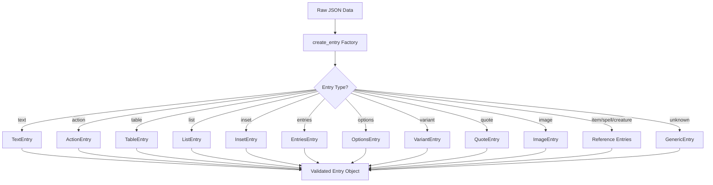

# Entry Types System

The Entry Types System is a comprehensive Pydantic-based architecture that replaces generic `dict[str, Any]` patterns with type-safe, validated structures for D&D content processing.

## Overview

This system addresses a critical architectural need: providing type safety and validation for the complex nested content structures found in D&D 5e data. Instead of working with untyped dictionaries that bypass validation, the system provides 13+ specialized entry models that ensure data integrity and enable IDE support.



## Architecture

### Core Components

#### Base Entry Class

```python
class BaseEntry(BaseModel):
    """Base class for all entry types."""
    model_config = ConfigDict(extra="forbid")
```

All entry types inherit from `BaseEntry`, which:
- Uses Pydantic for validation and serialization
- Forbids extra fields by default (strict validation)
- Provides consistent base behavior across all entry types

#### Entry Type Hierarchy

The system provides specialized models for each content structure:

**Content Structure Entries:**
- `TextEntry`: Simple text content
- `EntriesEntry`: Container with nested entries
- `InsetEntry`: Sidebar/inset content
- `ListEntry`: Structured lists with styles

**Interactive Content Entries:**
- `ActionEntry`: Combat actions with attack/damage info
- `OptionsEntry`: Choice-based content with selection counts
- `TableEntry`: Structured tables with headers and rows

**Reference Entries:**
- `ItemEntry`: References to items
- `SpellEntry`: References to spells
- `CreatureEntry`: References to creatures

**Specialized Content:**
- `VariantEntry`: Alternative rules with metadata
- `QuoteEntry`: Flavor text with attribution
- `ImageEntry`: Image references with metadata
- `GenericEntry`: Fallback for unknown types

### Factory Pattern Implementation

The `create_entry()` factory function provides type-safe instantiation:

```python
def create_entry(data: str | dict[str, Any]) -> Entry:
    """Factory function to create appropriate entry type from data."""
    if isinstance(data, str):
        return data  # Direct string entries

    entry_type = data.get("type")
    if entry_type == "action":
        return ActionEntry.model_validate(data)
    elif entry_type == "table":
        return TableEntry.model_validate(data)
    # ... additional type mappings
    else:
        return GenericEntry.model_validate(data)  # Unknown types
```

**Key Features:**
- **Type Detection**: Automatic entry type identification from `type` field
- **Validation**: Full Pydantic validation during instantiation
- **Fallback Handling**: `GenericEntry` for unknown types with extra field support
- **Error Handling**: Clear validation errors for malformed data

## Entry Type Details

### ActionEntry - Combat Actions

Handles combat actions with structured attack and damage information:

```python
class ActionEntry(BaseEntry):
    type: Literal["action"] = "action"
    name: str = Field(..., description="Name of the action")
    attack: dict[str, Any] | None = Field(None, description="Attack details")
    damage: dict[str, Any] | None = Field(None, description="Damage details")
    description: str | None = Field(None, description="Action description")
```

**Use Cases:**
- Monster stat blocks with multiple attacks
- Spell attack descriptions
- Magic item activated abilities

**Example:**
```json
{
    "type": "action",
    "name": "Longsword",
    "attack": {
        "type": "melee",
        "bonus": 5,
        "reach": 5
    },
    "damage": {
        "dice": "1d8+3",
        "type": "slashing"
    }
}
```

### TableEntry - Structured Data

Provides comprehensive table support with styling and formatting:

```python
class TableEntry(BaseEntry):
    type: Literal["table"] = "table"
    caption: str | None = Field(None, description="Table caption")
    colLabels: list[str] | None = Field(None, description="Column headers")
    colStyles: list[str] | None = Field(None, description="Column styles")
    rows: list[list[str]] = Field(default_factory=list, description="Table rows")
```

**Use Cases:**
- Spell lists organized by level
- Random encounter tables
- Magic item properties tables
- Class feature progression tables

**Example:**
```json
{
    "type": "table",
    "caption": "Spell Slots per Level",
    "colLabels": ["Level", "1st", "2nd", "3rd"],
    "colStyles": ["col-2", "col-2", "col-2", "col-2"],
    "rows": [
        ["1st", "2", "—", "—"],
        ["2nd", "3", "—", "—"],
        ["3rd", "4", "2", "—"]
    ]
}
```

### OptionsEntry - Choice Mechanics

Handles content with choice mechanics and selection counts:

```python
class OptionsEntry(BaseEntry):
    type: Literal["options"] = "options"
    count: int | None = Field(None, description="Number of options to choose")
    entries: list[str | dict[str, Any]] = Field(
        default_factory=list, description="Available options"
    )
```

**Use Cases:**
- Class feature choices (Fighting Style, Expertise)
- Spell selection lists
- Background skill choices
- Feat selection options

**Example:**
```json
{
    "type": "options",
    "count": 2,
    "entries": [
        "Arcana",
        "History",
        "Investigation",
        "Nature",
        "Religion"
    ]
}
```

### VariantEntry - Alternative Rules

Provides structured metadata for variant rules and optional content:

```python
class VariantEntry(BaseEntry):
    type: Literal["variant"] = "variant"
    name: str = Field(..., description="Variant name")
    entries: list[str | dict[str, Any]] = Field(
        default_factory=list, description="Variant description"
    )
    source: str | None = Field(None, description="Variant source")
```

**Use Cases:**
- Optional class features
- Alternative spell components
- Variant combat rules
- House rules documentation

## Integration with Content Models

### Before: Generic Dict Pattern

```python
# Old pattern - no type safety
class Spell(BaseModel):
    name: str
    entries: list[dict[str, Any]]  # Could be anything!

# Usage problems:
spell = get_spell("fireball")
for entry in spell.entries:
    # No IDE support, runtime errors possible
    if entry.get("type") == "table":
        headers = entry["colLabels"]  # Might not exist!
```

### After: Typed Entry Pattern

```python
# New pattern - full type safety
from dnd5e.core.models.entry_types import Entry, create_entry

class Spell(BaseModel):
    name: str
    entries: list[Entry]  # Type-safe union of all entry types

# Usage benefits:
spell = get_spell("fireball")
for entry in spell.entries:
    if isinstance(entry, TableEntry):
        headers = entry.colLabels  # IDE knows this exists and its type
        if headers:  # Proper null checking
            print(f"Table headers: {headers}")
```

### Migration Pattern

The system supports gradual migration from dict patterns:

```python
def migrate_entries(raw_entries: list[str | dict[str, Any]]) -> list[Entry]:
    """Convert raw entry data to typed entries."""
    return [create_entry(entry) for entry in raw_entries]

# In content models:
class AdventureSection(BaseModel):
    entries: list[Entry] = Field(default_factory=list)

    @field_validator("entries", mode="before")
    @classmethod
    def validate_entries(cls, v: list[str | dict[str, Any]]) -> list[Entry]:
        return [create_entry(entry) for entry in v]
```

## Validation and Error Handling

### Built-in Validation

Each entry type provides comprehensive validation:

```python
# Field validation
class ActionEntry(BaseEntry):
    name: str = Field(..., min_length=1, description="Action name required")

# Cross-field validation
class TableEntry(BaseEntry):
    @model_validator(mode="after")
    def validate_table_structure(self) -> "TableEntry":
        if self.colLabels and self.rows:
            expected_cols = len(self.colLabels)
            for i, row in enumerate(self.rows):
                if len(row) != expected_cols:
                    raise ValueError(
                        f"Row {i} has {len(row)} columns, expected {expected_cols}"
                    )
        return self
```

### Error Recovery

The `GenericEntry` provides graceful degradation for unknown types:

```python
class GenericEntry(BaseEntry):
    type: str = Field(..., description="Entry type")
    model_config = ConfigDict(extra="allow")  # Accept unknown fields

    @field_validator("type")
    @classmethod
    def validate_type_not_known(cls, v: str) -> str:
        known_types = {"text", "action", "table", ...}
        if v in known_types:
            raise ValueError(f"Use specific entry class for type '{v}'")
        return v
```

**Benefits:**
- **Forward Compatibility**: New entry types don't break existing code
- **Data Preservation**: Unknown fields are preserved in `GenericEntry`
- **Migration Safety**: Gradual migration without data loss
- **Debug Support**: Clear error messages for type mismatches

## Performance Considerations

### Memory Efficiency

The entry type system optimizes memory usage through:

**Literal Types**: Uses `Literal["action"]` instead of storing type strings
```python
class ActionEntry(BaseEntry):
    type: Literal["action"] = "action"  # Compile-time constant
```

**Lazy Validation**: Validation only occurs during instantiation
```python
# Validation happens once during creation
entry = ActionEntry.model_validate(data)

# Subsequent access is direct field access (fast)
name = entry.name  # No validation overhead
```

### Processing Performance

**Batch Processing**: Efficient validation of entry lists
```python
def validate_entries(entries: list[str | dict[str, Any]]) -> list[Entry]:
    """Batch validation with single error collection."""
    return [create_entry(entry) for entry in entries]
```

**Type Discrimination**: Fast isinstance checks for type-specific processing
```python
def process_entries(entries: list[Entry]) -> None:
    for entry in entries:
        if isinstance(entry, TableEntry):
            render_table(entry)  # Type-safe, fast dispatch
        elif isinstance(entry, ActionEntry):
            render_action(entry)
```

## Extension Patterns

### Adding New Entry Types

To add a new entry type:

1. **Define the Model:**
```python
class StatBlockEntry(BaseEntry):
    type: Literal["statblock"] = "statblock"
    creature_name: str = Field(..., description="Creature name")
    stats: dict[str, int] = Field(..., description="Ability scores")
```

2. **Update the Union Type:**
```python
Entry = (
    str | TextEntry | ActionEntry | ... | StatBlockEntry
)
```

3. **Extend the Factory:**
```python
def create_entry(data: str | dict[str, Any]) -> Entry:
    # ... existing cases
    elif entry_type == "statblock":
        return StatBlockEntry.model_validate(data)
```

### Custom Validation

Add domain-specific validation rules:

```python
class SpellLevelEntry(BaseEntry):
    type: Literal["spell_level"] = "spell_level"
    level: int = Field(..., ge=0, le=9, description="Spell level (0-9)")
    spells: list[str] = Field(..., min_items=1, description="Spell names")

    @field_validator("spells")
    @classmethod
    def validate_spell_names(cls, v: list[str]) -> list[str]:
        # Custom validation logic
        validated_spells = []
        for spell in v:
            if not spell.strip():
                raise ValueError("Spell names cannot be empty")
            validated_spells.append(spell.strip().title())
        return validated_spells
```

## Testing Strategies

### Unit Testing Entry Types

```python
import pytest
from dnd5e.core.models.entry_types import ActionEntry, create_entry

def test_action_entry_validation():
    """Test ActionEntry validation and creation."""
    data = {
        "type": "action",
        "name": "Sword Attack",
        "attack": {"bonus": 5},
        "damage": {"dice": "1d8+3"}
    }

    entry = ActionEntry.model_validate(data)
    assert entry.name == "Sword Attack"
    assert entry.attack["bonus"] == 5

def test_create_entry_factory():
    """Test factory function type discrimination."""
    # String entry
    text_entry = create_entry("Simple text")
    assert isinstance(text_entry, str)

    # Action entry
    action_data = {"type": "action", "name": "Attack"}
    action_entry = create_entry(action_data)
    assert isinstance(action_entry, ActionEntry)

    # Unknown type (should create GenericEntry)
    unknown_data = {"type": "unknown_type", "data": "something"}
    generic_entry = create_entry(unknown_data)
    assert isinstance(generic_entry, GenericEntry)
```

### Integration Testing

```python
def test_content_model_integration():
    """Test entry types with actual content models."""
    from dnd5e.core.models.spells import Spell

    spell_data = {
        "name": "Fireball",
        "entries": [
            "A bright streak flashes from your pointing finger.",
            {
                "type": "table",
                "caption": "Damage by Level",
                "colLabels": ["Level", "Damage"],
                "rows": [["3rd", "8d6"], ["4th", "9d6"]]
            }
        ]
    }

    spell = Spell.model_validate(spell_data)
    assert len(spell.entries) == 2
    assert isinstance(spell.entries[0], str)
    assert isinstance(spell.entries[1], TableEntry)
    assert spell.entries[1].caption == "Damage by Level"
```

## Migration Guide

### Updating Existing Models

**Step 1: Update Field Type**
```python
# Before
class Adventure(BaseModel):
    entries: list[dict[str, Any]]

# After
class Adventure(BaseModel):
    entries: list[Entry]
```

**Step 2: Add Validation**
```python
class Adventure(BaseModel):
    entries: list[Entry]

    @field_validator("entries", mode="before")
    @classmethod
    def validate_entries(cls, v: list[str | dict[str, Any]]) -> list[Entry]:
        return [create_entry(entry) for entry in v]
```

**Step 3: Update Processing Code**
```python
# Before - untyped access
def process_adventure(adventure):
    for entry in adventure.entries:
        if entry.get("type") == "table":
            headers = entry.get("colLabels", [])

# After - type-safe access
def process_adventure(adventure):
    for entry in adventure.entries:
        if isinstance(entry, TableEntry):
            headers = entry.colLabels or []
```

### Backward Compatibility

The system maintains full backward compatibility through:

- **Gradual Migration**: Models can migrate one at a time
- **GenericEntry Fallback**: Unknown types don't break processing
- **Field Preservation**: Extra fields are preserved during migration
- **Error Isolation**: Validation errors don't cascade to other entries

## Best Practices

### Type Safety
- Always use `isinstance()` checks for type-specific processing
- Leverage IDE type inference for field access
- Use `Entry` union type in function signatures

### Performance
- Create entries once during data loading, not during processing
- Use batch validation for large entry lists
- Cache frequently accessed entry properties

### Maintenance
- Add new entry types through proper inheritance
- Update factory function for new types
- Maintain comprehensive test coverage for validation rules

### Error Handling
- Provide clear error messages in custom validators
- Use `GenericEntry` for graceful degradation
- Log unknown entry types for future enhancement

## Conclusion

The Entry Types System represents a major architectural advancement in the 5e2pdf codebase, replacing brittle `dict[str, Any]` patterns with robust, type-safe models. This system provides:

- **Type Safety**: Full compile-time and runtime type checking
- **Data Integrity**: Comprehensive validation and error prevention
- **Developer Experience**: IDE support, auto-completion, and clear error messages
- **Extensibility**: Clean patterns for adding new entry types
- **Performance**: Efficient processing and memory usage

The system enables confident development and maintenance of complex D&D content processing while maintaining backward compatibility and providing clear migration paths for existing code.
