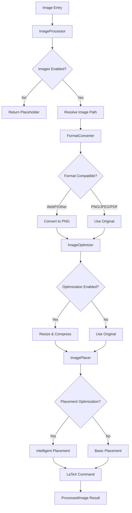

# Image Processing Pipeline

The Image Processing Pipeline is a comprehensive system for handling images in LaTeX documents, providing format conversion, optimization, and intelligent placement capabilities for D&D content.

## Overview

The image processing pipeline addresses critical requirements for PDF generation from D&D content:

- **Format Compatibility**: Convert WebP and other formats to LaTeX-compatible formats (PNG, JPEG, PDF)
- **Size Optimization**: Resize and compress images for optimal file size and quality
- **Intelligent Placement**: Generate appropriate LaTeX commands for different content contexts
- **Performance**: Cache processed images and handle operations efficiently
- **Fallback Handling**: Graceful degradation when image processing fails



## Architecture

### Core Components

The image processing system consists of four main components working in sequence:

#### 1. ImageProcessor - Pipeline Coordinator

Central coordinator that manages the complete image processing workflow.

```python
class ImageProcessor:
    """Core image processing pipeline for LaTeX documents."""

    def process_image_entry(
        self, image_entry: dict[str, Any], context: RenderContext
    ) -> str:
        """Process an image entry and return LaTeX code."""
```

**Key Features:**
- **Integration Point**: Seamless integration with RecursiveEntryProcessor
- **Error Handling**: Graceful fallback to placeholders on processing failures
- **Configuration**: Centralized configuration for all pipeline stages
- **Lazy Loading**: Components initialized only when needed

#### 2. FormatConverter - Format Compatibility

Handles conversion of images to LaTeX-compatible formats.

```python
class FormatConverter:
    """Handles image format conversion for LaTeX compatibility."""

    def convert_webp_to_png(self, webp_path: Path) -> ConversionResult:
        """Convert WebP image to PNG format."""
```

**Supported Conversions:**
- **WebP → PNG**: Primary conversion for 5etools WebP images
- **Unknown → PNG**: Fallback conversion for unsupported formats
- **Transparency Handling**: White background for transparent images
- **Quality Preservation**: Optimized conversion settings

#### 3. ImageOptimizer - Size and Quality

Optimizes images for document inclusion while maintaining visual quality.

```python
class ImageOptimizer:
    """Optimizes images for LaTeX documents."""

    def optimize_image(
        self, image_path: Path, context_hint: str | None = None
    ) -> OptimizationResult:
        """Optimize an image for LaTeX document inclusion."""
```

**Optimization Features:**
- **Intelligent Resizing**: Context-aware size limits (default 1200px width)
- **Quality Control**: JPEG quality (85%) and PNG compression (level 6)
- **Aspect Ratio Preservation**: Maintains original proportions
- **File Size Reduction**: Tracks compression ratios and savings

#### 4. ImagePlacer - LaTeX Integration

Generates appropriate LaTeX commands for different image contexts.

```python
class ImagePlacer:
    """Handles intelligent image placement and text wrapping."""

    def place_image(
        self, image_path: Path, image_entry: dict[str, Any]
    ) -> PlacementResult:
        """Generate LaTeX placement command for an image."""
```

**Placement Options:**
- **Float Strategies**: `here`, `top`, `bottom`, `page` placement
- **Text Wrapping**: `wrap-left`, `wrap-right` with configurable margins
- **Special Layouts**: `margin`, `full-width`, `inline` placement
- **Context-Aware**: Different strategies based on content type

## Processing Pipeline Flow

### Stage 1: Path Resolution

The pipeline begins by resolving image paths from various sources:

```python
def _resolve_image_path(self, image_path: str, context: RenderContext) -> Path:
    """Resolve image path, handling URLs and local paths."""

    if image_path.startswith(("http://", "https://")):
        # URL - would need to download (future enhancement)
        return Path("placeholder.png")

    # Local path - resolve relative to assets directory
    if context.assets_dir:
        return context.assets_dir / image_path
    else:
        return Path(image_path)
```

**Current Capabilities:**
- Local file path resolution relative to assets directory
- Placeholder handling for URLs (download capability planned)
- Integration with RenderContext for asset directory management

**Future Enhancements:**
- HTTP/HTTPS URL downloading with caching
- 5etools-img repository integration
- CDN fallback strategies

### Stage 2: Format Conversion

Converts images to LaTeX-compatible formats when needed:

```python
def convert_to_compatible_format(self, image_path: Path) -> ConversionResult | None:
    """Convert image to LaTeX-compatible format if needed."""

    suffix = image_path.suffix.lower()
    if suffix == ".webp":
        return self.convert_webp_to_png(image_path)
    elif suffix in {".png", ".jpg", ".jpeg", ".pdf"}:
        return None  # Already compatible
    else:
        return self._convert_unknown_format(image_path)
```

**Conversion Logic:**
- **WebP Images**: Convert to PNG with transparency handling
- **Compatible Formats**: PNG, JPEG, PDF pass through unchanged
- **Unknown Formats**: Attempt conversion to PNG with PIL
- **Error Recovery**: Return original path if conversion fails

**WebP Conversion Details:**
```python
def _convert_webp_sync(self, webp_path: Path, png_path: Path) -> None:
    """Synchronous WebP to PNG conversion."""
    with Image.open(webp_path) as img:
        # Handle transparency with white background
        if img.mode in ("RGBA", "LA"):
            background = Image.new("RGB", img.size, (255, 255, 255))
            if img.mode == "RGBA":
                background.paste(img, mask=img.split()[-1])
            img = background

        img.save(png_path, "PNG", optimize=True)
```

### Stage 3: Image Optimization

Optimizes images for document size and quality:

```python
class OptimizationConfig(BaseModel):
    """Configuration for image optimization."""

    max_width: int = 1200  # Maximum width in pixels
    max_height: int = 1600  # Maximum height in pixels
    jpeg_quality: int = 85  # JPEG quality (1-100)
    png_compression: int = 6  # PNG compression (0-9)
```

**Optimization Process:**
1. **Size Analysis**: Check if image exceeds maximum dimensions
2. **Proportional Resize**: Maintain aspect ratio during resizing
3. **Quality Optimization**: Apply format-specific compression
4. **Result Tracking**: Record compression ratios and file size savings

**Context-Aware Optimization:**
```python
def optimize_image(self, image_path: Path, context_hint: str | None = None):
    """Optimize with context awareness."""
    # Future: Different strategies based on context
    # - "creature": Portrait-oriented optimization
    # - "item": Small size optimization
    # - "chapter-art": High quality preservation
```

### Stage 4: LaTeX Placement

Generates appropriate LaTeX commands based on image context:

```python
class ImagePlacement(str, Enum):
    """Image placement options for LaTeX."""

    INLINE = "inline"           # Inline with text
    FLOAT_HERE = "here"         # Float here if possible
    FLOAT_TOP = "top"           # Float to top of page
    FLOAT_BOTTOM = "bottom"     # Float to bottom of page
    WRAP_LEFT = "wrap-left"     # Wrap text around left side
    WRAP_RIGHT = "wrap-right"   # Wrap text around right side
    MARGIN = "margin"           # Place in margin
    FULL_WIDTH = "full-width"   # Span full page width
```

**Placement Strategy Examples:**

**Basic Figure Placement:**
```latex
\begin{figure}[htbp]
    \centering
    \includegraphics[width=0.8\textwidth]{image.png}
    \caption{Image Title}
\end{figure}
```

**Text Wrapping Placement:**
```latex
\begin{wrapfigure}{r}{0.4\textwidth}
    \centering
    \includegraphics[width=0.38\textwidth]{image.png}
    \caption{Wrapped Image}
\end{wrapfigure}
```

**Inline Placement:**
```latex
\includegraphics[width=0.3\textwidth]{image.png}
```

## Configuration System

### ImageProcessingConfig

Central configuration for the entire pipeline:

```python
class ImageProcessingConfig(BaseModel):
    """Configuration for image processing pipeline."""

    enable_webp_conversion: bool = True
    enable_optimization: bool = True
    enable_placement_optimization: bool = True
    cache_processed_images: bool = True
    max_image_width: int = 1200
    jpeg_quality: int = 85
    png_compression: int = 6
```

**Configuration Hierarchy:**
1. **Default Values**: Sensible defaults for most use cases
2. **Runtime Override**: Configuration passed to ImageProcessor constructor
3. **Context-Specific**: Future support for per-document configuration

### Component-Specific Configuration

Each pipeline stage has detailed configuration options:

**Format Conversion:**
```python
# Automatically determined based on file extension
latex_compatible_formats = {".png", ".jpg", ".jpeg", ".pdf", ".eps"}
```

**Optimization Settings:**
```python
class OptimizationConfig(BaseModel):
    max_width: int = 1200
    max_height: int = 1600
    jpeg_quality: int = 85  # Balance of quality vs. size
    png_compression: int = 6  # Good compression without excessive CPU
    optimize_png: bool = True
    preserve_aspect_ratio: bool = True
```

**Placement Settings:**
```python
class PlacementConfig(BaseModel):
    default_placement: ImagePlacement = ImagePlacement.FLOAT_HERE
    default_size: ImageSize = ImageSize.MEDIUM
    enable_text_wrapping: bool = True
    caption_position: str = "bottom"
    wrap_lines: int = 10  # Minimum lines for wrapping
```

## Error Handling and Fallbacks

The pipeline provides comprehensive error handling at each stage:

### Processing Errors

```python
def process_image_entry(self, image_entry: dict[str, Any], context: RenderContext) -> str:
    """Process image with comprehensive error handling."""
    try:
        processed = self._process_image_pipeline(href, image_entry, context)
        return processed.latex_command
    except Exception as e:
        # Graceful fallback to placeholder
        title = image_entry.get("title", "")
        return f"% Image processing failed ({e}): {title}"
```

### Stage-Specific Fallbacks

**Format Conversion Fallback:**
```python
try:
    if self._format_converter.is_conversion_needed(image_path):
        result = self._format_converter.convert_to_compatible_format(image_path)
        return result.converted_path
except Exception:
    return image_path  # Use original if conversion fails
```

**Optimization Fallback:**
```python
try:
    result = self._optimizer.optimize_image(image_path)
    return result.optimized_path
except Exception:
    return image_path  # Use original if optimization fails
```

**Placement Fallback:**
```python
try:
    result = self._placer.place_image(image_path, image_entry)
    return result.latex_command
except Exception:
    # Basic placement as fallback
    return f"\\includegraphics[width={width_spec}]{{{image_path}}}"
```

### Dependency Management

The system gracefully handles missing dependencies:

```python
try:
    from PIL import Image
    PIL_AVAILABLE = True
except ImportError:
    PIL_AVAILABLE = False

class ImageOptimizer:
    def __init__(self):
        if not PIL_AVAILABLE:
            raise ImportError(
                "Pillow is required for image optimization. "
                "Install with: pip install Pillow"
            )
```

**Fallback Strategies:**
- **PIL Missing**: Disable optimization and conversion, use original images
- **File Not Found**: Generate placeholder comments in LaTeX
- **Conversion Failed**: Use original image format if LaTeX supports it
- **Optimization Failed**: Use original image without optimization

## Performance Optimization

### Lazy Initialization

Components are initialized only when needed:

```python
def _convert_format_if_needed(self, image_path: Path) -> Path:
    """Convert with lazy initialization."""
    if self._format_converter is None:
        try:
            from .format_converter import FormatConverter
            self._format_converter = FormatConverter()
        except ImportError:
            return image_path  # Skip if PIL unavailable
```

**Benefits:**
- **Faster Startup**: Only load components when processing images
- **Memory Efficiency**: Avoid loading PIL if images disabled
- **Graceful Degradation**: System works without image processing libraries

### Caching Strategy

The pipeline supports processed image caching:

```python
class ImageProcessingConfig(BaseModel):
    cache_processed_images: bool = True
```

**Future Caching Implementation:**
- **File-based Cache**: Store processed images with hash-based naming
- **Cache Invalidation**: Monitor source file modifications
- **Size Management**: LRU eviction for cache size control
- **Format-specific Caching**: Separate caches for converted vs. optimized images

### Processing Efficiency

**Synchronous Processing**: All operations are synchronous for simplicity and reliability:

```python
def _convert_webp_sync(self, webp_path: Path, png_path: Path) -> None:
    """Synchronous conversion for predictable behavior."""
    with Image.open(webp_path) as img:
        # Process image synchronously
        img.save(png_path, "PNG", optimize=True)
```

**Memory Management**: Images are processed one at a time to control memory usage:

```python
# Images opened in context managers for automatic cleanup
with Image.open(webp_path) as img:
    # Process and save
    background.paste(img, mask=img.split()[-1])
# Image automatically closed here
```

## Integration with Rendering System

### RecursiveEntryProcessor Integration

The image processor integrates seamlessly with the existing entry processing system:

```python
def process_image_entry(self, image_entry: dict[str, Any], context: RenderContext) -> str:
    """Integration point with RecursiveEntryProcessor."""

    # Respect global image settings
    if not context.include_images:
        return self._generate_placeholder(image_entry)

    # Process through pipeline
    return self._process_image_pipeline(href, image_entry, context).latex_command
```

### RenderContext Integration

The processor uses RenderContext for configuration and asset management:

```python
class RenderContext:
    """Rendering context with image support."""
    include_images: bool
    assets_dir: Path | None
    # ... other context fields
```

**Context Usage:**
- **Image Enablement**: Global toggle for image processing
- **Asset Directory**: Base directory for resolving image paths
- **Document Settings**: Future integration with document-specific settings

### Template Integration

Processed images integrate with the Jinja2 template system:

```python
# In LaTeX template
{{ process_image_entry(image_entry, context) }}

# Generates appropriate LaTeX command:
\begin{figure}[htbp]
    \centering
    \includegraphics[width=0.8\textwidth]{processed_image.png}
    \caption{Figure Caption}
\end{figure}
```

## Extension Patterns

### Adding New Image Sources

To support new image sources (URLs, CDNs, archives):

```python
class ImageResolver:
    """Extensible image resolution."""

    def resolve_image_path(self, image_path: str, context: RenderContext) -> Path:
        if image_path.startswith("5etools://"):
            return self._resolve_5etools_path(image_path)
        elif image_path.startswith("https://"):
            return self._download_and_cache(image_path)
        else:
            return self._resolve_local_path(image_path, context)
```

### Custom Placement Strategies

To add new placement strategies:

```python
class AdvancedImagePlacer(ImagePlacer):
    """Extended placement strategies."""

    def place_creature_portrait(self, image_path: Path, creature_data: dict) -> PlacementResult:
        """Specialized placement for creature portraits."""
        # Custom logic for creature stat blocks
        return PlacementResult(
            latex_command=self._generate_creature_placement(image_path, creature_data),
            placement=ImagePlacement.WRAP_RIGHT,
            size_spec="0.3\\textwidth"
        )
```

### Format Support Extension

To add support for new image formats:

```python
class ExtendedFormatConverter(FormatConverter):
    """Support for additional formats."""

    def convert_svg_to_pdf(self, svg_path: Path) -> ConversionResult:
        """Convert SVG to PDF for LaTeX."""
        # Implementation using cairosvg or similar
        pass

    def is_conversion_needed(self, image_path: Path) -> bool:
        """Extended format detection."""
        extended_formats = {".svg", ".tif", ".tiff", ".bmp"}
        return (super().is_conversion_needed(image_path) or
                image_path.suffix.lower() in extended_formats)
```

## Testing Strategies

### Unit Testing Components

```python
def test_webp_conversion():
    """Test WebP to PNG conversion."""
    converter = FormatConverter()

    # Create test WebP file
    test_webp = create_test_webp_image()

    # Test conversion
    result = converter.convert_webp_to_png(test_webp)

    assert result.converted_path.exists()
    assert result.target_format == "PNG"
    assert result.file_size_after > 0

def test_image_optimization():
    """Test image size optimization."""
    config = OptimizationConfig(max_width=800, jpeg_quality=75)
    optimizer = ImageOptimizer(config)

    # Create large test image
    large_image = create_test_image(1600, 1200)

    # Test optimization
    result = optimizer.optimize_image(large_image)

    assert result.optimized_size[0] <= 800  # Width reduced
    assert result.was_resized
    assert result.compression_ratio > 0
```

### Integration Testing

```python
def test_complete_pipeline():
    """Test complete image processing pipeline."""
    processor = ImageProcessor()
    context = RenderContext(include_images=True, assets_dir=Path("test_assets"))

    image_entry = {
        "type": "image",
        "href": "test_image.webp",
        "title": "Test Image"
    }

    # Test complete pipeline
    result = processor.process_image_entry(image_entry, context)

    # Verify LaTeX output
    assert "\\includegraphics" in result
    assert "Test Image" in result
    assert result.endswith(".png}")  # WebP converted to PNG
```

### Performance Testing

```python
def test_processing_performance():
    """Test image processing performance."""
    processor = ImageProcessor()
    test_images = create_test_image_set(100)  # 100 test images

    start_time = time.time()
    for image_path in test_images:
        processor.process_image_entry({"href": str(image_path)}, context)

    processing_time = time.time() - start_time
    assert processing_time < 30  # Should process 100 images in <30 seconds
```

## Best Practices

### Configuration Management

```python
# Recommended: Create configuration once and reuse
config = ImageProcessingConfig(
    enable_webp_conversion=True,
    enable_optimization=True,
    max_image_width=1200,
    jpeg_quality=85
)

processor = ImageProcessor(config)
```

### Error Handling

```python
# Always handle processing errors gracefully
try:
    latex_code = processor.process_image_entry(image_entry, context)
except Exception as e:
    logger.warning(f"Image processing failed: {e}")
    latex_code = "% Image placeholder - processing failed"
```

### Performance Optimization

```python
# Use lazy initialization for optional components
if context.include_images:
    processor = ImageProcessor(config)
else:
    # Skip image processing entirely
    processor = None
```

### File Management

```python
# Always use absolute paths for reliability
assets_dir = Path("/absolute/path/to/assets").resolve()
context = RenderContext(assets_dir=assets_dir)

# Use proper path joining
image_path = assets_dir / "creatures" / "dragon.png"
```

## Future Enhancements

### Planned Features

**URL Image Support:**
- HTTP/HTTPS image downloading with caching
- 5etools-img repository integration
- CDN fallback strategies
- Bandwidth-aware downloading

**Advanced Optimization:**
- Machine learning-based image classification
- Context-aware optimization strategies
- Batch processing for multiple images
- Progressive JPEG support

**Enhanced Placement:**
- Multi-column layout awareness
- Dynamic text wrapping based on content
- Magazine-style image placement
- Responsive sizing based on document format

**Performance Improvements:**
- Parallel image processing
- Advanced caching with dependency tracking
- Memory-mapped file processing for large images
- GPU acceleration for image operations

### Integration Roadmap

**Template System Integration:**
- Custom Jinja2 filters for image processing
- Template-level image configuration
- Dynamic image selection based on template context

**Configuration System Integration:**
- Document-level image processing settings
- User preference management
- Command-line option integration

**Asset Management Integration:**
- Centralized asset pipeline
- Version control integration for images
- Asset dependency tracking and bundling

## Conclusion

The Image Processing Pipeline provides a comprehensive solution for handling images in LaTeX documents, addressing the complex requirements of D&D content generation. The system's modular architecture enables:

- **Format Compatibility**: Seamless conversion from modern web formats to LaTeX-compatible formats
- **Quality Optimization**: Intelligent size and quality optimization for document inclusion
- **Flexible Placement**: Context-aware image placement with professional typographic results
- **Error Resilience**: Graceful handling of missing dependencies and processing failures
- **Performance**: Efficient processing with lazy initialization and caching support

The pipeline's design enables easy extension for new image sources, formats, and placement strategies while maintaining backward compatibility and reliable fallback behavior. This foundation supports high-quality PDF generation for D&D content while providing clear extension points for future enhancements.
