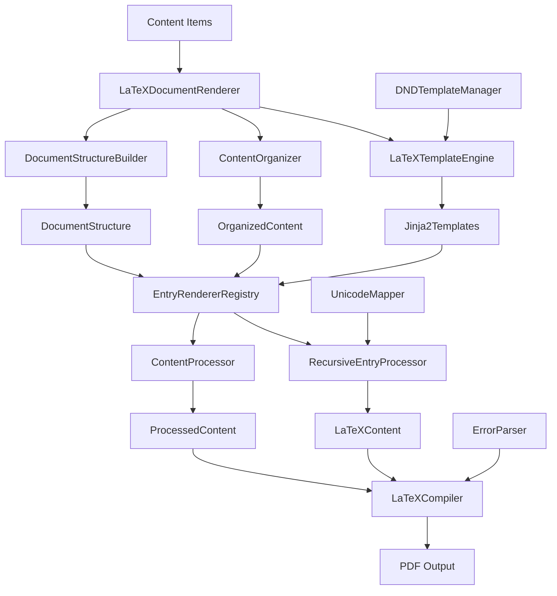

# LaTeX Rendering System Implementation Guide

This guide provides comprehensive information for understanding, extending, and debugging the sophisticated LaTeX rendering pipeline that transforms D&D 5e content into professional PDF documents.

## Overview

The LaTeX rendering system implements a multi-layered architecture designed for flexibility, maintainability, and extensibility. It transforms 5etools JSON data into beautifully formatted PDFs using the DND-5e-LaTeX-Template package.

### Key Benefits

- **Professional Output**: Generates publication-quality PDFs with D&D styling
- **Template-Based**: Jinja2 templates with LaTeX-specific customizations
- **Extensible**: Protocol-based design for custom content types
- **Robust**: Comprehensive error handling and Unicode support
- **Performance**: Multi-pass compilation with intelligent caching

## Architecture Components



### LaTeXDocumentRenderer

**Location**: `src/dnd5e/renderers/latex/document.py`

The central orchestrator of the rendering pipeline, responsible for:

- Document structure coordination and content organization
- Template context preparation and rendering coordination
- Integration between all rendering subsystems
- Multi-format output support (single items or complete documents)

#### Core Implementation

```python
from dnd5e.renderers.latex.document import LaTeXDocumentRenderer

# Initialize renderer with configuration
renderer = LaTeXDocumentRenderer({
    "templates_dir": "custom/templates",
    "use_dnd_template": True,
    "compilation_engine": "xelatex",
    "show_progress": True
})

# Render complete document
result = renderer.render_document(content_items)

# Render single item
item_latex = renderer.render(spell_item, context)
```

#### Key Features

```python
class LaTeXDocumentRenderer(DocumentRenderer):
    """LaTeX document renderer for D&D-style documents."""

    def render_document(
        self,
        content_items: Sequence[BaseContent],
        metadata: DocumentMetadata | None = None
    ) -> str:
        """Generate complete LaTeX document."""

    def render(
        self,
        content: BaseContent,
        context: dict[str, Any] | None = None
    ) -> str:
        """Render individual content item."""

    def compile_to_pdf(
        self,
        latex_content: str,
        output_path: Path
    ) -> CompilationResult:
        """Compile LaTeX to PDF."""
```

### LaTeXTemplateEngine

**Location**: `src/dnd5e/renderers/latex/template_engine.py`

Jinja2-based template engine with LaTeX-specific customizations:

#### Template Configuration

```python
# Custom delimiters to avoid LaTeX conflicts
JINJA_CONFIG = {
    'variable_start_string': '<#',
    'variable_end_string': '#>',
    'block_start_string': '<@',
    'block_end_string': '@>',
    'comment_start_string': '<#--',
    'comment_end_string': '--#>',
    'autoescape': False,  # LaTeX requires custom escaping
}
```

#### Essential LaTeX Filters

The template engine provides specialized filters for D&D content formatting:

```python
# Core LaTeX escaping
{{ variable | latex_escape }}

# D&D-specific formatting
{{ ability_score | dnd_ability_modifier }}      # +1, -2, etc.
{{ challenge_rating | dnd_challenge_rating }}   # 1/4, 2, 10, etc.
{{ spell_level | dnd_spell_level }}             # Cantrip, 1st-level, etc.
{{ text_content | latex_newlines }}             # Convert \n to \\
```

#### Template Hierarchy

```text
templates/
├── base.tex.j2               # Base document structure
├── book.tex.j2               # Book layout with DND template
├── article.tex.j2            # Article layout (simpler)
├── section.tex.j2            # Document sections and headings
├── spell_entry.tex.j2        # Spell formatting
├── creature_entry.tex.j2     # Monster stat blocks
├── item_entry.tex.j2         # Magic items and equipment
├── class_entry.tex.j2        # Character classes
├── race_entry.tex.j2         # Player races
├── feat_entry.tex.j2         # Feats and features
└── background_entry.tex.j2   # Character backgrounds
```

### RecursiveEntryProcessor

**Location**: `src/dnd5e/renderers/latex/entry_processor.py`

Handles the complex nested entry structures from 5etools data:

#### Core Processing Logic

```python
from dnd5e.renderers.latex.entry_processor import RecursiveEntryProcessor

# Initialize processor
processor = RecursiveEntryProcessor(
    use_dnd_template=True,
    validation_mode=ValidationMode.STRICT
)

# Process entry list
latex_content = processor.process_entries(entries, context)
```

#### Supported Entry Types

The processor handles 40+ entry types from 5etools format:

```python
# Key entry types and their LaTeX transformations
ENTRY_PROCESSORS = {
    'section': lambda entry: f"\\section{{{entry['name']}}}",
    'entries': process_nested_entries,
    'insetReadaloud': lambda entry: f"\\begin{{DndReadAloud}}{content}\\end{{DndReadAloud}}",
    'inset': lambda entry: f"\\begin{{DndSidebar}}{content}\\end{{DndSidebar}}",
    'table': process_table_entry,
    'list': process_list_entry,
    'image': process_image_entry,
    'quote': process_quote_entry,
    # ... 30+ more entry types
}
```

#### Advanced Features

- **Sectioning Depth Management**: Automatically handles proper nesting levels
- **Validation Modes**: Strict validation for development, liberal for production
- **Error Recovery**: Graceful fallback for unknown entry types
- **Statistics Tracking**: Processing metrics and error reporting

### ContentProcessor System

**Location**: `src/dnd5e/renderers/latex/content_processor.py`

Specialized processors that extract semantic information for enhanced rendering:

#### SpellProcessor

```python
class SpellProcessor(ContentProcessor):
    """Enhanced spell content processing."""

    def process(self, spell: Spell, context: RenderContext) -> dict[str, Any]:
        return {
            'level_ordinal': self._format_spell_level(spell.level),
            'damage_dice': self._extract_damage_dice(spell.entries),
            'has_upcast': self._check_upcast_effects(spell.entries),
            'ritual_casting': getattr(spell, 'ritual', False),
            'concentration': self._check_concentration(spell.duration),
            'class_availability': self._extract_spell_classes(spell),
            'formatted_components': self._format_components(spell.components),
            'formatted_range': self._format_range(spell.range),
        }
```

#### CreatureProcessor

```python
class CreatureProcessor(ContentProcessor):
    """Enhanced creature (monster) content processing."""

    def process(self, creature: Creature, context: RenderContext) -> dict[str, Any]:
        return {
            'proficiency_bonus': self._calculate_proficiency_bonus(creature.cr),
            'ability_modifiers': {
                ability: self._calculate_modifier(score)
                for ability, score in creature.abilities.items()
            },
            'cr_category': self._categorize_cr(creature.cr),
            'passive_perception': 10 + creature.skills.get('perception', 0),
            'is_spellcaster': self._has_spellcasting_feature(creature),
            'is_legendary': self._has_legendary_actions(creature),
            'formatted_speed': self._format_speed(creature.speed),
            'armor_class_details': self._format_ac_details(creature.ac),
        }
```

### LaTeXCompiler

**Location**: `src/dnd5e/renderers/latex/compiler.py`

Multi-engine compilation system with comprehensive error handling:

#### Engine Support

```python
LATEX_ENGINES = {
    'pdflatex': {
        'command': 'pdflatex',
        'supports_unicode': False,
        'supports_system_fonts': False,
        'recommended_for': ['simple_documents', 'basic_typography']
    },
    'xelatex': {
        'command': 'xelatex',
        'supports_unicode': True,
        'supports_system_fonts': True,
        'recommended_for': ['unicode_content', 'custom_fonts', 'dnd_template']
    },
    'lualatex': {
        'command': 'lualatex',
        'supports_unicode': True,
        'supports_system_fonts': True,
        'recommended_for': ['complex_scripts', 'advanced_typography']
    }
}
```

#### Multi-Pass Compilation

```python
def compile_document(
    self,
    latex_content: str,
    output_name: str = "document",
    working_dir: Path | None = None,
) -> CompilationResult:
    """Compile LaTeX document with multi-pass support."""

    # 1. Write temporary .tex file
    # 2. First pass: Basic compilation
    # 3. Check for cross-references, indices, bibliography
    # 4. Additional passes as needed (max 3)
    # 5. Parse errors and warnings
    # 6. Return compiled PDF or detailed error information
```

### Unicode and Character Handling

**Location**: `src/dnd5e/renderers/latex/unicode_mappings.py`

Comprehensive Unicode-to-LaTeX character mapping system:

#### Character Mappings

```python
# LaTeX special characters (order matters!)
LATEX_SPECIAL_CHARS = {
    '\\': r'\textbackslash{}',  # Must be first!
    '{': r'\{', '}': r'\}',
    '$': r'\$', '&': r'\&', '%': r'\%',
    '#': r'\#', '^': r'\textasciicircum{}',
    '_': r'\_', '~': r'\textasciitilde{}',
}

# Unicode character mappings
UNICODE_TO_LATEX = {
    # Smart quotes
    '"': "''", '"': '``',
    ''': '`', ''': "'",

    # Dashes and spacing
    '—': '---',  # Em dash
    '–': '--',   # En dash
    ' ': '~',    # Non-breaking space (selective)

    # Mathematical symbols
    '°': r'\textdegree{}',
    '±': r'\textpm{}',
    '×': r'\texttimes{}',
    '÷': r'\textdiv{}',

    # Currency symbols
    '€': r'\texteuro{}',
    '£': r'\textsterling{}',
    '¥': r'\textyen{}',
}
```

#### Security Features

- **Order-sensitive processing**: Prevents double-escaping
- **Problematic character detection**: Logs unmapped Unicode characters
- **Zero-width character removal**: Strips invisible formatting characters
- **Validation**: Comprehensive input sanitization

### DND-5e-LaTeX-Template Integration

**Location**: `src/dnd5e/renderers/latex/dnd_template.py`

Integration with the professional D&D LaTeX template package:

#### Template Detection

```python
class DNDTemplateManager:
    """Manages DND-5e-LaTeX-Template integration."""

    def __init__(self):
        self.template_files = [
            'dndbook.cls',      # Book document class
            'dndarticle.cls',   # Article document class
            'dndcore.def',      # Core definitions
            'dndoptions.clo',   # Class options
            'dndfonts.sty',     # Font configurations
            'dndheader.sty',    # Header styling
            'dndmonster.sty',   # Monster stat blocks
            'dndsections.sty',  # Section formatting
            'dndsidebar.sty',   # Sidebar environments
        ]

    def check_template_availability(self) -> tuple[bool, list[str]]:
        """Check if template is properly installed."""
```

#### Document Class Options

```latex
% Available options for dndbook and dndarticle classes
\documentclass[
    bg,           % Background images and textures
    justified,    % Justified text alignment
    twocolumn,    % Two-column layout
    highcontrast, % High contrast mode
    letterpaper,  % Paper size options
    10pt          % Font size options
]{dndbook}
```

#### Template Environments

```latex
% Read-aloud text boxes
\begin{DndReadAloud}
    "You enter a dimly lit chamber..."
\end{DndReadAloud}

% Sidebar content with optional title
\begin{DndSidebar}[Variant Rule]
    Optional rules for enhanced gameplay.
\end{DndSidebar}

% Professional table formatting
\begin{DndTable}[caption]{column specification}
    \textbf{Level} & \textbf{Proficiency Bonus} \\
    1st            & +2                         \\
\end{DndTable}

% Monster stat blocks
\begin{DndMonster}[float=!h]
    \DndMonsterType{Medium humanoid (human), lawful evil}
    \DndMonsterBasics[
        armor-class = {18 (Plate)},
        hit-points  = {52 (8d8 + 16)},
        speed       = {30 ft.},
    ]
    % ... additional monster details
\end{DndMonster}
```

## Implementation Patterns

### Adding New Content Types

#### 1. Create Content Processor

```python
# src/dnd5e/renderers/latex/content_processor.py
class BackgroundProcessor(ContentProcessor):
    """Processor for character background content."""

    def supports_content_type(self, content_type: ContentType) -> bool:
        return content_type == ContentType.BACKGROUND

    def process(self, background: Background, context: RenderContext) -> dict[str, Any]:
        return {
            'skill_proficiencies': self._format_skill_proficiencies(background),
            'equipment': self._format_starting_equipment(background),
            'feature_name': background.feature.get('name', ''),
            'language_options': self._extract_language_options(background),
            'tool_proficiencies': self._format_tool_proficiencies(background),
        }
```

#### 2. Create Entry Renderer

```python
# src/dnd5e/renderers/latex/entry_renderers.py
class BackgroundEntryRenderer(BaseEntryRenderer):
    """Renderer for character background entries."""

    template_name = "content_types/background.tex.j2"

    def render(self, background: Background, context: RenderContext) -> str:
        template_context = {
            'background': background,
            'formatted_skills': background.get_formatted_skills(),
            **context.processed_data  # From BackgroundProcessor
        }
        return self.template.render(template_context)
```

#### 3. Register Components

```python
# Register in appropriate registries
CONTENT_PROCESSORS[ContentType.BACKGROUND] = BackgroundProcessor()
ENTRY_RENDERERS[ContentType.BACKGROUND] = BackgroundEntryRenderer()
```

#### 4. Create Template

```latex
% templates/content_types/background.tex.j2
\section{<# background.name #>}

\textit{<# background.source #>}

<@ if background.prerequisite @>
\textbf{Prerequisite:} <# background.prerequisite | latex_escape #>
<@ endif @>

\textbf{Skill Proficiencies:} <# formatted_skills #>

<@ if background.languages @>
\textbf{Languages:} <# background.languages | join(', ') | latex_escape #>
<@ endif @>

\textbf{Equipment:} <# background.get_formatted_equipment() | latex_escape #>

\subsection{Feature: <# feature_name #>}
<@ for entry in background.entries @>
    <# entry | process_entry | latex_escape #>
<@ endfor @>
```

### Custom Document Layouts

#### Modify Document Structure

```python
# src/dnd5e/renderers/latex/document_structure.py
def create_spell_compendium_structure(content_items: list[BaseContent]) -> DocumentStructure:
    """Create specialized structure for spell compendiums."""
    structure = DocumentStructure()

    # Group spells by level
    spells_by_level = {}
    for item in content_items:
        if isinstance(item, Spell):
            level = item.level
            if level not in spells_by_level:
                spells_by_level[level] = []
            spells_by_level[level].append(item)

    # Create sections for each spell level
    for level in sorted(spells_by_level.keys()):
        section_title = 'Cantrips' if level == 0 else f'{level}{"st" if level == 1 else "nd" if level == 2 else "rd" if level == 3 else "th"}-Level Spells'
        section = ContentSection(
            title=section_title,
            content_items=spells_by_level[level]
        )
        structure.add_section(section)

    return structure
```

### Adding New Entry Types

#### Extend RecursiveEntryProcessor

```python
# src/dnd5e/renderers/latex/entry_processor.py
def process_custom_callout(self, entry: dict[str, Any], context: ProcessingContext) -> str:
    """Process custom callout boxes for special formatting."""
    content = self._process_nested_content(entry.get('entries', []), context)
    callout_type = entry.get('type', 'info')
    title = entry.get('title', '')

    # Map callout types to LaTeX environments
    env_mapping = {
        'info': 'DndSidebar',
        'warning': 'DndReadAloud',
        'tip': 'DndComment',
        'danger': 'DndDanger',
    }

    latex_env = env_mapping.get(callout_type, 'DndSidebar')
    title_text = f'[{title}]' if title else ''

    return f"\\begin{{{latex_env}}}{title_text}\n{content}\n\\end{{{latex_env}}}"

# Register the processor
ENTRY_PROCESSORS['customCallout'] = process_custom_callout
```

## Performance Optimization

### Template Caching

```python
# Templates are automatically cached, but you can control behavior
template_engine = LaTeXTemplateEngine({
    'cache_size': 100,           # Number of compiled templates to cache
    'cache_timeout': 3600,       # Cache timeout in seconds
    'auto_reload': False,        # Set True for development
    'optimize_whitespace': True   # Remove unnecessary whitespace
})
```

### Content Processing Optimization

```python
# Batch processing for large content sets
def process_content_batch(content_items: list[BaseContent]) -> dict[str, Any]:
    """Process content items in batches."""

    # Process all items sequentially
    results = [process_content_item(item) for item in content_items]

    return combine_processing_results(results)
```

### Compilation Performance

```python
# Optimize compilation settings
compilation_config = CompilationConfig(
    engine=LaTeXEngine.XELATEX,
    max_passes=2,              # Reduce passes for faster compilation
    halt_on_error=True,        # Stop on first error
    interaction_mode='nonstopmode',  # Non-interactive mode
    enable_shell_escape=False,  # Disable for security and speed
    optimize_pdf=True,         # Enable PDF optimization
)
```

## Testing Strategies

### Unit Testing

```python
import pytest
from dnd5e.renderers.latex.entry_processor import RecursiveEntryProcessor
from dnd5e.core.entry_registry import ValidationMode

class TestRecursiveEntryProcessor:
    """Test suite for entry processing."""

    def test_section_processing(self):
        """Test section entry processing."""
        processor = RecursiveEntryProcessor(validation_mode=ValidationMode.STRICT)

        entry = {
            'type': 'section',
            'name': 'Test Section',
            'entries': ['Some content here.']
        }

        result = processor.process_entry(entry, mock_context())

        assert r'\section{Test Section}' in result
        assert 'Some content here.' in result

    def test_nested_entry_processing(self):
        """Test deeply nested entry structures."""
        processor = RecursiveEntryProcessor()

        complex_entry = {
            'type': 'entries',
            'entries': [
                'Top level text.',
                {
                    'type': 'inset',
                    'name': 'Sidebar',
                    'entries': ['Sidebar content.']
                },
                {
                    'type': 'list',
                    'items': ['Item 1', 'Item 2']
                }
            ]
        }

        result = processor.process_entry(complex_entry, mock_context())

        assert 'Top level text.' in result
        assert r'\begin{DndSidebar}' in result
        assert r'\begin{itemize}' in result
```

### Integration Testing

```python
@pytest.mark.integration
def test_complete_document_rendering():
    """Test end-to-end document rendering."""

    # Setup test content
    test_spell = create_test_spell()
    test_monster = create_test_monster()
    content_items = [test_spell, test_monster]

    # Initialize renderer
    renderer = LaTeXDocumentRenderer({
        'templates_dir': 'tests/fixtures/templates',
        'use_dnd_template': False  # Use test templates
    })

    # Render document
    latex_output = renderer.render_document(content_items)

    # Verify structure
    assert r'\documentclass' in latex_output
    assert r'\begin{document}' in latex_output
    assert r'\end{document}' in latex_output

    # Verify content is present
    assert test_spell.name in latex_output
    assert test_monster.name in latex_output
```

### Performance Testing

```python
@pytest.mark.performance
def test_large_document_performance():
    """Benchmark rendering performance with large documents."""

    # Create large content set
    content_items = create_large_content_set(1000)  # 1000 items

    renderer = LaTeXDocumentRenderer()

    start_time = time.time()
    latex_output = renderer.render_document(content_items)
    end_time = time.time()

    duration = end_time - start_time

    # Performance assertions
    assert duration < 30.0  # Should complete in under 30 seconds
    assert len(latex_output) > 50000  # Should generate substantial output

    # Memory usage should be reasonable
    import psutil
    process = psutil.Process()
    assert process.memory_info().rss < 500 * 1024 * 1024  # Less than 500MB
```

## Error Handling and Debugging

### Enable Debug Mode

```python
# Enable comprehensive debugging
renderer = LaTeXDocumentRenderer({
    'debug': True,              # Detailed logging
    'validation_mode': 'strict',  # Catch all validation errors
    'error_tracking': True,     # Comprehensive error collection
    'save_intermediate_files': True,  # Keep .tex files for debugging
})
```

### Custom Error Handlers

```python
# src/dnd5e/renderers/latex/error_parser.py
def add_custom_error_pattern(pattern: str, severity: ErrorSeverity, suggestion: str):
    """Add custom error detection pattern."""
    CUSTOM_ERROR_PATTERNS[pattern] = {
        'pattern': re.compile(pattern),
        'severity': severity,
        'suggestion': suggestion,
        'category': 'custom'
    }

# Example usage
add_custom_error_pattern(
    r"Package dnd5e Error: Invalid spell level (\d+)",
    ErrorSeverity.ERROR,
    "Spell levels must be between 0 (cantrip) and 9. Check your spell data."
)
```

### Common LaTeX Compilation Issues

#### Missing Packages

```python
# Check for required packages
def validate_latex_installation() -> list[str]:
    """Validate LaTeX installation and required packages."""
    missing_packages = []

    required_packages = [
        'geometry', 'xcolor', 'graphicx', 'fancyhdr',
        'tikz', 'tcolorbox', 'fontspec'  # For XeLaTeX
    ]

    for package in required_packages:
        if not check_package_available(package):
            missing_packages.append(package)

    return missing_packages
```

#### Unicode Issues

```python
# Handle problematic Unicode characters
def sanitize_unicode_content(text: str) -> str:
    """Sanitize text content for LaTeX processing."""

    # Remove zero-width characters
    text = re.sub(r'[\u200b-\u200d\ufeff]', '', text)

    # Replace problematic Unicode characters
    for unicode_char, latex_replacement in UNICODE_TO_LATEX.items():
        text = text.replace(unicode_char, latex_replacement)

    # Log unmapped characters for investigation
    unmapped_chars = get_unmapped_unicode_chars(text)
    if unmapped_chars:
        logger.warning(f"Unmapped Unicode characters found: {unmapped_chars}")

    return text
```

## Extension Points

### Custom Template Filters

```python
# Add custom Jinja2 filters for specialized formatting
def register_custom_filters(template_engine: LaTeXTemplateEngine):
    """Register custom template filters."""

    @template_engine.filter('format_currency')
    def format_currency(value: int) -> str:
        """Format currency values in D&D style."""
        if value >= 10000:
            return f"{value // 10000} pp"
        elif value >= 100:
            return f"{value // 100} gp"
        elif value >= 10:
            return f"{value // 10} sp"
        else:
            return f"{value} cp"

    @template_engine.filter('format_dice')
    def format_dice(dice_str: str) -> str:
        """Format dice notation with proper typography."""
        # Convert 1d6+2 to 1d6 + 2 with proper spacing
        return re.sub(r'(\d+d\d+)([+-])(\d+)', r'\1 \2 \3', dice_str)
```

### Custom Compilation Engines

```python
# Support for additional LaTeX engines
class CustomLaTeXEngine:
    """Custom LaTeX engine implementation."""

    def __init__(self, command: str, options: list[str]):
        self.command = command
        self.options = options

    def compile(self, tex_file: Path, output_dir: Path) -> CompilationResult:
        """Compile using custom engine."""
        # Implementation specific to custom engine
        pass

# Register custom engine
LATEX_ENGINES['tectonic'] = CustomLaTeXEngine(
    command='tectonic',
    options=['--synctex', '--keep-logs']
)
```

## Migration and Compatibility

### Upgrading Templates

When updating template versions:

1. **Backup existing templates** before updates
2. **Test with sample content** to verify compatibility
3. **Update custom filters** if template structure changes
4. **Validate output** against expected results

### Version Compatibility

The LaTeX rendering system maintains compatibility with:

- **DND-5e-LaTeX-Template**: Versions 0.7.0 and above
- **LaTeX Distributions**: TeX Live 2020+, MiKTeX 2.9+
- **Jinja2**: Versions 3.0+ with security updates

## Troubleshooting

### Common Issues

**Template not found errors**:
- Verify template directory configuration
- Check file permissions
- Ensure template inheritance paths are correct

**Unicode rendering issues**:
- Use XeLaTeX or LuaLaTeX for Unicode support
- Verify font availability for special characters
- Check Unicode mapping definitions

**Compilation failures**:
- Enable debug mode for detailed error logs
- Check LaTeX installation and package availability
- Verify DND-5e-LaTeX-Template installation

**Performance issues**:
- Profile with cProfile to identify bottlenecks
- Consider template caching optimization
- Use async processing for large document sets

For additional debugging techniques and troubleshooting guides, see the [API Documentation](../../api-reference/index.md) and [Contributing Guide](../../contributing/index.md).
