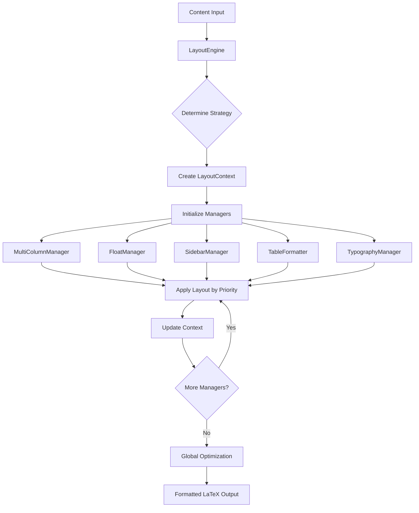

# Layout Engine System

The Layout Engine System is a sophisticated multi-component architecture that coordinates document layout, float positioning, table formatting, and typography to create professional-quality PDF output for D&D content.

## Overview

The layout engine addresses complex typographic challenges in D&D content by providing:

- **Multi-Column Layout Management**: Dynamic column layout with intelligent break decisions
- **Float Positioning**: Optimal placement of figures, tables, and stat blocks
- **Sidebar Management**: Specialized handling of D&D sidebar environments
- **Table Formatting**: Automatic table optimization and column specification
- **Typography Control**: Advanced typography with drop caps and spacing optimization
- **Content-Aware Processing**: Different strategies based on content type and document format



## Architecture

### Core Components

The layout engine consists of a central coordinator and five specialized managers:

#### 1. LayoutEngine - Central Coordinator

The main engine coordinates all layout managers and provides the primary interface:

```python
class LayoutEngine:
    """Coordinates multiple layout managers to create optimal document layouts."""

    def process_content(
        self, content: str, content_type: ContentType,
        hints: LayoutHint | None = None, strategy: LayoutStrategy | None = None
    ) -> str:
        """Process content through the layout system."""
```

**Key Features:**
- **Manager Coordination**: Orchestrates all layout managers by priority
- **Strategy Selection**: Content-type-aware layout strategy determination
- **Context Management**: Maintains layout state throughout processing
- **Batch Processing**: Processes multiple content blocks with coordination
- **Optimization**: Global layout optimizations and spacing adjustments

#### 2. Layout Managers

Five specialized managers handle different aspects of layout:

**MultiColumnManager**: Handles column layout and breaks
**FloatManager**: Manages float positioning for figures and stat blocks
**SidebarManager**: Processes D&D-specific sidebar environments
**TableFormatter**: Optimizes table formatting and column specifications
**TypographyManager**: Controls typography, spacing, and visual hierarchy

### Layout Strategies

The system provides six layout strategies optimized for different content types:

```python
class LayoutStrategy(Enum):
    """Layout strategies for different document types and content."""

    SINGLE_COLUMN = "single_column"    # Adventure narratives
    MULTI_COLUMN = "multi_column"      # General content
    MAGAZINE = "magazine"              # Mixed content layouts
    REFERENCE = "reference"            # Spell lists, stat blocks
    ADVENTURE = "adventure"            # Adventure-specific formatting
    SUPPLEMENT = "supplement"          # Supplement books
```

**Strategy Mapping:**
- **Adventures**: Single-column narrative with embedded stat blocks
- **Reference Books**: Multi-column compact layout for spells/items
- **Supplements**: Mixed layout with floating elements
- **Magazine Style**: Complex layouts with varied content organization

### Layout Context System

The `LayoutContext` provides comprehensive state management:

```python
class LayoutContext(DocumentContext):
    """Context information for layout decisions with validation."""

    strategy: LayoutStrategy
    page_position: str | None       # "top", "middle", "bottom"
    column_count: int = 2           # Number of columns (1-4)
    column_position: int | None     # Current column (0-based)
    available_space: float | None   # Available space in points
    hints: LayoutHint | None        # Layout preferences
```

**Context Features:**
- **Position Awareness**: Tracks page and column position for optimal placement
- **State Tracking**: Counts floats, sidebars, tables for decision making
- **Strategy Integration**: Links strategy to specific layout decisions
- **Validation**: Pydantic validation ensures context consistency

### Layout Hints System

The `LayoutHint` model provides fine-grained control over layout decisions:

```python
class LayoutHint(BaseModel):
    """Layout hints that content renderers can provide."""

    # Float preferences
    float_position: FloatPosition | None
    allow_float: bool = True
    span_columns: bool = False

    # Column preferences
    force_column_break: bool = False
    avoid_column_break: bool = False
    column_count: int | None = None

    # Sidebar preferences
    sidebar_type: SidebarType | None
    sidebar_position: FloatPosition | None

    # Typography preferences
    use_drop_cap: bool = False
    emphasis_level: int = 0  # 0=normal, 1=emphasized, 2=strong

    # Table preferences
    table_width: str | None
    table_columns: str | None
    allow_table_split: bool = True

    # Spacing preferences
    space_before: str | None
    space_after: str | None

    # Content organization
    group_with_next: bool = False
    group_with_previous: bool = False
```

## Manager Deep Dive

### MultiColumnManager

Handles dynamic column layout with intelligent break decisions:

```python
class MultiColumnManager(ContentLayoutManager):
    """Manages multi-column layouts and column breaks."""

    def apply_layout(self, content: str, context: LayoutContext) -> str:
        """Apply multi-column layout with intelligent breaks."""
```

**Features:**
- **Dynamic Columns**: Adjusts column count based on content type and strategy
- **Break Detection**: Identifies optimal locations for column breaks
- **Content Awareness**: Different column handling for different content types
- **Balance Optimization**: Ensures balanced column content distribution

**Column Strategies:**
```python
# Content-type specific column preferences
content_column_preferences = {
    ContentType.ADVENTURE: 1,      # Single column for narrative
    ContentType.SPELL: 2,          # Two columns for spell lists
    ContentType.CREATURE: 1,       # Single column for stat blocks
    ContentType.ITEM: 2,           # Two columns for item lists
    ContentType.CLASS: 2,          # Two columns for class features
}
```

### FloatManager

Manages sophisticated float positioning for optimal document flow:

```python
class FloatManager(ContentLayoutManager):
    """Manages float positioning for figures, tables, and stat blocks."""

    content_float_preferences = {
        ContentType.CREATURE: FloatPosition.FULL_WIDTH_BOTTOM,
        ContentType.SPELL: FloatPosition.HERE,
        ContentType.ITEM: FloatPosition.HERE,
        ContentType.CLASS: FloatPosition.TOP,
    }
```

**Float Positioning Options:**
- `HERE`: Place float at current location if possible
- `TOP`: Float to top of current or next page
- `BOTTOM`: Float to bottom of current or next page
- `PAGE`: Float to dedicated float page
- `FORCE_HERE`: Force placement at exact location
- `FULL_WIDTH_BOTTOM`: Span full page width at bottom

**Smart Positioning Logic:**
```python
def _determine_float_position(self, context: LayoutContext) -> FloatPosition:
    """Determine optimal float position based on context."""

    # Consider page position
    if context.page_position == "top":
        return FloatPosition.HERE if self._has_room_here(context) else FloatPosition.BOTTOM
    elif context.page_position == "bottom":
        return FloatPosition.TOP

    # Consider float density
    if context.float_count >= self.max_floats_per_page:
        return FloatPosition.PAGE

    # Use content-type preferences
    return self.content_float_preferences.get(
        context.content_type, FloatPosition.HERE
    )
```

### SidebarManager

Handles D&D-specific sidebar environments with intelligent placement:

```python
class SidebarType(Enum):
    """Types of sidebar environments."""

    SIDEBAR = "DndSidebar"          # General sidebar content
    COMMENT = "DndComment"          # Commentary boxes
    READ_ALOUD = "DndReadAloud"     # Read-aloud text
    AREA = "DndArea"                # Location descriptions
    SUB_AREA = "DndSubArea"         # Sub-location descriptions
```

**Sidebar Processing:**
- **Type Detection**: Automatically detects sidebar content patterns
- **Placement Optimization**: Positions sidebars to avoid layout conflicts
- **Content Wrapping**: Handles text wrapping around sidebar elements
- **Visual Hierarchy**: Maintains proper visual organization

### TableFormatter

Provides automatic table optimization and intelligent column specification:

```python
class TableFormatter(ContentLayoutManager):
    """Manages automatic table formatting and optimization."""

    content_column_specs = {
        "spell_list": "l X c",      # Name, Description, Level
        "item_list": "l X r",       # Name, Description, Cost
        "ability_list": "l X",      # Name, Description
        "class_features": "l X",    # Feature, Description
        "class_table": "c l X",     # Level, Feature, Description
        "equipment": "l l r r",     # Item, Type, Weight, Cost
    }
```

**Automatic Features:**
- **Column Detection**: Identifies column types (numeric, text, mixed)
- **Width Optimization**: Calculates optimal column widths
- **Content Classification**: Recognizes common D&D table patterns
- **Format Standardization**: Applies consistent table formatting

**Column Type Detection:**
```python
numeric_patterns = [
    r"^\d+$",                    # Pure numbers
    r"^\d+\.\d+$",              # Decimals
    r"^\d+d\d+$",               # Dice notation
    r"^\+\d+$",                 # Modifiers
    r"^\d+\s*(gp|sp|cp|pp)$",   # Currency
    r"^\d+\s*ft\.?$",           # Distances
    r"^\d+\s*lbs?\.?$",         # Weight
]
```

### TypographyManager

Controls advanced typography and visual hierarchy:

```python
class TypographyManager(ContentLayoutManager):
    """Manages typography, spacing, and visual hierarchy."""

    def apply_typography_enhancements(self, content: str, context: LayoutContext) -> str:
        """Apply typography improvements based on content type and position."""
```

**Typography Features:**
- **Drop Caps**: Automatic drop cap application for chapter openings
- **Emphasis Levels**: Hierarchical emphasis system (normal, emphasized, strong)
- **Spacing Optimization**: Intelligent vertical spacing between elements
- **Visual Hierarchy**: Consistent visual organization across content types

## Processing Pipeline

### Single Content Processing

The basic processing flow for individual content pieces:

```python
def process_content(self, content: str, content_type: ContentType,
                   hints: LayoutHint | None = None,
                   strategy: LayoutStrategy | None = None) -> str:
    """Process content through the layout system."""

    # 1. Determine layout strategy
    strategy = strategy or self._determine_strategy(content_type, hints)

    # 2. Create layout context
    context = self._create_context(content_type, strategy, hints)

    # 3. Apply managers in priority order
    processed_content = content
    for manager in self.managers:
        if manager.can_handle(context):
            processed_content = manager.apply_layout(processed_content, context)
            context = self._update_context(context, manager, processed_content)

    return processed_content
```

### Batch Content Processing

For coordinated processing of multiple content blocks:

```python
def process_content_blocks(self, content_blocks: list[tuple[str, ContentType]],
                          document_strategy: LayoutStrategy | None = None) -> list[str]:
    """Process multiple content blocks with coordinated layout decisions."""

    # 1. Analyze blocks for optimal layout
    block_contexts = self._analyze_content_blocks(content_blocks, document_strategy)

    # 2. Process each block with context awareness
    processed_blocks = []
    for i, ((content, content_type), context) in enumerate(
        zip(content_blocks, block_contexts, strict=False)
    ):
        hints = self._generate_block_hints(i, content_blocks, context)
        processed_content = self.process_content(content, content_type, hints, context.strategy)
        processed_blocks.append(processed_content)

    # 3. Apply global optimizations
    if self.enable_optimization:
        processed_blocks = self._optimize_block_sequence(processed_blocks)

    return processed_blocks
```

### Context Analysis

The engine analyzes content context to make optimal layout decisions:

```python
def _analyze_content_blocks(self, content_blocks: list[tuple[str, ContentType]],
                           document_strategy: LayoutStrategy | None) -> list[LayoutContext]:
    """Analyze content blocks to create optimal layout contexts."""

    contexts = []
    for i, (content, content_type) in enumerate(content_blocks):
        # Estimate page position based on block sequence
        page_position = self._estimate_page_position(i, len(content_blocks))

        # Create context with position information
        context = LayoutContext(
            strategy=document_strategy or self._determine_strategy(content_type, None),
            content_type=content_type,
            column_count=self.default_column_count,
            page_position=page_position,
        )
        contexts.append(context)

    return contexts
```

## Configuration System

### Engine Configuration

The layout engine supports comprehensive configuration:

```python
engine_config = {
    "default_columns": 2,                    # Default column count
    "enable_optimization": True,             # Global optimization

    # Manager-specific configuration
    "multi_column": {
        "balance_columns": True,
        "min_column_height": 20,
    },
    "float": {
        "max_floats_per_page": 3,
        "small_float_threshold": 10,
        "large_float_threshold": 30,
    },
    "sidebar": {
        "default_width": "0.3\\textwidth",
        "allow_page_breaks": False,
    },
    "table": {
        "auto_width": True,
        "min_column_width": "2cm",
    },
    "typography": {
        "enable_drop_caps": True,
        "paragraph_spacing": "\\medskip",
    }
}

engine = LayoutEngine(engine_config)
```

### Document Type Optimization

The engine can optimize for specific document types:

```python
def optimize_for_document_type(self, document_type: str) -> None:
    """Optimize layout engine for specific document types."""

    if document_type == "adventure":
        # Adventure-specific optimizations
        self.strategy_preferences.update({
            ContentType.ADVENTURE: LayoutStrategy.ADVENTURE,
            ContentType.CREATURE: LayoutStrategy.ADVENTURE,
            ContentType.SPELL: LayoutStrategy.ADVENTURE,
        })
        self.default_column_count = 1

    elif document_type == "reference":
        # Reference book optimizations
        for content_type in ContentType:
            self.strategy_preferences[content_type] = LayoutStrategy.REFERENCE
        self.default_column_count = 2

    elif document_type == "supplement":
        # Supplement book optimizations
        for content_type in ContentType:
            self.strategy_preferences[content_type] = LayoutStrategy.SUPPLEMENT
        self.default_column_count = 2
```

## Advanced Features

### Layout Statistics

The engine provides detailed statistics about layout decisions:

```python
def get_layout_statistics(self, processed_blocks: list[str]) -> dict[str, int]:
    """Get statistics about layout usage in processed content."""

    return {
        "total_blocks": len(processed_blocks),
        "blocks_with_floats": sum(1 for block in processed_blocks
                                 if self._content_has_floats(block)),
        "blocks_with_sidebars": sum(1 for block in processed_blocks
                                   if self._content_has_sidebars(block)),
        "blocks_with_tables": sum(1 for block in processed_blocks
                                 if self._content_has_tables(block)),
        "blocks_with_columns": sum(1 for block in processed_blocks
                                  if "multicols" in block),
    }
```

### Block Optimization

Global optimization applies spacing and separation improvements:

```python
def _optimize_block_sequence(self, blocks: list[str]) -> list[str]:
    """Apply global optimizations to the sequence of blocks."""

    optimized = []
    for i, block in enumerate(blocks):
        # Add appropriate spacing between different types of content
        if i > 0 and self._blocks_need_separation(blocks[i - 1], block):
            optimized.append("\\medskip\n")
        optimized.append(block)

    return optimized
```

### Content Detection

The engine uses sophisticated content detection:

```python
def _content_has_floats(self, content: str) -> bool:
    """Check if content contains float environments."""
    float_indicators = [
        "\\begin{figure}",      # Standard figures
        "\\begin{table}",       # Standard tables
        "\\begin{DndMonster}",  # D&D stat blocks
        "float=",               # Float parameters
        "float*=",              # Full-width floats
    ]
    return any(indicator in content for indicator in float_indicators)

def _content_has_sidebars(self, content: str) -> bool:
    """Check if content contains sidebar environments."""
    sidebar_indicators = [
        "\\begin{DndSidebar}",
        "\\begin{DndComment}",
        "\\begin{DndReadAloud}",
    ]
    return any(indicator in content for indicator in sidebar_indicators)
```

## Integration Patterns

### Template Integration

The layout engine integrates with Jinja2 templates:

```python
# In LaTeX template


    {{ layout_engine.process_content(content_block.content,
                                    content_block.type,
                                    content_block.hints) }}

```

### Renderer Integration

Integration with the document renderer:

```python
class LaTeXDocumentRenderer:
    def __init__(self):
        self.layout_engine = LayoutEngine(self.get_layout_config())

    def render_content_blocks(self, blocks: list[ContentBlock]) -> str:
        # Convert to format expected by layout engine
        content_blocks = [(block.content, block.content_type) for block in blocks]

        # Process through layout engine
        processed_blocks = self.layout_engine.process_content_blocks(
            content_blocks, self.document_strategy
        )

        return "\n\n".join(processed_blocks)
```

### Context Provider Integration

Integration with context providers:

```python
def create_layout_context(self, content_item: BaseContent,
                         document_context: DocumentContext) -> LayoutContext:
    """Create layout context from document context."""

    return LayoutContext(
        strategy=self._determine_strategy_from_document(document_context),
        content_type=content_item.content_type,
        column_count=document_context.get_column_preference(),
        hints=self._extract_layout_hints(content_item),
        # Inherit from document context
        document_type=document_context.document_type,
        metadata=document_context.metadata,
    )
```

## Extension Patterns

### Custom Layout Managers

To add new layout managers:

```python
class CustomLayoutManager(ContentLayoutManager):
    """Custom layout manager for specialized content."""

    def get_supported_content_types(self) -> set[ContentType]:
        return {ContentType.CUSTOM_TYPE}

    def get_priority(self) -> int:
        return 60  # Medium-high priority

    def apply_layout(self, content: str, context: LayoutContext) -> str:
        # Custom layout logic
        if self._should_apply_custom_layout(content, context):
            return self._apply_custom_transformation(content, context)
        return content

    def _should_apply_custom_layout(self, content: str, context: LayoutContext) -> bool:
        # Detection logic
        return "custom-marker" in content

    def _apply_custom_transformation(self, content: str, context: LayoutContext) -> str:
        # Transformation logic
        return f"\\begin{{customenv}}\n{content}\n\\end{{customenv}}"

# Register with engine
engine.managers.append(CustomLayoutManager())
engine.managers.sort(key=lambda m: m.get_priority(), reverse=True)
```

### Custom Layout Strategies

To add new layout strategies:

```python
class LayoutStrategy(Enum):
    # Existing strategies...
    CUSTOM_STRATEGY = "custom_strategy"

class CustomizedLayoutEngine(LayoutEngine):
    def _determine_strategy(self, content_type: ContentType, hints: LayoutHint | None) -> LayoutStrategy:
        # Custom strategy logic
        if self._is_custom_content(content_type, hints):
            return LayoutStrategy.CUSTOM_STRATEGY
        return super()._determine_strategy(content_type, hints)

    def _is_custom_content(self, content_type: ContentType, hints: LayoutHint | None) -> bool:
        # Custom detection logic
        return hints and hasattr(hints, 'custom_flag') and hints.custom_flag
```

### Environment Helpers

The system provides helpers for LaTeX environment management:

```python
from .base import EnvironmentWrapper

# Wrap content in environments
wrapped = EnvironmentWrapper.wrap_environment(
    content="Your content here",
    environment="DndSidebar",
    title="Sidebar Title"
)

# Create multi-column layout
multicol = EnvironmentWrapper.wrap_multicols(
    content="Column content",
    columns=2,
    column_sep="1cm"
)

# Add layout breaks
content_with_breaks = (
    content +
    EnvironmentWrapper.add_column_break() +
    more_content +
    EnvironmentWrapper.add_vertical_space("\\bigskip")
)
```

## Testing Strategies

### Unit Testing Managers

```python
def test_float_manager_positioning():
    """Test float positioning logic."""
    manager = FloatManager()
    context = LayoutContext(
        strategy=LayoutStrategy.REFERENCE,
        content_type=ContentType.CREATURE,
        page_position="top"
    )

    # Test float decision
    assert manager.can_handle(context)

    # Test positioning logic
    float_pos = manager._determine_float_position(context)
    assert float_pos == FloatPosition.FULL_WIDTH_BOTTOM

def test_table_formatter_detection():
    """Test table content detection."""
    formatter = TableFormatter()

    # Test table detection
    table_content = "\\begin{DndTable}[header=Spells]{c X c}"
    assert formatter._is_dnd_table(table_content)

    # Test column specification
    context = LayoutContext(content_type=ContentType.SPELL)
    optimized = formatter._optimize_dnd_table(table_content, context)
    assert "textwidth" in optimized
```

### Integration Testing

```python
def test_layout_engine_coordination():
    """Test coordination between multiple managers."""
    engine = LayoutEngine({
        "enable_optimization": True,
        "default_columns": 2
    })

    # Test content with multiple layout needs
    mixed_content = """
    \\begin{DndMonster}[float*=b]{Ancient Dragon}
    A powerful creature with many abilities.
    \\end{DndMonster}

    \\begin{DndTable}{c X c}
    Level & Spell & School \\\\
    1st & Magic Missile & Evocation \\\\
    \\end{DndTable}
    """

    result = engine.process_content(mixed_content, ContentType.ADVENTURE)

    # Verify multiple managers were applied
    assert "\\begin{DndMonster}" in result
    assert "\\begin{DndTable}" in result

    # Verify coordination worked
    stats = engine.get_layout_statistics([result])
    assert stats["blocks_with_floats"] > 0
    assert stats["blocks_with_tables"] > 0
```

### Performance Testing

```python
def test_layout_performance():
    """Test layout engine performance with large content."""
    engine = LayoutEngine()

    # Generate large content set
    content_blocks = []
    for i in range(1000):
        content_blocks.append((f"Content block {i}", ContentType.SPELL))

    start_time = time.time()
    results = engine.process_content_blocks(content_blocks)
    processing_time = time.time() - start_time

    assert len(results) == 1000
    assert processing_time < 5  # Should process 1000 blocks in <5 seconds
```

## Best Practices

### Configuration Management

```python
# Recommended: Use environment-specific configurations
def create_layout_engine_for_document(document_type: str) -> LayoutEngine:
    """Create optimized layout engine for document type."""

    base_config = {
        "enable_optimization": True,
        "default_columns": 2,
    }

    if document_type == "adventure":
        base_config.update({
            "default_columns": 1,
            "float": {"max_floats_per_page": 5},
            "typography": {"enable_drop_caps": True}
        })
    elif document_type == "reference":
        base_config.update({
            "default_columns": 2,
            "table": {"auto_width": True},
            "typography": {"enable_drop_caps": False}
        })

    engine = LayoutEngine(base_config)
    engine.optimize_for_document_type(document_type)
    return engine
```

### Layout Hints Usage

```python
# Recommended: Provide specific layout hints for complex content
hints = LayoutHint(
    float_position=FloatPosition.FULL_WIDTH_BOTTOM,
    span_columns=True,
    avoid_column_break=True,
    space_before="\\bigskip",
    emphasis_level=1
)

result = engine.process_content(creature_statblock, ContentType.CREATURE, hints)
```

### Performance Optimization

```python
# Recommended: Use batch processing for multiple blocks
content_blocks = [(block.content, block.type) for block in blocks]
processed_blocks = engine.process_content_blocks(
    content_blocks,
    document_strategy=LayoutStrategy.REFERENCE
)

# Avoid: Processing blocks individually
# for block in blocks:
#     processed = engine.process_content(block.content, block.type)  # Less efficient
```

### Error Handling

```python
# Recommended: Graceful handling of layout errors
try:
    processed_content = engine.process_content(content, content_type, hints)
except Exception as e:
    logger.warning(f"Layout processing failed: {e}")
    processed_content = content  # Use original content as fallback
```

## Future Enhancements

### Planned Features

**Advanced Float Management:**
- Dynamic float sizing based on content analysis
- Cross-page float coordination
- Smart float collision avoidance
- Float density optimization

**Enhanced Typography:**
- Advanced paragraph styling
- Automatic heading hierarchy
- Smart quote handling
- Hyphenation control

**Responsive Layout:**
- Page size aware layouts
- Dynamic column adjustment
- Content-based column balancing
- Adaptive spacing systems

**AI-Powered Optimization:**
- Machine learning-based layout decisions
- Content quality scoring
- Automated layout A/B testing
- User preference learning

### Integration Roadmap

**Template System Integration:**
- Layout-aware template compilation
- Dynamic template selection based on layout strategy
- Template performance optimization
- Custom layout template creation tools

**Content Management Integration:**
- Layout preference storage per content type
- User-specific layout customization
- Layout version control and comparison
- Batch layout optimization tools

**Performance Enhancements:**
- Parallel manager processing
- Layout decision caching
- Incremental layout updates
- Memory usage optimization

## Conclusion

The Layout Engine System provides sophisticated document layout capabilities that rival professional typesetting systems. Its modular architecture enables:

- **Professional Quality**: Complex multi-column layouts with optimal float positioning
- **Content Awareness**: Different strategies for different types of D&D content
- **Extensibility**: Clean patterns for adding new managers and strategies
- **Performance**: Efficient processing with batch optimization capabilities
- **Flexibility**: Comprehensive configuration and hint systems

The system's design balances complexity with usability, providing powerful layout capabilities while maintaining clear interfaces for extension and customization. This foundation enables high-quality PDF generation that meets the sophisticated typographic requirements of professional D&D content.
