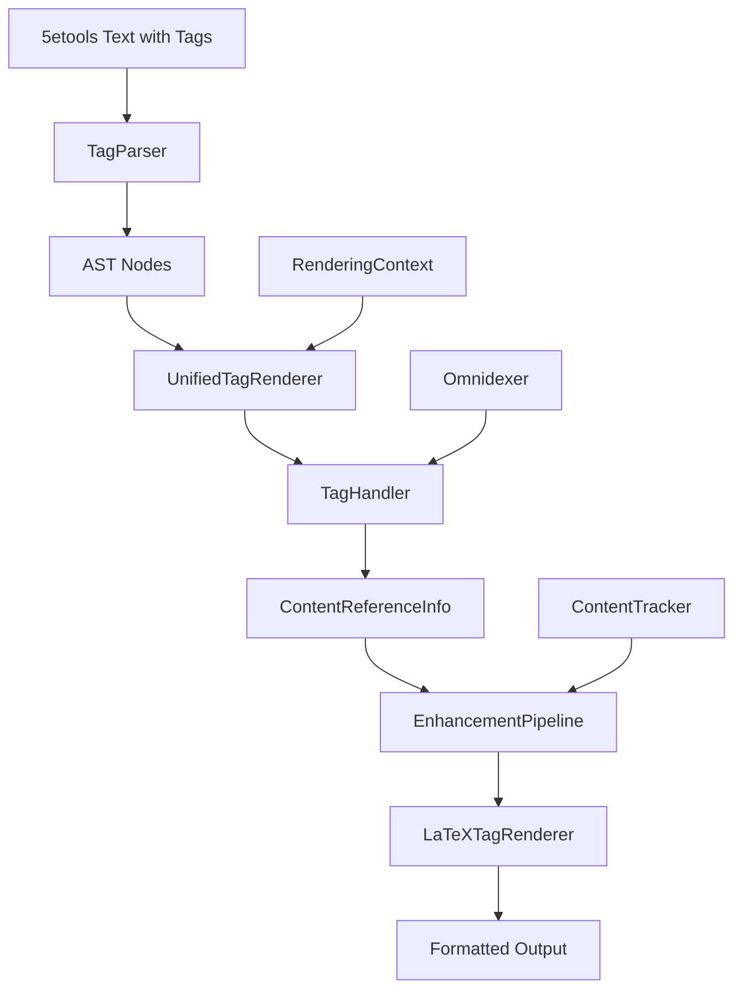

# Tag System Architecture

Comprehensive guide to the unified tag processing and rendering architecture that transforms 5etools tags into formatted output.

## Table of Contents

- [System Overview](#system-overview)
- [Architecture Components](#architecture-components)
- [Processing Pipeline](#processing-pipeline)
- [Core Handler System](#core-handler-system)
- [Enhancement Pipeline](#enhancement-pipeline)
- [Integration Points](#integration-points)
- [Extension Patterns](#extension-patterns)

## System Overview

The tag system provides comprehensive processing of 5etools tags (e.g., `{@spell fireball}`, `{@creature goblin}`) through a unified architecture that separates business logic from presentation concerns.

### Key Design Principles

- **Separation of Concerns**: Business logic separated from presentation formatting
- **Type Safety**: Full Pydantic validation and Python 3.12 type annotations
- **Composition over Inheritance**: Flexible handler composition through protocols
- **Format Agnostic**: Core handlers work with any output format

### Architecture Overview



## Architecture Components

### 1. Text Processing Layer (`src/dnd5e/core/text/`)

**Purpose**: Parse and structure 5etools tags into processable AST nodes

#### TagParser (`tag_parser.py`)
- **Lark-based parser** with custom grammar for 5etools tag syntax
- **AST generation** creating typed nodes for each tag type
- **Nested tag support** for complex formatting like `{@i {@b text}}`
- **Parameter validation** ensuring correct tag structure

```python
# Example: Parse a creature tag with display text
parser = TagParser()
ast = parser.parse("{@creature goblin|MM|Goblin Warrior}")
# Creates: CreatureTagNode(name="goblin", source="MM", display_text_nodes=[TextNode("Goblin Warrior")])
```

#### Tag AST (`tag_ast.py`)
- **Hierarchical node structure** representing parsed tags
- **Specialized node types** for each tag category (CreatureTagNode, SpellTagNode, etc.)
- **Rich metadata** including source, display text, and page references

### 2. Core Handler System (`src/dnd5e/renderers/core/handlers.py`)

**Purpose**: Extract structured information from tags using business logic

#### TagHandler Protocol
```python
@runtime_checkable
class TagHandler(Protocol):
    def handles_tag_type(self, tag_type: str) -> bool: ...
    def extract_content_info(self, node: TagNode, context: RenderingContext) -> ContentReferenceInfo: ...
    def should_include_page_reference(self, page: str | None) -> bool: ...
    def validate_content_reference(self, node: TagNode, context: RenderingContext) -> list[TagValidationError]: ...
    def track_content_for_appendix(self, node: TagNode, context: RenderingContext) -> None: ...
```

#### Handler Implementations

**Content Handlers** (Creatures, Spells, Items, etc.):
- Extract name, source, and display text
- Apply format styles (bold for creatures, italic for spells)
- Validate content exists in omnidexer
- Track references for appendices

**Formatting Handlers** (Bold, Italic, etc.):
- Process nested formatting tags
- Return FormattingNode objects for presentation layer
- Handle complex nesting like `{@i {@b text}}`

**Special Handlers** (DC, Dice, etc.):
- Process game mechanics tags
- Extract numerical values and context
- Apply appropriate formatting rules

### 3. Enhancement Pipeline (`src/dnd5e/renderers/core/interfaces.py`)

**Purpose**: Apply presentation-specific formatting to structured content

#### Enhancement Phases
1. **Base Formatting** (Priority 100): Apply bold, italic, monospace styles
2. **Cross-References** (Priority 200): Generate hyperlinks and labels
3. **Content Tracking** (Priority 300): Register content for appendices
4. **Validation** (Priority 400): Handle errors and warnings

```python
# Example enhancement pipeline
pipeline = EnhancementPipeline([
    BaseFormattingEnhancer(),     # \textbf{}, \textit{}
    HyperlinkEnhancer(),          # \hyperref[label]{text}
    ContentTrackingEnhancer(),    # Register for appendix
    ValidationEnhancer()          # Error handling
])
```

### 4. Unified Renderer (`src/dnd5e/renderers/core/interfaces.py`)

**Purpose**: Orchestrate the complete tag processing pipeline

```python
class UnifiedTagRenderer:
    def render_tag(self, node: TagNode, context: RenderingContext) -> str:
        # 1. Find appropriate core handler
        handler = self._find_handler(node.tag_type)

        # 2. Extract structured information
        content_info = handler.extract_content_info(node, context)

        # 3. Apply enhancement pipeline
        return self.enhancement_pipeline.apply_enhancements(content_info, context)
```

## Processing Pipeline

### Complete Tag Processing Flow

1. **Text Parsing**: Raw 5etools text → AST nodes
2. **Handler Selection**: Tag type → appropriate TagHandler
3. **Information Extraction**: AST node → ContentReferenceInfo
4. **Enhancement Processing**: ContentReferenceInfo → formatted output
5. **Integration**: Formatted tags embedded in final document

### Example: Creature Tag Processing

```python
# Input: "{@creature goblin|MM|Goblin Warrior|166}"
# 1. Parsing
ast_node = CreatureTagNode(
    name="goblin",
    source="MM",
    display_text_nodes=[TextNode("Goblin Warrior")],
    page="166"
)

# 2. Core Handler Processing
content_info = ContentReferenceInfo(
    name="goblin",
    display_text="Goblin Warrior",
    source="MM",
    page="166",
    content_type=ContentType.CREATURE,
    format_style=FormatStyle.BOLD
)

# 3. Enhancement Pipeline
# Base: "Goblin Warrior" → "\textbf{Goblin Warrior}"
# Hyperlink: → "\hyperref[creature:goblin]{\textbf{Goblin Warrior}}"
# Final: "\hyperref[creature:goblin]{\textbf{Goblin Warrior}}"
```

## Core Handler System

### Handler Categories

#### Content Reference Handlers

Handle references to D&D content with omnidexer integration:

- **CreatureTagHandler**: Creatures (bold formatting)
- **SpellTagHandler**: Spells (italic formatting)
- **ItemTagHandler**: Items (italic formatting)
- **ClassTagHandler**: Classes (bold formatting)
- **FeatTagHandler**: Feats (bold formatting)
- **RaceTagHandler**: Races (plain formatting)
- **BackgroundTagHandler**: Backgrounds (plain formatting)
- **ConditionTagHandler**: Conditions (italic formatting)

**Common Features**:
- Content validation via omnidexer lookups
- Appendix content tracking
- Page reference business rules (skip "1", include others)
- Source and display text handling

#### Formatting Handlers

Handle text formatting with nested tag support:

- **FormattingTagHandler**: Processes `@i`, `@b`, `@code`, `@tt`
- **Returns FormattingNode objects** for presentation layer
- **Nested processing**: `{@i {@b text}}` → `\textit{\textbf{text}}`

#### Mechanics Handlers

Handle game mechanics and special tags:

- **DCTagHandler**: Difficulty Class references
- **DiceTagHandler**: Dice roll expressions
- **Adventure/Book handlers**: Special page reference handling

### Handler Registration

```python
def get_default_core_handlers() -> list[TagHandler]:
    """Get all default core handlers."""
    return [
        CreatureTagHandler(),
        SpellTagHandler(),
        ItemTagHandler(),
        ClassTagHandler(),
        FeatTagHandler(),
        RaceTagHandler(),
        BackgroundTagHandler(),
        AdventureTagHandler(),
        BookTagHandler(),
        ConditionTagHandler(),
        DCTagHandler(),
        DiceTagHandler(),
        FormattingTagHandler(),
    ]
```

## Enhancement Pipeline

### EnhancementPipeline Class

Manages sequential application of enhancements with priority ordering:

```python
class EnhancementPipeline:
    def apply_enhancements(self, content_info: ContentReferenceInfo, context: RenderingContext) -> str:
        current_info = content_info

        for enhancer in self.enhancers:  # Ordered by priority
            enhanced = enhancer.enhance_content_reference(current_info, context)
            if enhanced:
                current_info = current_info.with_display_text(enhanced)

        return current_info.display_text
```

### Enhancement Types

#### Base Formatting (Priority 100)
- Apply LaTeX formatting commands
- Handle FormatStyle mappings (bold, italic, plain)
- Process text decorations and styling

#### Cross-Reference Generation (Priority 200)
- Generate `\hyperref` commands for LaTeX
- Create document labels and references
- Handle page number formatting

#### Content Tracking (Priority 300)
- Register content for appendix generation
- Track source references and page numbers
- Coordinate with ContentTracker service

#### Validation and Error Handling (Priority 400)
- Log validation errors in debug mode
- Handle missing content gracefully
- Provide fallback formatting

## Integration Points

### Document Rendering Integration

The tag system integrates with document rendering through:

#### LaTeX Document Renderer
```python
# In document rendering context
context = RenderingContext(
    output_format="latex",
    omnidexer=self.omnidexer,
    content_tracker=self.content_tracker,
    tag_resolver=self.tag_resolver,
    metadata={
        "document_type": "adventure",
        "hyperlink_manager": self.hyperlink_manager
    }
)

# Text with tags gets processed
processed_text = self.tag_resolver.resolve_tags(raw_text, context)
```

#### Service Container Integration
```python
# Services provided through dependency injection
container = DefaultServiceContainer()
omnidexer = container.get_service(Omnidexer)
tag_resolver = container.get_service(TagResolver)
content_tracker = container.get_service(ContentTracker)
```

### CLI Integration

Tag processing is transparent to CLI users:

```bash
# Adventure conversion with full tag processing
uv run 5e2pdf convert adventure "CoS" --output cos.pdf

# Debug mode shows tag processing details
uv run 5e2pdf convert adventure "CoS" --debug
```

## Extension Patterns

### Adding New Content Types

1. **Create AST Node** in `tag_ast.py`:
```python
@dataclass
class DeityTagNode(TagNode):
    name: str
    pantheon: str | None = None
    source: str | None = None
    display_text_nodes: list[ASTNode] | None = None
```

2. **Update Parser** in `tag_parser.py`:
```python
elif tag_type == "deity":
    return DeityTagNode(name, pantheon, display_text_nodes)
```

3. **Create Handler**:
```python
class DeityTagHandler:
    def handles_tag_type(self, tag_type: str) -> bool:
        return tag_type == "deity"

    def extract_content_info(self, node: TagNode, context: RenderingContext) -> ContentReferenceInfo:
        return ContentReferenceInfo(
            name=node.name,
            display_text=self._extract_display_text(node, context),
            source=node.pantheon,
            format_style=FormatStyle.ITALIC
        )
```

4. **Register Handler**:
```python
def get_default_core_handlers():
    return [
        # ... existing handlers
        DeityTagHandler(),
    ]
```

### Adding New Enhancement Types

1. **Implement Enhancer Protocol**:
```python
class CustomEnhancer:
    def enhance_content_reference(self, content_info: ContentReferenceInfo, context: RenderingContext) -> str:
        # Apply custom enhancement logic
        return enhanced_text

    def get_enhancement_priority(self) -> int:
        return 250  # Between cross-refs and content tracking
```

2. **Register with Pipeline**:
```python
pipeline = EnhancementPipeline([
    BaseFormattingEnhancer(),
    HyperlinkEnhancer(),
    CustomEnhancer(),        # New enhancer
    ContentTrackingEnhancer(),
    ValidationEnhancer()
])
```

### Custom Output Formats

The core handlers are format-agnostic. To support new formats:

1. **Implement Format-Specific Enhancers**:
```python
class HTMLEnhancer:
    def enhance_content_reference(self, content_info: ContentReferenceInfo, context: RenderingContext) -> str:
        if context.output_format == "html":
            return f'<a href="#{content_info.name}">{content_info.display_text}</a>'
        return content_info.display_text
```

2. **Create Format-Specific Pipeline**:
```python
html_pipeline = EnhancementPipeline([
    HTMLFormattingEnhancer(),
    HTMLHyperlinkEnhancer(),
    ContentTrackingEnhancer(),  # Format-agnostic
    ValidationEnhancer()        # Format-agnostic
])
```

## Performance Considerations

### Caching Strategy

- **Parser Caching**: AST nodes cached by input text hash
- **Handler Result Caching**: ContentReferenceInfo cached per node
- **Enhancement Caching**: Final output cached by enhancement key
- **Omnidexer Integration**: Leverages existing content lookup caching

### Optimization Techniques

- **Lazy Enhancement**: Enhancements only applied when needed
- **Batch Processing**: Multiple tags processed together when possible
- **Service Reuse**: Service instances shared across processing pipeline
- **Memory Management**: Large AST trees cleaned up after processing

### Performance Monitoring

Debug mode provides detailed performance metrics:

```bash
uv run 5e2pdf convert adventure "CoS" --debug
# Shows: parsing time, handler selection, enhancement pipeline timing
```

## Testing Strategy

### Unit Testing Approach

- **Handler Tests**: Each handler tested independently with mock contexts
- **Enhancement Tests**: Pipeline stages tested with known inputs/outputs
- **Integration Tests**: Full pipeline tested with real 5etools content
- **Performance Tests**: Benchmarking critical path operations

### Test Organization

```
tests/
├── core/text/                    # Parser and AST tests
├── renderers/core/              # Handler and enhancement tests
│   ├── test_handlers.py        # Core handler functionality
│   ├── test_interfaces.py      # Pipeline and enhancement tests
│   └── integration/            # Full pipeline integration
└── fixtures/                   # Test data and mock content
```

### Mock Strategies

- **Context Mocking**: RenderingContext with controlled service instances
- **Content Mocking**: Mock omnidexer responses for validation testing
- **Service Mocking**: Mock content tracker and hyperlink manager behavior

## Migration and Compatibility

### Legacy System Removal

The tag system has completed a major architectural refactoring:

- **✅ COMPLETE**: Cross-reference system organized in `core/references/`
- **✅ COMPLETE**: Separated business logic from presentation
- **✅ COMPLETE**: Implemented composition-based handler architecture
- **✅ COMPLETE**: Unified rendering pipeline with enhancement stages

### Backwards Compatibility

- **Public APIs**: Core functionality maintains compatibility
- **Configuration**: Existing LaTeX templates work unchanged
- **Output Format**: Generated LaTeX identical to previous versions
- **Performance**: Improved performance with reduced dual-system overhead

## Troubleshooting

### Common Issues

#### Missing Tag Handler
**Symptom**: Unknown tags rendered as plain text
**Solution**: Add handler to `get_default_core_handlers()`

#### Validation Errors
**Symptom**: Content not found warnings in debug mode
**Solution**: Check omnidexer content loading and source abbreviations

#### Enhancement Failures
**Symptom**: Tags not properly formatted in output
**Solution**: Check enhancement pipeline configuration and priority ordering

#### Performance Issues
**Symptom**: Slow tag processing
**Solution**: Enable caching, check for circular references, profile enhancement pipeline

### Debug Tools

```python
# Enable detailed tag processing logging
context = RenderingContext(
    output_format="latex",
    debug_mode=True,
    metadata={"tag_debug": True}
)

# Access processing statistics
pipeline.get_performance_stats()
```

## Future Enhancements

### Planned Improvements

- **Rule Type Integration**: Full support for action/condition/sense/hazard references
- **Advanced Caching**: Cross-session persistent caching for large adventures
- **Plugin System**: Dynamic handler registration for custom content types
- **Multi-Format Support**: Parallel HTML and Markdown enhancement pipelines

### Extension Opportunities

- **Custom Tag Types**: User-defined tags for homebrew content
- **Advanced Validation**: Schema-based validation for tag parameters
- **Cross-Document References**: References between multiple documents
- **Interactive Output**: Dynamic content in electronic formats

The tag system provides a robust, extensible foundation for processing 5etools markup with clear separation of concerns and strong type safety throughout the pipeline.
