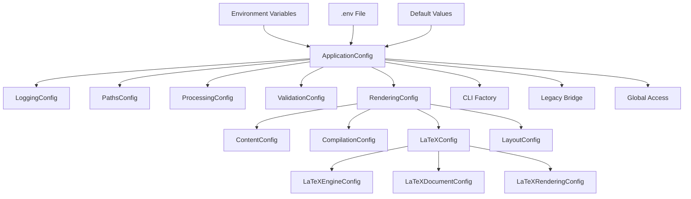

# Unified Configuration System

The Unified Configuration System consolidates scattered configuration patterns throughout the 5e2pdf codebase into a single, cohesive Pydantic-based configuration architecture with environment variable support and hierarchical organization.

## Overview

The unified configuration system addresses configuration complexity by providing:

- **Single Source of Truth**: Replaces scattered TypedDict and separate config classes
- **Hierarchical Organization**: Logical grouping of related configuration options
- **Environment Variable Support**: DND5E_ prefixed environment variables with nested delimiter support
- **Type Safety**: Full Pydantic validation and type checking
- **CLI Integration**: Seamless integration with CLI parameter defaults
- **Backward Compatibility**: Legacy config bridging for existing components
- **Runtime Validation**: Automatic validation and error reporting



## Architecture

### Configuration Hierarchy

The system provides a logical hierarchy of configuration sections:

```python
class ApplicationConfig(BaseSettings):
    """Complete application configuration."""

    logging: LoggingConfig              # Application logging settings
    paths: PathsConfig                  # File and directory paths
    processing: ProcessingConfig        # Content processing settings
    validation: ValidationConfig        # Content validation settings
    rendering: RenderingConfig          # Content rendering settings
```

#### Top-Level Configuration Sections

**LoggingConfig**: Application logging configuration
```python
class LoggingConfig(BaseModel):
    level: str = "WARNING"              # DEBUG, INFO, WARNING, ERROR, CRITICAL
    format: str = "%(log_color)s..."    # Colorlog format string
```

**PathsConfig**: File and directory path management
```python
class PathsConfig(BaseModel):
    data_path: Path | None = None       # D&D 5e data files
    assets_path: Path = Path("assets")  # Asset files
    output_path: Path = Path("output")  # Generated output
    build_path: Path = Path("build")    # Build artifacts
    font_dir: Path | None = None        # Custom fonts
```

**ProcessingConfig**: Content processing behavior
```python
class ProcessingConfig(BaseModel):
    max_workers: int = 5                # Worker processes (1-16)
    enable_caching: bool = True         # Content caching
    cache_ttl: int = 3600              # Cache TTL in seconds
```

**ValidationConfig**: Content validation settings
```python
class ValidationConfig(BaseModel):
    strictness: Literal["strict", "normal", "lenient"] = "normal"
    enable_summary: bool = False        # Error summary reports
    max_duplicate_errors: int = 1       # Duplicate error limit
```

### Rendering Configuration Subsystem

The `RenderingConfig` provides comprehensive control over content rendering:

```python
class RenderingConfig(BaseModel):
    template_dir: Path | None = None    # Custom templates
    output_format: Literal["latex", "pdf", "html"] = "latex"
    debug: bool = False                 # Debug mode
    strict_mode: bool = False          # Strict validation

    content: ContentConfig             # Content inclusion
    compilation: CompilationConfig     # Compilation behavior
    latex: LaTeXConfig                # LaTeX-specific settings
    layout: LayoutConfig              # Layout configuration
```

#### Content Configuration

Controls what content is included by default:

```python
class ContentConfig(BaseModel):
    include_images: bool = False        # Include images
    include_items: bool = True          # Include item lists
    include_creatures: bool = True      # Include creature lists
```

#### Compilation Configuration

Controls PDF compilation behavior:

```python
class CompilationConfig(BaseModel):
    auto_compile_pdf: bool = False      # Automatic PDF compilation
```

#### LaTeX Configuration Subsystem

Comprehensive LaTeX configuration with three main areas:

```python
class LaTeXConfig(BaseModel):
    engine: LaTeXEngineConfig          # Compilation engines
    document: LaTeXDocumentConfig      # Document structure
    rendering: LaTeXRenderingConfig    # Content rendering
```

**LaTeX Engine Configuration:**
```python
class LaTeXEngineConfig(BaseModel):
    primary_engine: Literal["lualatex", "xelatex", "pdflatex"] = "lualatex"
    fallback_engines: list[Literal[...]] = ["xelatex", "pdflatex"]
    timeout: int = 300                  # Compilation timeout (30-∞)
    max_passes: int = 3                 # Max compilation passes (1-10)
    show_progress: bool = True          # Show progress
    keep_temp_files: bool = False       # Keep temp files for debug
```

**LaTeX Document Configuration:**
```python
class LaTeXDocumentConfig(BaseModel):
    document_class: str = "dndbook"     # LaTeX document class
    class_options: list[str] = ["justified", "twocolumn"]
    paper_size: Literal["letterpaper", "a4paper", "a5paper"] = "letterpaper"
    font_size: Literal["10pt", "11pt", "12pt"] = "11pt"
    font_scheme: Literal["dmsguild", "commercial", "system"] = "dmsguild"
    background: str | None = None       # Background style
    high_contrast: bool = False         # High contrast printing
    justified_text: bool = False        # Justify text columns
    fancy_headers: bool = True          # Fancy page headers
    two_column: bool = True             # Two-column layout
    show_toc: bool = True              # Table of contents
    show_index: bool = True            # Alphabetical index
```

**LaTeX Rendering Configuration:**
```python
class LaTeXRenderingConfig(BaseModel):
    enable_hyperlinks: bool = True      # PDF hyperlinks
    enable_cross_refs: bool = True      # Cross-references
    auto_page_refs: bool = True         # Automatic page references
    hyperlink_styles: dict[str, dict[str, Any]] = {}  # Custom link styles
    cross_ref_format: str = "see page~\\pageref{{{label}}}"
    appendix_organization: Literal["alphabetical", "source", "type"] = "alphabetical"
```

#### Layout Configuration

```python
class LayoutConfig(BaseModel):
    columns: int = 2                    # Number of columns (1-4)
    spacing: str = "normal"             # Line spacing
    margins: dict[str, str] = {         # Page margins
        "top": "1in", "bottom": "1in",
        "left": "1in", "right": "1in"
    }
    float_placement: str = "htbp"       # Float placement options
```

## Environment Variable Integration

The system supports comprehensive environment variable configuration with Pydantic Settings:

### Environment Variable Naming

```python
model_config = SettingsConfigDict(
    env_file=".env",                    # Load from .env file
    env_file_encoding="utf-8",
    case_sensitive=False,               # Case insensitive matching
    env_prefix="DND5E_",               # All variables prefixed with DND5E_
    env_nested_delimiter="__",          # Double underscore for nesting
)
```

### Environment Variable Examples

**Top-level configuration:**
```bash
# Logging configuration
export DND5E_LOGGING__LEVEL=DEBUG
export DND5E_LOGGING__FORMAT="%(levelname)s: %(message)s"

# Path configuration
export DND5E_PATHS__DATA_PATH=/path/to/5etools-data
export DND5E_PATHS__OUTPUT_PATH=/custom/output
export DND5E_PATHS__FONT_DIR=/usr/share/fonts/custom

# Processing configuration
export DND5E_PROCESSING__MAX_WORKERS=8
export DND5E_PROCESSING__ENABLE_CACHING=true
export DND5E_PROCESSING__CACHE_TTL=7200
```

**Nested rendering configuration:**
```bash
# Content configuration
export DND5E_RENDERING__CONTENT__INCLUDE_IMAGES=true
export DND5E_RENDERING__CONTENT__INCLUDE_ITEMS=false

# LaTeX engine configuration
export DND5E_RENDERING__LATEX__ENGINE__PRIMARY_ENGINE=xelatex
export DND5E_RENDERING__LATEX__ENGINE__TIMEOUT=600
export DND5E_RENDERING__LATEX__ENGINE__KEEP_TEMP_FILES=true

# LaTeX document configuration
export DND5E_RENDERING__LATEX__DOCUMENT__DOCUMENT_CLASS=article
export DND5E_RENDERING__LATEX__DOCUMENT__PAPER_SIZE=a4paper
export DND5E_RENDERING__LATEX__DOCUMENT__FONT_SIZE=12pt
export DND5E_RENDERING__LATEX__DOCUMENT__TWO_COLUMN=false

# LaTeX rendering configuration
export DND5E_RENDERING__LATEX__RENDERING__ENABLE_HYPERLINKS=false
export DND5E_RENDERING__LATEX__RENDERING__APPENDIX_ORGANIZATION=source
```

**Validation configuration:**
```bash
export DND5E_VALIDATION__STRICTNESS=strict
export DND5E_VALIDATION__ENABLE_SUMMARY=true
export DND5E_VALIDATION__MAX_DUPLICATE_ERRORS=5
```

### .env File Support

The system automatically loads configuration from `.env` files:

```bash
# .env file example
DND5E_LOGGING__LEVEL=INFO
DND5E_PATHS__DATA_PATH=/home/user/5etools-data
DND5E_RENDERING__CONTENT__INCLUDE_IMAGES=true
DND5E_RENDERING__LATEX__ENGINE__PRIMARY_ENGINE=lualatex
DND5E_RENDERING__LATEX__DOCUMENT__PAPER_SIZE=a4paper
DND5E_PROCESSING__MAX_WORKERS=4
DND5E_VALIDATION__STRICTNESS=normal
```

## Global Configuration Access

The system provides global configuration access with lazy initialization:

### Primary Access Functions

```python
from dnd5e.core.config.unified_config import get_app_config, reset_app_config

# Get global configuration (initialized on first access)
config = get_app_config()

# Reset configuration (mainly for testing)
reset_app_config()

# Backward compatibility aliases
from dnd5e.core.config.unified_config import get_settings, reset_settings
config = get_settings()  # Same as get_app_config()
```

### Configuration Usage Patterns

**Basic usage:**
```python
# Access configuration sections
config = get_app_config()
log_level = config.logging.level
output_path = config.paths.output_path
include_images = config.rendering.content.include_images
```

**Service configuration:**
```python
def create_omnidexer() -> Omnidexer:
    """Create omnidexer with unified config."""
    config = get_app_config()
    return Omnidexer(
        data_path=config.paths.data_path,
        enable_caching=config.processing.enable_caching,
        cache_ttl=config.processing.cache_ttl,
    )
```

**Rendering configuration:**
```python
def create_latex_renderer() -> LaTeXRenderer:
    """Create LaTeX renderer with unified config."""
    config = get_app_config()
    return LaTeXRenderer(
        template_dir=config.rendering.template_dir,
        output_format=config.rendering.output_format,
        latex_config=config.rendering.latex,
        debug=config.rendering.debug,
    )
```

## CLI Integration

The unified configuration provides seamless CLI integration through the configuration factory:

### CLI Factory Pattern

```python
from dnd5e.cli.config_factory import get_cli_defaults, get_config_default

# Get all CLI defaults from unified config
cli_defaults = get_cli_defaults()

# Get specific defaults
document_class = get_config_default("document_class")
include_images = get_config_default("with_images")
```

### CLI Parameter Mapping

The factory maps unified config to CLI parameters:

```python
def get_cli_defaults() -> dict[str, Any]:
    """Map unified config to CLI parameter defaults."""
    config = get_app_config()
    return {
        # Document structure
        "document_class": config.rendering.latex.document.document_class,
        "font_size": config.rendering.latex.document.font_size,
        "background": config.rendering.latex.document.background,
        "two_column": config.rendering.latex.document.two_column,
        "justified": config.rendering.latex.document.justified_text,

        # Content inclusion
        "with_images": config.rendering.content.include_images,
        "with_items": config.rendering.content.include_items,
        "with_creatures": config.rendering.content.include_creatures,
        "with_index": config.rendering.latex.document.show_index,

        # Compilation
        "compile_pdf": config.rendering.compilation.auto_compile_pdf,

        # Processing
        "concurrent_limit": config.processing.max_workers,
    }
```

### CLI Command Integration

CLI commands use the factory for default values:

```python
@click.command()
@click.option(
    "--document-class",
    default=lambda: get_config_default("document_class"),
    help="LaTeX document class to use"
)
@click.option(
    "--with-images/--no-images",
    default=lambda: get_config_default("with_images"),
    help="Include images in output"
)
def convert(document_class: str, with_images: bool):
    """Convert command with unified config defaults."""
    # Command implementation uses unified config defaults
```

## Validation and Error Handling

The system provides comprehensive validation through Pydantic:

### Field Validation

```python
class LoggingConfig(BaseModel):
    level: str = "WARNING"

    @field_validator("level")
    @classmethod
    def validate_log_level(cls, v: str) -> str:
        """Validate log level is supported."""
        valid_levels = {"DEBUG", "INFO", "WARNING", "ERROR", "CRITICAL"}
        if v.upper() not in valid_levels:
            raise ValueError(f"Log level must be one of {valid_levels}")
        return v.upper()
```

### Range Validation

```python
class ProcessingConfig(BaseModel):
    max_workers: int = Field(
        default=5,
        ge=1, le=16,                    # Between 1 and 16
        description="Maximum number of worker processes"
    )
    cache_ttl: int = Field(
        default=3600,
        ge=0,                           # Non-negative
        description="Cache time-to-live in seconds"
    )
```

### Post-Initialization Processing

```python
def model_post_init(self, __context: Any) -> None:
    """Post-process configuration after parsing."""
    # Ensure output directory exists
    self.paths.output_path.mkdir(parents=True, exist_ok=True)
    self.paths.build_path.mkdir(parents=True, exist_ok=True)
```

### Error Reporting

The system provides clear error messages for configuration issues:

```python
# Example validation error
try:
    config = ApplicationConfig(logging__level="INVALID")
except ValidationError as e:
    print(e)
    # Output: Log level must be one of {'DEBUG', 'INFO', 'WARNING', 'ERROR', 'CRITICAL'}
```

## Legacy Compatibility

The system provides backward compatibility with existing configuration patterns:

### Legacy LaTeX Config Bridge

```python
def create_legacy_latex_config_from_unified(config: ApplicationConfig) -> LaTeXConfig:
    """Create legacy LaTeX config from unified config."""
    from dnd5e.core.config.latex_config import LaTeXConfig, LaTeXDocumentConfig

    # Map unified config to legacy structure
    doc_config = LaTeXDocumentConfig(
        document_class=config.rendering.latex.document.document_class,
        class_options=config.rendering.latex.document.class_options,
        paper_size=config.rendering.latex.document.paper_size,
        font_size=config.rendering.latex.document.font_size,
        # ... additional mappings
    )

    return LaTeXConfig(document=doc_config)
```

### Compatibility Functions

```python
# Backward compatibility helpers
def get_default_paper_size() -> str:
    """Get default paper size for legacy code."""
    config = get_app_config()
    return config.rendering.latex.document.paper_size

def get_settings() -> ApplicationConfig:
    """Legacy alias for get_app_config()."""
    return get_app_config()
```

### Migration Pattern

Legacy code can gradually migrate to unified config:

```python
# Before: Direct legacy config usage
from dnd5e.core.config.latex_config import get_latex_config
latex_config = get_latex_config()

# After: Unified config with legacy bridge
from dnd5e.core.config.unified_config import get_app_config, create_legacy_latex_config_from_unified
app_config = get_app_config()
latex_config = create_legacy_latex_config_from_unified(app_config)

# Future: Direct unified config usage
app_config = get_app_config()
document_class = app_config.rendering.latex.document.document_class
```

## Testing Support

The system provides comprehensive testing support:

### Configuration Reset

```python
def test_configuration():
    """Test with clean configuration state."""
    from dnd5e.core.config.unified_config import reset_app_config, get_app_config

    # Start with clean slate
    reset_app_config()

    # Test default configuration
    config = get_app_config()
    assert config.logging.level == "WARNING"
    assert config.processing.max_workers == 5
```

### Override Testing

```python
def test_environment_override():
    """Test environment variable overrides."""
    import os
    from dnd5e.core.config.unified_config import reset_app_config, get_app_config

    # Set environment variables
    os.environ["DND5E_LOGGING__LEVEL"] = "DEBUG"
    os.environ["DND5E_PROCESSING__MAX_WORKERS"] = "8"

    # Reset to pick up new environment
    reset_app_config()

    config = get_app_config()
    assert config.logging.level == "DEBUG"
    assert config.processing.max_workers == 8

    # Cleanup
    del os.environ["DND5E_LOGGING__LEVEL"]
    del os.environ["DND5E_PROCESSING__MAX_WORKERS"]
```

### Validation Testing

```python
def test_configuration_validation():
    """Test configuration validation."""
    from pydantic import ValidationError
    from dnd5e.core.config.unified_config import ApplicationConfig

    # Test invalid log level
    with pytest.raises(ValidationError, match="Log level must be one of"):
        ApplicationConfig(logging={"level": "INVALID"})

    # Test invalid worker count
    with pytest.raises(ValidationError, match="ensure this value is less than"):
        ApplicationConfig(processing={"max_workers": 20})
```

## Best Practices

### Configuration Organization

```python
# Recommended: Group related configuration logically
config = get_app_config()

# LaTeX-specific configuration
latex_engine = config.rendering.latex.engine.primary_engine
document_class = config.rendering.latex.document.document_class
enable_hyperlinks = config.rendering.latex.rendering.enable_hyperlinks

# Content processing configuration
max_workers = config.processing.max_workers
enable_caching = config.processing.enable_caching

# Path configuration
data_path = config.paths.data_path
output_path = config.paths.output_path
```

### Environment Variable Usage

```bash
# Recommended: Use descriptive environment variable names
export DND5E_RENDERING__LATEX__DOCUMENT__DOCUMENT_CLASS=article
export DND5E_RENDERING__CONTENT__INCLUDE_IMAGES=true
export DND5E_PROCESSING__MAX_WORKERS=4

# Avoid: Generic or unclear names
export DND5E_CLASS=article  # Unclear what this affects
export DND5E_WORKERS=4      # Could be any type of worker
```

### Service Configuration

```python
# Recommended: Pass specific config sections to services
def create_service_with_config():
    config = get_app_config()

    return SomeService(
        # Pass only relevant configuration
        processing_config=config.processing,
        validation_config=config.validation,
    )

# Avoid: Passing entire configuration to services
def create_service_with_full_config():
    config = get_app_config()
    return SomeService(config=config)  # Too broad
```

### Testing Configuration

```python
# Recommended: Use specific test configurations
def test_with_specific_config():
    from dnd5e.core.config.unified_config import ApplicationConfig

    test_config = ApplicationConfig(
        processing={"max_workers": 1},
        validation={"strictness": "strict"},
        rendering={"debug": True}
    )

    # Use test_config for testing
```

## Extension Patterns

### Adding New Configuration Sections

```python
class CustomConfig(BaseModel):
    """Configuration for custom functionality."""

    enable_custom_feature: bool = Field(
        default=False,
        description="Enable custom feature"
    )
    custom_parameter: str = Field(
        default="default_value",
        description="Custom parameter"
    )

# Extend ApplicationConfig
class ExtendedApplicationConfig(ApplicationConfig):
    """Extended application configuration."""

    custom: CustomConfig = Field(
        default_factory=CustomConfig,
        description="Custom configuration"
    )
```

### Custom Validation

```python
class CustomConfig(BaseModel):
    setting_a: str
    setting_b: int

    @model_validator(mode="after")
    def validate_settings_compatibility(self) -> "CustomConfig":
        """Validate cross-field dependencies."""
        if self.setting_a == "special" and self.setting_b < 10:
            raise ValueError("Special mode requires setting_b >= 10")
        return self
```

### Configuration Factories

```python
def create_development_config() -> ApplicationConfig:
    """Create configuration optimized for development."""
    return ApplicationConfig(
        logging={"level": "DEBUG"},
        rendering={"debug": True},
        processing={"max_workers": 1},  # Easier debugging
        validation={"strictness": "lenient"},
    )

def create_production_config() -> ApplicationConfig:
    """Create configuration optimized for production."""
    return ApplicationConfig(
        logging={"level": "WARNING"},
        rendering={"debug": False},
        processing={"max_workers": 8},
        validation={"strictness": "normal"},
    )
```

## Future Enhancements

### Planned Features

**Dynamic Configuration Reloading:**
- Hot reload of configuration changes
- Configuration change notifications
- Service restart coordination

**Configuration Profiles:**
- Named configuration profiles (development, production, testing)
- Profile switching and inheritance
- Profile-specific environment variable sets

**Advanced Validation:**
- Cross-section validation rules
- Conditional configuration validation
- Configuration dependency analysis

**Configuration Management UI:**
- Web-based configuration editor
- Configuration validation and preview
- Configuration export and import tools

### Integration Roadmap

**Service Container Integration:**
- Automatic service reconfiguration on config changes
- Configuration-driven service instantiation
- Service lifecycle management based on configuration

**Plugin System Integration:**
- Plugin-specific configuration sections
- Dynamic configuration schema extension
- Plugin configuration validation

**Performance Enhancements:**
- Configuration access caching
- Lazy configuration section loading
- Configuration serialization optimization

## Conclusion

The Unified Configuration System provides a comprehensive, type-safe solution for managing all application configuration in 5e2pdf. Its key advantages include:

- **Consolidation**: Single source of truth replacing scattered configuration patterns
- **Type Safety**: Full Pydantic validation and IDE support
- **Environment Integration**: Comprehensive environment variable support
- **CLI Integration**: Seamless CLI parameter default management
- **Backward Compatibility**: Smooth migration path for existing code
- **Extensibility**: Clean patterns for adding new configuration sections

The system's hierarchical organization and validation capabilities ensure reliable configuration management while providing the flexibility needed for different deployment scenarios and use cases. This foundation enables confident configuration management across the entire application lifecycle.
