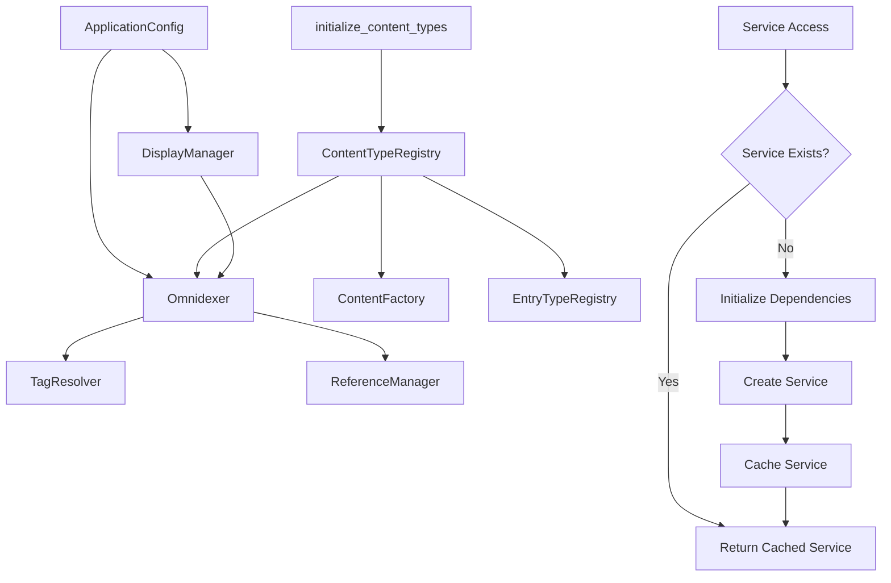

# Service Container Architecture

The Service Container provides centralized dependency injection and lifecycle management for 5e2pdf core services, replacing complex global singleton patterns with a clean, testable architecture.

## Overview

The service container architecture addresses critical architectural challenges in managing application-wide services:

- **Global State Management**: Replaces scattered singleton instances with centralized service management
- **Dependency Injection**: Type-safe service access with automatic dependency resolution
- **Lifecycle Management**: Proper initialization, cleanup, and resource management
- **Test Isolation**: Simple global state reset for reliable test execution
- **Performance**: Lazy initialization ensures services are created only when needed

```mermaid
graph TD
    A[CLI Command] --> B[get_global_container()]
    B --> C[DefaultServiceContainer]

    C --> D[get_omnidexer()]
    C --> E[get_tag_resolver()]
    C --> F[get_entry_registry()]
    C --> G[get_reference_manager()]
    C --> H[get_display_manager()]
    C --> I[get_content_factory()]
    C --> J[get_content_type_registry()]

    D --> K[Omnidexer Instance]
    E --> L[TagResolver Instance]
    F --> M[EntryTypeRegistry Instance]
    G --> N[ReferenceManager Instance]
    H --> O[DisplayManager Instance]
    I --> P[ContentFactory Instance]
    J --> Q[ContentTypeRegistry Instance]

    K -.-> R[Dependencies]
    L -.-> R
    M -.-> R
    N -.-> R
    O -.-> R
    P -.-> R
    Q -.-> R

    S[Service Lifecycle] --> T[Lazy Loading]
    T --> U[Caching]
    U --> V[Cleanup]
```

## Core Architecture

### ServiceContainer Protocol

The service container is defined by a protocol that ensures type safety and clear contracts:

```python
from typing import Protocol
from dnd5e.core.loaders.omnidexer import Omnidexer
from dnd5e.core.text.tag_resolver import TagResolver
from dnd5e.core.models.entry_types import EntryTypeRegistry
from dnd5e.core.unified_references import ReferenceManager
from dnd5e.cli.display_manager import DisplayManager
from dnd5e.core.models.content_factory import ContentFactory
from dnd5e.core.config.unified_config import ApplicationConfig
from dnd5e.core.registry.content_type_registry import ContentTypeRegistry

class ServiceContainer(Protocol):
    """Protocol defining the service container interface."""

    def get_omnidexer(self) -> Omnidexer:
        """Get the omnidexer service for content indexing and loading."""
        ...

    def get_tag_resolver(self) -> TagResolver:
        """Get the tag resolver service for cross-reference resolution."""
        ...

    def get_entry_registry(self) -> EntryTypeRegistry:
        """Get the entry registry service for entry type validation."""
        ...

    def get_reference_manager(self) -> ReferenceManager:
        """Get the reference manager service for reference parsing."""
        ...

    def get_display_manager(self) -> DisplayManager:
        """Get the display manager service for CLI progress display."""
        ...

    def get_content_factory(self) -> ContentFactory:
        """Get the content factory service for dynamic content creation."""
        ...

    def get_content_type_registry(self) -> ContentTypeRegistry:
        """Get the content type registry service for dynamic content type management."""
        ...

    def get_app_config(self) -> ApplicationConfig:
        """Get the application configuration service."""
        ...

    def close(self) -> None:
        """Close the container and clean up all services."""
        ...
```

### DefaultServiceContainer Implementation

The concrete implementation provides lazy initialization and automatic dependency injection:

```python
class DefaultServiceContainer:
    """Default implementation of the service container."""

    def __init__(self) -> None:
        self._omnidexer: Omnidexer | None = None
        self._tag_resolver: TagResolver | None = None
        self._entry_registry: EntryTypeRegistry | None = None
        self._reference_manager: ReferenceManager | None = None
        self._display_manager: DisplayManager | None = None
        self._content_factory: ContentFactory | None = None
        self._content_type_registry: ContentTypeRegistry | None = None
        self._app_config: ApplicationConfig | None = None
        self._closed = False

    def get_omnidexer(self) -> Omnidexer:
        """Get omnidexer with lazy initialization and progress display."""
        if self._closed:
            raise RuntimeError("Container has been closed")

        if self._omnidexer is None:
            display_manager = self.get_display_manager()
            # Initialize with progress display
            self._omnidexer = Omnidexer(display_manager=display_manager)
            self._omnidexer.load_all_data()

        return self._omnidexer

    def get_tag_resolver(self) -> TagResolver:
        """Get tag resolver with automatic omnidexer dependency injection."""
        if self._closed:
            raise RuntimeError("Container has been closed")

        if self._tag_resolver is None:
            omnidexer = self.get_omnidexer()  # Automatic dependency
            self._tag_resolver = TagResolver(omnidexer=omnidexer)

        return self._tag_resolver

    def close(self) -> None:
        """Close container and clean up all service resources."""
        self._closed = True

        # Clean up services in reverse dependency order
        if self._tag_resolver is not None:
            self._tag_resolver.close()
        if self._omnidexer is not None:
            self._omnidexer.close()
        # ... other service cleanup

        # Clear references
        self._omnidexer = None
        self._tag_resolver = None
        # ... clear other references
```

## Global Container Management

### get_global_container()

The global container provides a singleton instance for CLI and application usage:

```python
from dnd5e.core.container import get_global_container

# CLI command usage
def convert_command(book_id: str) -> None:
    container = get_global_container()
    omnidexer = container.get_omnidexer()

    # Services are cached and reused across calls
    tag_resolver = container.get_tag_resolver()

    # Process content with injected services
    content = omnidexer.find(ContentType.BOOK, book_id)
    resolved_content = tag_resolver.resolve_tags(content)
```

**Key Characteristics:**
- **Singleton Pattern**: Single global instance per application
- **Lazy Initialization**: Container and services created on first access
- **Service Caching**: Services are cached after first creation
- **Thread Safety**: Safe for single-threaded CLI usage

### reset_global_container()

Critical for test isolation and global state management:

```python
from dnd5e.core.container import reset_global_container

def setup_method(self) -> None:
    """Test setup with complete global state reset."""
    # Single call replaces complex individual resets
    reset_global_container()

    # Legacy components still need individual reset
    from dnd5e.core.cache import CacheManager
    from dnd5e.cli.main import reset_cli_globals

    CacheManager.reset()
    reset_cli_globals()
```

**Impact on Testing:**
- **Before**: 8+ individual singleton reset calls required
- **After**: Single `reset_global_container()` call handles most services
- **Reliability**: Eliminates test contamination from persistent state
- **Performance**: Faster test setup and teardown

## Scoped Container Usage

### service_container() Context Manager

For operations requiring complete isolation from global state:

```python
from dnd5e.core.container import service_container

def process_multiple_books(book_ids: list[str]) -> None:
    """Process books with isolated container per book."""
    for book_id in book_ids:
        # Each book gets fresh services - no state contamination
        with service_container() as container:
            omnidexer = container.get_omnidexer()
            processor = BookProcessor(container)
            processor.process(book_id)
        # Container automatically closed and cleaned up
```

**Use Cases:**
- **Batch Processing**: Isolated processing of multiple items
- **Testing**: Complete isolation for specific test scenarios
- **Parallel Processing**: Safe concurrent processing with separate containers
- **Resource Management**: Automatic cleanup prevents resource leaks

## Service Dependencies and Initialization

### ContentTypeRegistry Integration

The registry service is crucial for the dynamic content type system:

```python
def get_content_type_registry(self) -> ContentTypeRegistry:
    """Get content type registry with initialization dependency."""
    if self._closed:
        raise RuntimeError("Container has been closed")

    if self._content_type_registry is None:
        # Registry must be initialized before other content services
        from dnd5e.core.registry import initialize_content_types
        initialize_content_types()

        from dnd5e.core.interfaces import get_content_type_registry
        self._content_type_registry = get_content_type_registry()

    return self._content_type_registry

def get_content_factory(self) -> ContentFactory:
    """Get content factory with registry dependency."""
    if self._content_factory is None:
        # Ensure registry is initialized first
        registry = self.get_content_type_registry()
        self._content_factory = ContentFactory()
        # Factory automatically uses registered content types

    return self._content_factory
```

**Registry Service Dependencies:**
- **ContentFactory**: Uses registry for dynamic content creation
- **Omnidexer**: Uses registry for available content types
- **SourceManager**: Uses registry file patterns for source detection
- **System Integration**: Must be initialized before other services

### Dependency Graph

The container manages complex service dependencies automatically:



### Lazy Initialization Benefits

**Performance Impact:**
- **Startup Time**: Only needed services are initialized
- **Memory Usage**: Unused services consume no memory
- **Test Performance**: Tests only pay for services they use

**Example Initialization Sequence:**
```python
container = get_global_container()
# No services created yet - container is lightweight

omnidexer = container.get_omnidexer()
# 1. DisplayManager created for progress display
# 2. ApplicationConfig loaded
# 3. Omnidexer created with dependencies
# 4. Data loading begins with progress display

tag_resolver = container.get_tag_resolver()
# 1. Reuses existing omnidexer (no reload)
# 2. TagResolver created with omnidexer dependency
# 3. Immediate availability - no additional loading
```

## Migration from Global Singletons

### Before: Complex Global State Management

**Legacy Pattern Problems:**
```python
# Multiple files with global state
from dnd5e.core.entry_registry import get_registry, reset_entry_registry
from dnd5e.core.unified_references import get_reference_manager, reset_reference_manager
from dnd5e.core.tag_resolver import get_tag_resolver, reset_tag_resolver
# ... 8+ more imports and resets

# Test setup nightmare
def setup_method(self) -> None:
    reset_entry_registry()
    reset_reference_manager()
    reset_tag_resolver()
    reset_content_factory()
    reset_omnidexer()
    reset_display_manager()
    reset_content_type_registry()
    reset_cache_manager()
    # ... more resets, easy to forget one
```

**Issues:**
- **Scattered State**: Global variables across multiple modules
- **Test Brittleness**: Easy to forget a reset, causing test contamination
- **Initialization Order**: Complex dependency management
- **Resource Leaks**: No coordinated cleanup

### After: Clean Service Container Pattern

**Modern Pattern Benefits:**
```python
from dnd5e.core.container import get_global_container, reset_global_container

# Simple, centralized access
container = get_global_container()
registry = container.get_entry_registry()
ref_manager = container.get_reference_manager()
tag_resolver = container.get_tag_resolver()

# Simple test setup
def setup_method(self) -> None:
    reset_global_container()  # Handles most services
    CacheManager.reset()      # Only legacy components need individual reset
    reset_cli_globals()       # CLI-specific state
```

**Benefits:**
- **Centralized Management**: Single point of control for all services
- **Reliable Testing**: One reset call prevents most contamination issues
- **Clear Dependencies**: Explicit dependency injection
- **Proper Cleanup**: Coordinated resource management

## Error Handling and Edge Cases

### Container State Management

```python
# Container lifecycle management
container = get_global_container()
service = container.get_omnidexer()

# Manual cleanup
container.close()

# Error on access after close
try:
    service = container.get_omnidexer()
except RuntimeError as e:
    print(f"Container closed: {e}")
    # Solution: create new container or reset global
    reset_global_container()
    container = get_global_container()  # Fresh container
```

### Service Initialization Failures

```python
# Service initialization errors are propagated
try:
    container = get_global_container()
    omnidexer = container.get_omnidexer()
except ConfigurationError as e:
    logger.error(f"Failed to initialize omnidexer: {e}")
    # Recovery strategies:
    # 1. Fix configuration and retry
    # 2. Use fallback configuration
    # 3. Create isolated container with custom config
```

### Memory and Resource Management

```python
# Automatic cleanup with context manager
def process_large_dataset() -> None:
    with service_container() as container:
        # Services automatically cleaned up on exit
        omnidexer = container.get_omnidexer()
        # ... processing
    # All resources released, memory freed

# Manual cleanup for long-running processes
def long_running_service() -> None:
    container = get_global_container()
    try:
        # ... long-running operations
        pass
    finally:
        container.close()  # Explicit cleanup
        reset_global_container()  # Prepare for next operation
```

## Best Practices

### CLI Usage Patterns

```python
# ✅ Good: Use global container for CLI commands
from dnd5e.core.container import get_global_container

def convert_command(book_id: str) -> None:
    container = get_global_container()
    omnidexer = container.get_omnidexer()
    processor = BookProcessor(container)
    processor.convert(book_id)

# ❌ Avoid: Direct service instantiation
def bad_convert_command(book_id: str) -> None:
    omnidexer = Omnidexer()  # Manual instantiation
    omnidexer.load_all_data()  # No progress display
    # ... missing dependencies, no cleanup
```

### Testing Patterns

```python
# ✅ Good: Proper test isolation
class TestContentProcessing:
    def setup_method(self) -> None:
        reset_global_container()  # Clean state
        CacheManager.reset()      # Legacy cleanup
        reset_cli_globals()       # CLI state

    def test_processing(self) -> None:
        container = get_global_container()
        omnidexer = container.get_omnidexer()
        # ... test with clean state

# ❌ Avoid: Forgetting to reset state
class BadTestContentProcessing:
    def test_processing(self) -> None:
        # No setup - contaminated state from previous tests
        container = get_global_container()
        # ... test may fail due to state contamination
```

### Batch Processing Patterns

```python
# ✅ Good: Isolated processing
def process_multiple_books(book_ids: list[str]) -> None:
    for book_id in book_ids:
        with service_container() as container:
            processor = BookProcessor(container)
            processor.process(book_id)
        # Fresh container for each book

# ✅ Also Good: Shared container with cleanup
def process_with_shared_container(book_ids: list[str]) -> None:
    container = get_global_container()
    try:
        processor = BookProcessor(container)
        for book_id in book_ids:
            processor.process(book_id)
    finally:
        container.close()

# ❌ Avoid: No cleanup between items
def bad_batch_processing(book_ids: list[str]) -> None:
    container = get_global_container()
    for book_id in book_ids:
        # State contamination between books
        processor = BookProcessor(container)
        processor.process(book_id)
    # No cleanup - resource leaks
```

### Service Access Patterns

```python
# ✅ Good: Access through container
def process_content(content_data: dict) -> None:
    container = get_global_container()
    registry = container.get_entry_registry()
    factory = container.get_content_factory()

    # Services properly initialized with dependencies
    entry = factory.create_entry(content_data)
    validated = registry.validate_entry(entry)

# ❌ Avoid: Direct singleton access
def bad_process_content(content_data: dict) -> None:
    registry = get_registry()  # Legacy singleton
    factory = get_content_factory()  # Legacy singleton

    # Manual dependency management, no cleanup
    entry = factory.create_entry(content_data)
    validated = registry.validate_entry(entry)
```

## Performance Characteristics

### Initialization Benchmarks

**Service Initialization Times:**
- **Container Creation**: ~1ms (lightweight)
- **First Omnidexer Access**: ~2-3s (data loading)
- **Subsequent Service Access**: ~1-5ms (cached)
- **Container Reset**: ~10ms (cleanup + recreation)

**Memory Usage:**
- **Empty Container**: ~100KB
- **With Omnidexer**: ~50-100MB (depends on data size)
- **Full Service Set**: ~80-150MB (typical usage)

### Caching Benefits

**Service Caching Impact:**
```python
container = get_global_container()

# First access - full initialization
start = time.time()
omnidexer1 = container.get_omnidexer()  # ~2-3 seconds
print(f"First access: {time.time() - start:.2f}s")

# Second access - cached
start = time.time()
omnidexer2 = container.get_omnidexer()  # ~1ms
print(f"Cached access: {time.time() - start:.6f}s")

assert omnidexer1 is omnidexer2  # Same instance
```

## Future Enhancements

### Planned Features

**Configuration-Driven Services:**
```python
# Future: Service configuration through unified config
class ServiceContainerConfig(BaseModel):
    omnidexer_config: OmnidexerConfig
    cache_config: CacheConfig
    display_config: DisplayConfig

container = DefaultServiceContainer(config=service_config)
```

**Plugin Architecture:**
```python
# Future: Pluggable service implementations
class PluggableServiceContainer:
    def register_service(self, service_type: Type[T], implementation: Type[T]) -> None:
        """Register custom service implementations."""
        ...

    def get_service(self, service_type: Type[T]) -> T:
        """Get service with pluggable implementations."""
        ...
```

**Health Monitoring:**
```python
# Future: Service health monitoring
class MonitoredServiceContainer:
    def get_service_health(self) -> Dict[str, ServiceHealth]:
        """Get health status of all services."""
        ...

    def restart_unhealthy_services(self) -> None:
        """Restart services that have failed health checks."""
        ...
```

### Integration Roadmap

**Metrics and Monitoring:**
- Service initialization time tracking
- Memory usage monitoring per service
- Service call frequency and performance metrics

**Advanced Lifecycle Management:**
- Service warm-up strategies
- Graceful service shutdown
- Service dependency cycle detection

**Testing Enhancements:**
- Mock service injection for testing
- Service state inspection utilities
- Performance testing helpers

## Conclusion

The Service Container Architecture provides a robust foundation for managing complex application services in 5e2pdf. Its key benefits include:

- **Simplified Architecture**: Centralized service management replaces scattered global state
- **Improved Testing**: Single reset call eliminates complex test setup patterns
- **Type Safety**: Protocol-based design ensures compile-time correctness
- **Performance**: Lazy initialization and caching optimize resource usage
- **Maintainability**: Clear dependency injection and lifecycle management

The migration from global singletons to the service container pattern represents a significant architectural improvement, providing better testability, cleaner code organization, and more reliable operation across the entire application lifecycle.
